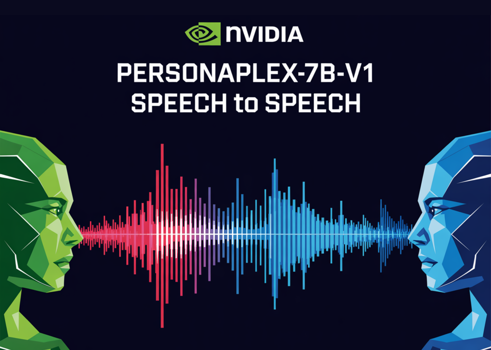

# NVIDIA Releases PersonaPlex-7B-v1: A Real-Time Speech-to-Speech Model Designed for Natural and Full-Duplex Conversations

> NVIDIA Researchers released PersonaPlex-7B-v1, a full duplex speech to speech conversational model that targets natural voice interactions with precise persona control. From ASR→LLM→TTS to a single full duplex model Conventional voice assistants usually run a cascade. Automatic Speech Recognition (ASR) converts speech to text, a language model generates a text answer, and Text to Speech […]

NVIDIA Researchers released PersonaPlex-7B-v1, a full duplex speech to speech conversational model that targets natural voice interactions with precise persona control.

### From ASR→LLM→TTS to a single full duplex model

Conventional voice assistants usually run a cascade. Automatic Speech Recognition (ASR) converts speech to text, a language model generates a text answer, and Text to Speech (TTS) converts back to audio. Each stage adds latency, and the pipeline cannot handle overlapping speech, natural interruptions, or dense backchannels.

PersonaPlex replaces this stack with a single Transformer model that performs streaming speech understanding and speech generation in one network. The model operates on continuous audio encoded with a neural codec and predicts both text tokens and audio tokens autoregressively. Incoming user audio is incrementally encoded, while PersonaPlex simultaneously generates its own speech, which enables barge in, overlaps, rapid turn taking, and contextual backchannels.

PersonaPlex runs in a dual stream configuration. One stream tracks user audio, the other stream tracks agent speech and text. Both streams share the same model state, so the agent can keep listening while speaking and can adjust its response when the user interrupts. This design is directly inspired by Kyutai’s Moshi full duplex framework.

### Hybrid prompting, voice control and role control

PersonaPlex uses two prompts to define the conversational identity.

- The voice prompt is a sequence of audio tokens that encodes vocal characteristics, speaking style, and prosody.

- The text prompt describes role, background, organization information, and scenario context.

Together, these prompts constrain both the linguistic content and the acoustic behavior of the agent. On top of this, a system prompt supports fields such as name, business name, agent name, and business information, with a budget up to 200 tokens.

### Architecture, Helium backbone and audio path

The PersonaPlex model has 7B parameters and follows the Moshi network architecture. A Mimi speech encoder that combines ConvNet and Transformer layers converts waveform audio into discrete tokens. Temporal and depth Transformers process multiple channels that represent user audio, agent text, and agent audio. A Mimi speech decoder that also combines Transformer and ConvNet layers generates the output audio tokens. Audio uses a 24 kHz sample rate for both input and output.

PersonaPlex is built on Moshi weights and uses [Helium](https://kyutai.org/blog/2025-04-30-helium) as the underlying language model backbone. Helium provides semantic understanding and enables generalization outside the supervised conversational scenarios. This is visible in the ‘space emergency’ example, where a prompt about a reactor core failure on a Mars mission leads to coherent technical reasoning with appropriate emotional tone, even though this situation is not part of the training distribution.

### Training data blend, real conversations and synthetic roles

Training has 1 stage and uses a blend of real and synthetic dialogues.

Real conversations come from 7,303 calls, about 1,217 hours, in the Fisher English corpus. These conversations are back annotated with prompts using GPT-OSS-120B. The prompts are written at different granularity levels, from simple persona hints like ‘You enjoy having a good conversation’ to longer descriptions that include life history, location, and preferences. This corpus provides natural backchannels, disfluencies, pauses, and emotional patterns that are difficult to obtain from TTS alone.

Synthetic data covers assistant and customer service roles. NVIDIA team reports 39,322 synthetic assistant conversations, about 410 hours, and 105,410 synthetic customer service conversations, about 1,840 hours. Qwen3-32B and GPT-OSS-120B generate the transcripts, and Chatterbox TTS converts them to speech. For assistant interactions, the text prompt is fixed as ‘You are a wise and friendly teacher. Answer questions or provide advice in a clear and engaging way.’ For customer service scenarios, prompts encode organization, role type, agent name, and structured business rules such as pricing, hours, and constraints.

This design lets PersonaPlex disentangle natural conversational behavior, which comes mainly from Fisher, from task adherence and role conditioning, which come mainly from synthetic scenarios.

### Evaluation on FullDuplexBench and ServiceDuplexBench

PersonaPlex is evaluated on FullDuplexBench, a benchmark for full duplex spoken dialogue models, and on a new extension called ServiceDuplexBench for customer service scenarios.

FullDuplexBench measures conversational dynamics with Takeover Rate and latency metrics for tasks such as smooth turn taking, user interruption handling, pause handling, and backchanneling. GPT-4o serves as an LLM judge for response quality in question answering categories. PersonaPlex reaches smooth turn taking TOR 0.908 with latency 0.170 seconds and user interruption TOR 0.950 with latency 0.240 seconds. Speaker similarity between voice prompts and outputs on the user interruption subset uses WavLM TDNN embeddings and reaches 0.650.

PersonaPlex outperforms many other open source and closed systems on conversational dynamics, response latency, interruption latency, and task adherence in both assistant and customer service roles.

*https://research.nvidia.com/labs/adlr/personaplex/*

### Key Takeaways

- PersonaPlex-7B-v1 is a 7B parameter full duplex speech to speech conversational model from NVIDIA, built on the Moshi architecture with a Helium language model backbone, code under MIT and weights under the NVIDIA Open Model License.

- The model uses a dual stream Transformer with Mimi speech encoder and decoder at 24 kHz, it encodes continuous audio into discrete tokens and generates text and audio tokens at the same time, which enables barge in, overlaps, fast turn taking, and natural backchannels.

- Persona control is handled by hybrid prompting, a voice prompt made of audio tokens sets timbre and style, a text prompt and a system prompt of up to 200 tokens defines role, business context, and constraints, with ready made voice embeddings such as NATF and NATM families.

- Training uses a blend of 7,303 Fisher conversations, about 1,217 hours, annotated with GPT-OSS-120B, plus synthetic assistant and customer service dialogs, about 410 hours and 1,840 hours, generated with Qwen3-32B and GPT-OSS-120B and rendered with Chatterbox TTS, which separates conversational naturalness from task adherence.

- On FullDuplexBench and ServiceDuplexBench, PersonaPlex reaches smooth turn taking takeover rate 0.908 and user interruption takeover rate 0.950 with sub second latency and improved task adherence.

---

Check out the **[Technical details](https://research.nvidia.com/labs/adlr/personaplex/), [Model weights](https://huggingface.co/nvidia/personaplex-7b-v1) **and** [Repo](https://github.com/NVIDIA/personaplex)**. Also, feel free to follow us on **[Twitter](https://x.com/intent/follow?screen_name=marktechpost)** and don’t forget to join our **[100k+ ML SubReddit](https://www.reddit.com/r/machinelearningnews/)** and Subscribe to **[our Newsletter](https://www.aidevsignals.com/)**. Wait! are you on telegram? **[now you can join us on telegram as well.](https://t.me/machinelearningresearchnews)**
