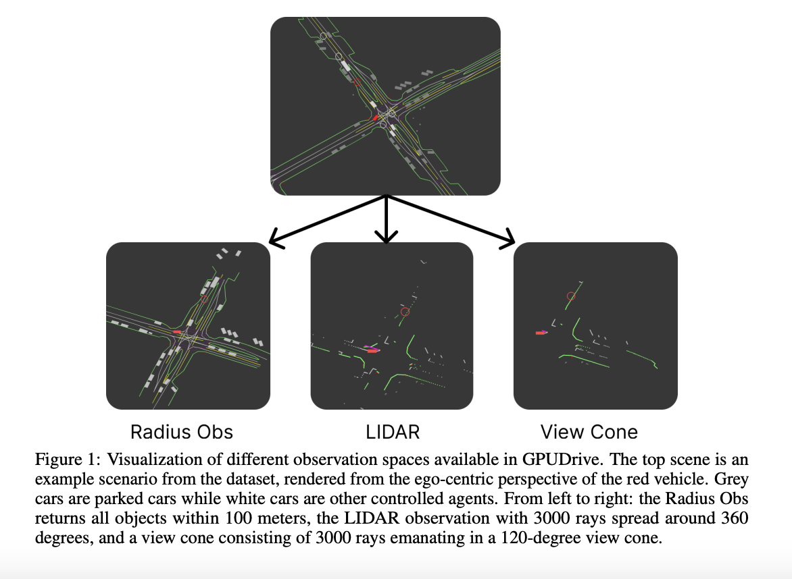

# NYU Researchers Open-Sourced GPUDrive: A GPU-Accelerated Multi-Agent Driving Simulation at 1 Million FPS

> Multi-agent planning for mixed human-robot environments faces significant challenges. Current methodologies, often relying on data-driven human motion prediction and hand-tuned costs, struggle with long-term reasoning and complex interactions. Researchers aim to solve two primary issues: developing human-compatible strategies without clear equilibrium concepts and generating sufficient samples for learning algorithms. Existing approaches, while effective in scaling […]

Multi-agent planning for mixed human-robot environments faces significant challenges. Current methodologies, often relying on data-driven human motion prediction and hand-tuned costs, struggle with long-term reasoning and complex interactions. Researchers aim to solve two primary issues: developing human-compatible strategies without clear equilibrium concepts and generating sufficient samples for learning algorithms. Existing approaches, while effective in scaling real-world autonomy, falter in rare, complex scenarios. The divergence between techniques used in zero-sum games and practical robotic systems highlights the need for innovative solutions that can bridge this gap and improve multi-agent planning in human-robot settings.

Existing approaches to multi-agent planning in mixed human-robot environments include various frameworks and simulators. Open-source platforms like JaxMARL, Jumanji, and VMAS offer hardware-accelerated environments for fully cooperative or competitive tasks. GPUDrive, built on Madrona, provides a mixed-motive setting with GPU acceleration, supporting numerous agents across diverse scenarios and including human demonstrations.

In autonomous driving, simulators like MetaDrive, nuPlan, Nocturne, and Waymax utilize real-world data. GPUDrive focuses on behavioral and control aspects, offering GPU acceleration, various sensor modalities, and extensive scalability. Simulators often feature baseline agents such as car-following models, rule-based agents, and recorded human driving logs. Some incorporate learning-based agents using reinforcement learning. GPUDrive combines human driving logs with high-performing reinforcement learning agents, creating a comprehensive environment for studying multi-agent learning in autonomous driving scenarios.

Researchers from New York University and Stanford University introduced **_GPUDrive_**, an innovative simulator designed to overcome the challenges in multi-agent learning for self-driving planners. It combines real-world driving data with high-speed simulation capabilities, enabling the application of sample-inefficient but effective reinforcement learning algorithms to planner design. Running at over a million steps per second on both consumer-grade and datacenter-class GPUs, GPUDrive supports hundreds to thousands of simultaneous worlds with hundreds of agents per world. The simulator offers a variety of sensor modalities, including LIDAR and human-like view cones, allowing researchers to study the effects of different sensor types on agent characteristics. GPUDrive’s ability to incorporate driving logs and maps from existing self-driving datasets facilitates the integration of imitation learning tools with reinforcement learning algorithms.

GPUDrive’s simulation design addresses the challenges of generating billions of environment samples for multi-agent learning in self-driving scenarios. Built on the Madrona framework, it offers high-throughput reinforcement learning environments with parallel execution of multiple independent worlds on accelerators. This simulator tackles specific challenges in driving simulation through several technical innovations. It uses a Bounding Volume Hierarchy (BVH) to efficiently track physics entities and reduce collision checks. A polyline decimation algorithm is applied to simplify road geometry, significantly reducing memory usage and improving step times. Also, it supports various observation spaces, including a radius-based observation, LIDAR scans, and a human-like view cone. It uses the Waymo Open Motion Dataset, representing maps as polylines and including expert human driving demonstrations. Agent dynamics are modeled using both Ackermann and simplified bicycle models, allowing for different vehicle characteristics and invertibility for imitation learning.

GPUDrive demonstrates exceptional performance in simulation speed and reinforcement learning. It achieves over a million Agent Steps Per Second on consumer-grade GPUs, significantly outperforming CPU-based implementations. The simulator provides a 25-40x training speedup compared to Nocturne, solving scenarios in minutes instead of hours. GPUDrive’s scalability is evident as it improves sample efficiency with larger datasets, taking only 15 seconds per scenario when training on 1024 unique scenarios. This performance enables effective utilization of large datasets like the Waymo Open Motion Dataset, even with limited computational resources, potentially accelerating multi-agent learning research in autonomous driving.

This research introduces GPUDrive, an innovative GPU-accelerated simulator designed to generate the vast amount of data needed for effective reinforcement learning in multi-agent driving scenarios. By utilizing the Madrona Engine, it achieves remarkable throughput, processing millions of steps per second across hundreds of worlds and agents. This efficiency dramatically reduces training time, allowing for scenario-solving in minutes or even seconds when amortized. While It represents a significant advancement in scaling reinforcement learning for multi-agent planning in autonomous driving, the researchers acknowledge remaining challenges, including optimizing hyperparameters, addressing reset call impacts, and achieving human-level driving performance across all scenarios.

---

Check out the [**Paper** ](https://arxiv.org/abs/2408.01584)and **[GitHub](https://github.com/Emerge-Lab/gpudrive)**. All credit for this research goes to the researchers of this project. Also, don’t forget to follow us on **[Twitter](https://twitter.com/Marktechpost)** and join our **[Telegram Channel](https://pxl.to/at72b5j)** and [**LinkedIn Gr**](https://www.linkedin.com/groups/13668564/)[**oup**](https://www.linkedin.com/groups/13668564/). **If you like our work, you will love our**[** newsletter..**](https://marktechpost-newsletter.beehiiv.com/subscribe)

Don’t Forget to join our **[48k+ ML SubReddit](https://www.reddit.com/r/machinelearningnews/)**

**Find Upcoming [AI Webinars here](https://www.marktechpost.com/ai-webinars-list-llms-rag-generative-ai-ml-vector-database/)**

---

> [Arcee AI Released DistillKit: An Open Source, Easy-to-Use Tool Transforming Model Distillation for Creating Efficient, High-Performance Small Language Models](https://www.marktechpost.com/2024/08/01/arcee-ai-released-distillkit-an-open-source-easy-to-use-tool-transforming-model-distillation-for-creating-efficient-high-performance-small-language-models/)
