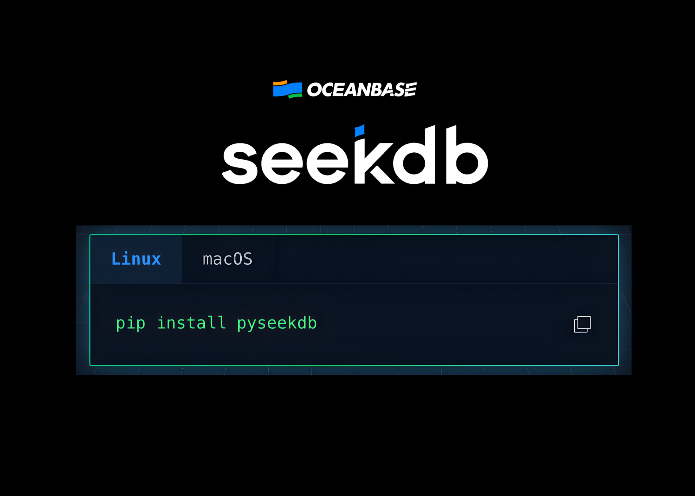

# OceanBase Releases seekdb: An Open Source AI Native Hybrid Search Database for Multi-model RAG and AI Agents

> AI applications rarely deal with one clean table. They mix user profiles, chat logs, JSON metadata, embeddings, and sometimes spatial data. Most teams answer this with a patchwork of an OLTP database, a vector store, and a search engine. OceanBase released seekdb, an open source AI focused database (under the Apache 2.0 license). seekdb is […]

AI applications rarely deal with one clean table. They mix user profiles, chat logs, JSON metadata, embeddings, and sometimes spatial data. Most teams answer this with a patchwork of an OLTP database, a vector store, and a search engine. **[OceanBase](https://www.oceanbase.ai/)** released **[seekdb](https://pxllnk.co/4orh5qr)**, an open source AI focused database (under the Apache 2.0 license). seekdb is described as an AI native search database that unifies relational data, vector data, text, JSON, and GIS in one engine and exposes hybrid search and in database AI workflows.

### What is seekdb?

**[seekdb](https://pxllnk.co/4orh5qr)** is positioned as the lightweight, embedded version of the OceanBase engine, aimed at AI applications rather than general purpose distributed deployments. It runs as a single node database, supports embedded mode and client or server mode, and remains compatible with MySQL drivers and SQL syntax.

In the capability matrix, **[seekdb](https://pxllnk.co/4orh5qr) is marked as:**

- Embedded database supported

- Standalone database supported

- Distributed database not supported

while the full OceanBase product covers the distributed case.

From a data model perspective, **[seekdb](https://pxllnk.co/4orh5qr) supports:**

- Relational data with standard SQL

- Vector search

- Full text search

- JSON data

- Spatial GIS data

all inside one storage and indexing layer.

### Hybrid search as the core feature

The main feature OceanBase pushes is hybrid search. This is search that combines vector based semantic retrieval, full text keyword retrieval, and scalar filters in a single query and a single ranking step.

**[seekdb](https://pxllnk.co/4orh5qr) implements hybrid search through a system package named DBMS_HYBRID_SEARCH with two entry points:**

- DBMS_HYBRID_SEARCH.SEARCH which returns results as JSON, sorted by relevance

- DBMS_HYBRID_SEARCH.GET_SQL which returns the concrete SQL string used for execution

**The hybrid search path can run:**

- pure vector search

- pure full text search

- combined hybrid search

and can push relational filters and joins down into storage. It also supports query reranking strategies like weighted scores and reciprocal rank fusion and can plug in large language model based re-rankers.

For retrieval augmented generation (RAG) and agent memory, this means you can write a single SQL query that does semantic matching on embeddings, exact matching on product codes or proper nouns, and relational filtering on user or tenant scopes.

### Vector and full text engine details

At its core, seekdb exposes a **modern vector** and** full text stack.**

**For vectors, seekdb:**

- supports dense vectors and sparse vectors

- supports Manhattan, Euclidean, inner product, and cosine distance metrics

- provides in memory index types such as HNSW, HNSW SQ, HNSW BQ

- provides disk based index types including IVF and IVF PQ

Hybrid vector index show how you can store raw text, let seekdb call an embedding model automatically, and have the system maintain the corresponding vector index without a separate preprocessing pipeline.

**For text, seekdb offers full text search with:**

- keyword, phrase, and Boolean queries

- BM25 ranking for relevance

- multiple tokenizer modes

The key point is that full text and vector indexes are first class and are integrated in the same query planner as scalar indexes and GIS indexes, so hybrid search does not need external orchestration.

### AI functions inside the database

**[seekdb](https://pxllnk.co/4orh5qr)** includes built in AI function expressions that let you call models directly from SQL, without a separate application service mediating every call. **The main functions are:**

- AI_EMBED to convert text into embeddings

- AI_COMPLETE for text generation using a chat or completion model

- AI_RERANK to rerank a list of candidatesAI_PROMPT to assemble prompt templates and dynamic values into a JSON object for AI_COMPLETE

Model metadata and endpoints are managed by the DBMS_AI_SERVICE package, which lets you register external providers, set URLs, and configure keys, all on the database side. 

### Multimodal data and workloads

**[seekdb](https://pxllnk.co/4orh5qr)** is built to handle multiple data modalities in one node. it has a multimodal data and indexing layer that covers vectors, text, JSON, and GIS, and a multi-model compute layer for hybrid workloads across vector, full text, and scalar conditions.

It also provides JSON indexes for metadata queries and GIS indexes for spatial conditions. **This allows queries like:**

- find semantically similar documents

- filter by JSON metadata like tenant, region, or category

- constrain by spatial range or polygon

without leaving the same engine.

Because seekdb is derived from the OceanBase engine, it inherits ACID transactions, row and column hybrid storage, and vectorized execution, although high scale distributed deployments remain a job for the full OceanBase database.

### Comparison Table

### Key Takeaways

- **AI native hybrid search: s**eekdb unifies vector search, full text search and relational filtering in a single SQL and DBMS_HYBRID_SEARCH interface, so RAG and agent workloads can run multi signal retrieval in one query instead of stitching together multiple engines.

- **Multimodal data in one engine: **seekdb stores and indexes relational data, vectors, text, JSON and GIS in the same engine, which lets AI applications keep documents, embeddings and metadata consistent without maintaining separate databases.

- **In database AI functions for RAG: **With AI_EMBED, AI_COMPLETE, AI_RERANK and AI_PROMPT, seekdb can call embedding models, LLMs and rerankers directly from SQL, which simplifies RAG pipelines and moves more orchestration logic into the database layer.

- **Single node, embedded friendly design: **seekdb is a single node, MySQL compatible engine that supports embedded and standalone modes, while distributed, large scale deployments remain the role of full OceanBase, which makes seekdb suitable for local, edge and service embedded AI workloads.

- **Open source and tool ecosystem: **seekdb is open sourced under Apache 2.0 and integrates with a growing ecosystem of AI tools and frameworks, with Python support via pyseekdb and MCP based integration for code assistants and agents, so it can act as a unified data plane for AI applications.

---

Check out the **[Repo](https://pxllnk.co/4orh5qr)** and **[Project](https://www.oceanbase.ai/)**. Feel free to check out our **[GitHub Page for Tutorials, Codes and Notebooks](https://github.com/Marktechpost/AI-Tutorial-Codes-Included)**. Also, feel free to follow us on **[Twitter](https://x.com/intent/follow?screen_name=marktechpost)** and don’t forget to join our **[100k+ ML SubReddit](https://www.reddit.com/r/machinelearningnews/)** and Subscribe to **[our Newsletter](https://www.aidevsignals.com/)**. Wait! are you on telegram? **[now you can join us on telegram as well.](https://t.me/machinelearningresearchnews)**
