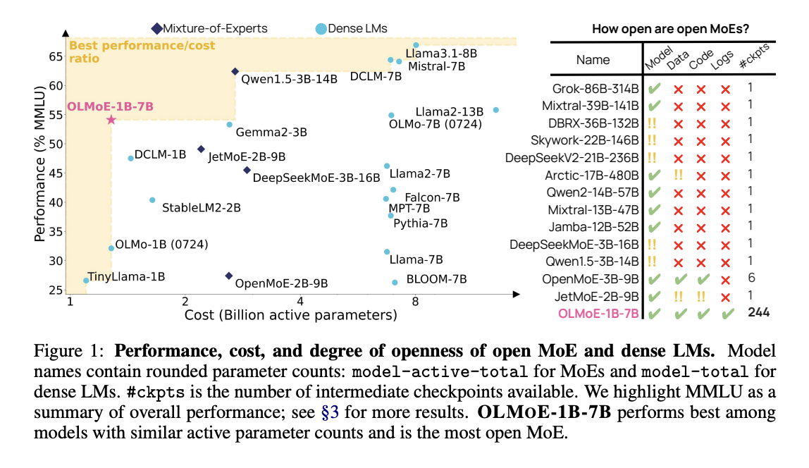

# OLMoE-1B-7B and OLMoE-1B-7B-INSTRUCT Released: A Fully Open-Sourced Mixture-of-Experts LLM with 1B Active and 7B Total Parameters

> Large-scale language models have become integral to natural language processing (NLP) advancements, transforming how machines understand and generate human language. These models have demonstrated remarkable abilities in various tasks, such as text generation, translation, and question-answering. Their development has been fueled by the availability of massive datasets and the use of sophisticated algorithms, allowing them […]

Large-scale language models have become integral to natural language processing (NLP) advancements, transforming how machines understand and generate human language. These models have demonstrated remarkable abilities in various tasks, such as text generation, translation, and question-answering. Their development has been fueled by the availability of massive datasets and the use of sophisticated algorithms, allowing them to process and respond in human-like ways. However, scaling these models comes with significant computational costs, making it increasingly difficult for all but the most well-funded institutions to utilize them effectively. The balance between the sheer power of these models and their computational efficiency remains a critical area of exploration within the field of NLP.

A key challenge facing the NLP community is the high computational cost of training and deploying state-of-the-art language models. While these models, such as GPT-4 and Llama2, offer impressive performance, their resource requirements are enormous. For instance, GPT-4 reportedly requires hundreds of GPUs and vast amounts of memory to function, which makes it inaccessible to smaller research teams and open-source developers. The inefficiency stems from the dense structure of these models, where all parameters are activated for every input. This dense activation leads to unnecessary resource usage, especially when a more targeted approach could suffice. The high cost of using such models limits access and creates a barrier to innovation and experimentation for smaller teams.

Historically, the predominant approach to this problem has been using dense models, where each model layer activates all its parameters for every piece of input data. While this approach ensures comprehensive coverage, it is highly inefficient in terms of both memory and processing power. Some models, such as the Llama2-13B and DeepSeekMoE-16B, have attempted to optimize this through various architectures. Still, these methods remain largely closed-source, limiting the broader community’s ability to improve or adapt them. Industry leaders have adopted certain sparse models, notably the Gemini-1.5 model, which has implemented a Mixture-of-Experts (MoE) approach to manage the balance between cost and performance. Despite this, most sparse models available today remain proprietary, and critical details about their training and data usage are often undisclosed.

Researchers from the Allen Institute for AI, Contextual AI, University of Washington, and Princeton University introduced [**OLMoE**](https://github.com/allenai/OLMoE), a new open-source Mixture-of-Experts language model that combines efficiency with high performance. OLMoE introduces a sparse architecture that activates only a small subset of its parameters, or “experts,” for each input token, significantly reducing the computational power needed. This is a major shift from dense models, where all parameters are engaged for every token. They have introduced two versions of the OLMoE model: [**OLMoE-1B-7B**](https://huggingface.co/allenai/OLMoE-1B-7B-0924) and [**OLMoE-1B-7B-INSTRUCT**](https://huggingface.co/allenai/OLMoE-1B-7B-0924-Instruct). OLMoE-1B-7B has a total of 7 billion parameters but uses only 1 billion active parameters per input token, while OLMoE-1B-7B-INSTRUCT builds upon this with additional fine-tuning to improve task-specific performance.

OLMoE’s architecture focuses on efficiency by implementing fine-grained routing and small expert groups. It includes 64 small experts in each layer, of which only eight are activated simultaneously. This granularity enables the model to handle various tasks more efficiently than models that activate all parameters per token. The model was pre-trained on 5 trillion tokens, creating a strong foundation for performance across a wide range of NLP tasks. The training process employed two auxiliary losses, load balancing, and router z-losses, to ensure that parameters are used optimally across different layers, enhancing stability and performance. These design decisions allow OLMoE to be more efficient than comparable dense models, such as the OLMo-7B, which requires significantly more active parameters per token input.

The performance of OLMoE-1B-7B has been benchmarked against several leading models, demonstrating significant improvements in efficiency and results. For example, OLMoE outperformed larger models, including Llama2-13B and DeepSeekMoE-16B, on common NLP benchmarks such as MMLU, GSM8k, and HumanEval. These benchmarks are important as they test a model’s capability across various tasks, including logical reasoning, mathematics, and natural language understanding. OLMoE-1B-7B delivered results on par with these larger models while using only 1.3 billion active parameters, which is significantly more cost-effective. This is particularly noteworthy because it shows that sparse models like OLMoE can achieve competitive performance without requiring the vast computational resources that dense models need. OLMoE’s ability to outperform models with 10x more active parameters demonstrates its efficiency and value in AI.

In conclusion, OLMoE addresses the problem of inefficiency in traditional dense models by introducing a sparse Mixture-of-Experts approach that reduces resource usage without compromising results. With 7 billion parameters but only 1.3 billion activated per token, OLMoE-1B-7B and its fine-tuned variant OLMoE-1B-7B-INSTRUCT provide more accessible solutions for researchers and developers seeking high-performance language models without the prohibitive costs typically associated with them. This open-source initiative sets a new standard in the field by making its model, data, and training logs available for public use, encouraging further innovation and experimentation.

---

Check out the **[Paper ](https://arxiv.org/abs/2409.02060)and [Model Card.](https://huggingface.co/allenai/OLMoE-1B-7B-0924)** All credit for this research goes to the researchers of this project. Also, don’t forget to follow us on **[Twitter](https://twitter.com/Marktechpost)** and [**LinkedIn**](https://www.linkedin.com/company/marktechpost/?viewAsMember=true). Join our **[Telegram Channel](https://www.zyphra.com/post/zamba2-mini)**. **If you like our work, you will love our**[** newsletter..**](https://marktechpost-newsletter.beehiiv.com/subscribe)

Don’t Forget to join our **[50k+ ML SubReddit](https://www.reddit.com/r/machinelearningnews/)**
