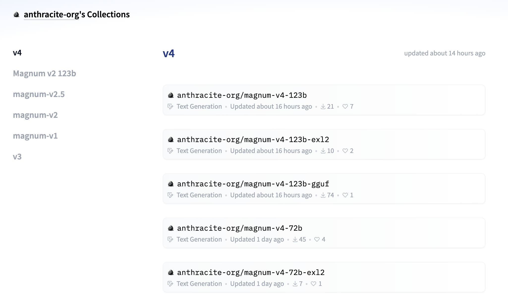

# Open Collective Releases Magnum/v4 Series Models From 9B to 123B Parameters

> In the rapidly evolving world of AI, challenges related to scalability, performance, and accessibility remain central to the efforts of research communities and open-source advocates. Issues such as the computational demands of large-scale models, the lack of diverse model sizes for different use cases, and the need to balance accuracy with efficiency are critical obstacles. […]

In the rapidly evolving world of AI, challenges related to scalability, performance, and accessibility remain central to the efforts of research communities and open-source advocates. Issues such as the computational demands of large-scale models, the lack of diverse model sizes for different use cases, and the need to balance accuracy with efficiency are critical obstacles. As organizations increasingly depend on AI to solve diverse problems, there is a growing need for models that are both versatile and scalable.

[Open Collective](https://opencollective.com/) has recently introduced the Magnum/v4 series, which includes models of 9B, 12B, 22B, 27B, 72B, and 123B parameters. This release marks a significant milestone for the open-source community, as it aims to create a new standard in large language models that are freely available for researchers and developers. Magnum/v4 is more than just an incremental update—it represents a full-fledged commitment to creating models that can be leveraged by those who want both breadth and depth in their AI capabilities. The diversity in sizes also reflects the broadening scope of AI development, allowing developers the flexibility to choose models based on specific requirements, whether they need compact models for edge computing or massive models for cutting-edge research. This approach fosters inclusivity in AI development, enabling even those with limited resources to access high-performing models.

Technically, the Magnum/v4 models are designed with flexibility and efficiency in mind. With parameter counts ranging from 9 billion to 123 billion, these models cater to different computational limits and use cases. For example, the smaller 9B and 12B parameter models are suitable for tasks where latency and speed are crucial, such as interactive applications or real-time inference. On the other hand, the 72B and 123B models provide the sheer power needed for more intensive natural language processing tasks, like deep content generation or complex reasoning. Furthermore, these models have been trained on a diverse dataset aimed at reducing bias and improving generalizability. They integrate advancements like efficient training optimizations, parameter sharing, and improved sparsity techniques, which contribute to a balance between computational efficiency and high-quality outputs.

The importance of the Magnum/v4 models cannot be overstated, particularly in the context of the current AI landscape. These models contribute towards democratizing access to cutting-edge AI technologies. Notably, Open Collective’s release provides a seamless solution for researchers, enthusiasts, and developers who are constrained by the availability of computational resources. Unlike proprietary models locked behind exclusive paywalls, Magnum/v4 stands out due to its open nature and adaptability, allowing experimentation without restrictive licensing. Early results demonstrate impressive gains in language understanding and generation across a variety of tasks, with benchmarks indicating that the 123B model, in particular, offers performance comparable to leading proprietary models. This represents a key achievement in the open-source domain, highlighting the potential of community-driven model development in narrowing the gap between open and closed AI ecosystems.

Open Collective’s Magnum/v4 models make powerful AI tools accessible to a wider community. By offering models from 9B to 123B parameters, they empower both small and large-scale AI projects, fostering innovation without resource constraints. As AI reshapes industries, Magnum/v4 contributes to a more inclusive, open, and collaborative future.

---

Check out the** [Model Series here on HuggingFace.](https://huggingface.co/collections/anthracite-org/v4-671450072656036945a21348)** All credit for this research goes to the researchers of this project. Also, don’t forget to follow us on **[Twitter](https://twitter.com/Marktechpost)** and join our **[Telegram Channel](https://pxl.to/at72b5j)** and [**LinkedIn Gr**](https://www.linkedin.com/groups/13668564/)[**oup**](https://www.linkedin.com/groups/13668564/). **If you like our work, you will love our**[** newsletter..**](https://marktechpost-newsletter.beehiiv.com/subscribe) Don’t Forget to join our **[50k+ ML SubReddit](https://www.reddit.com/r/machinelearningnews/)**.

**[[Upcoming Live Webinar- Oct 29, 2024] ](https://go.predibase.com/predibase-inference-engine-102924-lp?utm_medium=3rdparty&utm_source=marktechpost)****[The Best Platform for Serving Fine-Tuned Models: Predibase Inference Engine (Promoted)](https://go.predibase.com/predibase-inference-engine-102924-lp?utm_medium=3rdparty&utm_source=marktechpost)**
