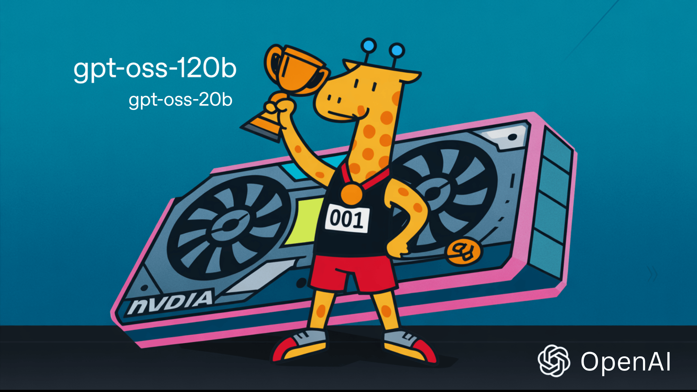

# OpenAI Just Released the Hottest Open-Weight LLMs: gpt-oss-120B (Runs on a High-End Laptop) and gpt-oss-20B (Runs on a Phone)

> OpenAI has just sent seismic waves through the AI world: for the first time since GPT-2 hit the scene in 2019, the company is releasing not one, but TWO open-weight language models. Meet gpt-oss-120b and gpt-oss-20b—models that anyone can download, inspect, fine-tune, and run on their own hardware. This launch doesn’t just shift the AI […]

OpenAI has just sent seismic waves through the AI world: for the first time since GPT-2 hit the scene in 2019, the company is releasing not one, but TWO open-weight language models. Meet **gpt-oss-120b** and **gpt-oss-20b**—models that anyone can download, inspect, fine-tune, and run on their own hardware. This launch doesn’t just shift the AI landscape; it detonates a new era of transparency, customization, and raw computational power for researchers, developers, and enthusiasts everywhere.

### Why Is This Release a Big Deal?

OpenAI has long cultivated a reputation for both jaw-dropping model capabilities and a fortress-like approach to proprietary tech. That changed on August 5, 2025. These new models are distributed under the permissive **Apache 2.0 license**, making them open for commercial and experimental use. The difference? Instead of hiding behind cloud APIs, **anyone** can now put OpenAI-grade models under their microscope—or put them directly to work on problems at the edge, in enterprise, or even on consumer devices.

### Meet the Models: Technical Marvels with Real-World Muscle

#### gpt-oss-120B

- **Size:** 117 billion parameters (with 5.1 billion active parameters per token, thanks to Mixture-of-Experts tech)

- **Performance:** Punches at the level of OpenAI’s o4-mini (or better) in real-world benchmarks.

- **Hardware:** Runs on a single high-end GPU—think Nvidia H100, or 80GB-class cards. No server farm required.

- **Reasoning:** Features chain-of-thought and agentic capabilities—ideal for research automation, technical writing, code generation, and more.

- **Customization:** Supports configurable “reasoning effort” (low, medium, high), so you can dial up power when needed or save resources when you don’t.

- **Context:** Handles up to a massive 128,000 tokens—enough text to read entire books at a time.

- **Fine-Tuning:** Built for easy customization and local/private inference—no rate limits, full data privacy, and total deployment control.

### gpt-oss-20B

- **Size:** 21 billion parameters (with 3.6 billion active parameters per token, also Mixture-of-Experts).

- **Performance:** Sits squarely between o3-mini and o4-mini in reasoning tasks—on par with the best “small” models available.

- **Hardware:** Runs on consumer-grade laptops—with just 16GB RAM or equivalent, it’s the most powerful open-weight reasoning model you can fit on a phone or local PC.

- **Mobile Ready:** Specifically optimized to deliver low-latency, private on-device AI for smartphones (including Qualcomm Snapdragon support), edge devices, and any scenario needing local inference minus the cloud.

- **Agentic Powers:** Like its big sibling, 20B can use APIs, generate structured outputs, and execute Python code on demand.

### Technical Details: Mixture-of-Experts and MXFP4 Quantization

Both models use a **Mixture-of-Experts (MoE)** architecture, only activating a handful of “expert” subnetworks per token. The result? Enormous parameter counts with modest memory usage and lightning-fast inference—perfect for today’s high-performance consumer and enterprise hardware.

Add to that **native MXFP4 quantization**, shrinking model memory footprints without sacrificing accuracy. The 120B model fits snugly onto a single advanced GPU; the 20B model can run comfortably on laptops, desktops, and even mobile hardware.

### Real-World Impact: Tools for Enterprise, Developers, and Hobbyists

- **For Enterprises:** On-premises deployment for data privacy and compliance. No more black-box cloud AI: financial, healthcare, and legal sectors can now own and secure every bit of their LLM workflow.

- **For Developers:** Freedom to tinker, fine-tune, and extend. No API limits, no SaaS bills, just pure, customizable AI with full control over latency or cost.

- **For the Community:** Models are already available on Hugging Face, Ollama, and more—go from download to deployment in minutes.

### How Does GPT-OSS Stack Up?

Here’s the kicker: **gpt-oss-120B is the first freely available open-weight model that matches the performance of top-tier commercial models like o4-mini**. The 20B variant not only bridges the performance gap for on-device AI but will likely accelerate innovation and push boundaries on what’s possible with local LLMs.

### The Future Is Open (Again)

OpenAI’s GPT-OSS isn’t just a release; it’s a clarion call. By making state-of-the-art reasoning, tool use, and agentic capabilities available for anyone to inspect and deploy, OpenAI throws open the door to an entire community of makers, researchers, and enterprises—not just to use, but to build on, iterate, and evolve.

---

Check out the **[gpt-oss-120B](https://huggingface.co/openai/gpt-oss-120b)**, **[gpt-oss-20B](https://huggingface.co/openai/gpt-oss-20b)** and  **[Technical Blog](https://openai.com/index/introducing-gpt-oss/)_._** Feel free to check out our **[GitHub Page for Tutorials, Codes and Notebooks](https://github.com/Marktechpost/AI-Tutorial-Codes-Included)**. Also, feel free to follow us on **[Twitter](https://x.com/intent/follow?screen_name=marktechpost)** and don’t forget to join our **[100k+ ML SubReddit](https://www.reddit.com/r/machinelearningnews/)** and Subscribe to **[our Newsletter](https://www.aidevsignals.com/)**.
