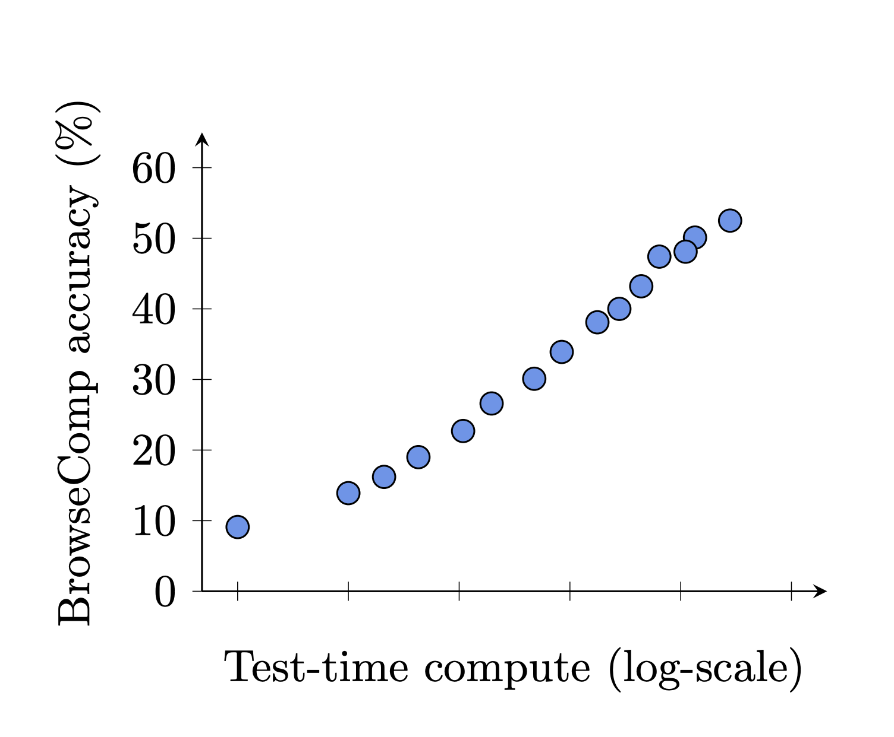

# OpenAI Open Sources BrowseComp: A New Benchmark for Measuring the Ability for AI Agents to Browse the Web

> Despite advances in large language models (LLMs), AI agents still face notable limitations when navigating the open web to retrieve complex information. While many models excel on static knowledge benchmarks, they often underperform when tasked with locating nuanced, context-dependent facts across multiple sources. Most existing benchmarks evaluate a model’s recall of easily accessible knowledge, which […]

Despite advances in large language models (LLMs), AI agents still face notable limitations when navigating the open web to retrieve complex information. While many models excel on static knowledge benchmarks, they often underperform when tasked with locating nuanced, context-dependent facts across multiple sources. Most existing benchmarks evaluate a model’s recall of easily accessible knowledge, which does not reflect the intricacy of real-world browsing tasks. In contrast, agents operating in applied settings—whether assisting with research, summarizing policy, or fact-checking claims—require persistence, structured reasoning, and the ability to dynamically adapt their search strategies. These capabilities remain underdeveloped in current AI systems.

**OpenAI Open Sources BrowseComp: A Benchmark of 1,266 Information-Seeking Tasks**

To better evaluate these capabilities, OpenAI has released **BrowseComp**, a benchmark designed to assess agents’ ability to persistently browse the web and retrieve hard-to-find information. The benchmark includes 1,266 fact-seeking problems, each with a short, unambiguous answer. Solving these tasks often requires navigating through multiple webpages, reconciling diverse information, and filtering relevant signals from noise.

The benchmark is inspired by the notion that just as programming competitions serve as focused tests for coding agents, BrowseComp offers a similarly constrained yet revealing evaluation of web-browsing agents. It deliberately avoids tasks with ambiguous user goals or long-form outputs, focusing instead on the core competencies of precision, reasoning, and endurance.

BrowseComp is created using a reverse-question design methodology: beginning with a specific, verifiable fact, they constructed a question designed to obscure the answer through complexity and constraint. Human trainers ensured that questions could not be solved via superficial search and would challenge both retrieval and reasoning capabilities. Additionally, questions were vetted to ensure they would not be easily solvable by GPT-4, OpenAI o1, or earlier browsing-enabled models.

The dataset spans a broad range of domains—including science, history, arts, sports, and entertainment—and is balanced to promote topic diversity. Each task is formulated so that the correct answer is a short string, which simplifies evaluation and reduces ambiguity. Human performance was also assessed, with human trainers given two hours per task; most failed to solve the majority of tasks, reflecting their difficulty.

**Model Evaluation and Findings**

OpenAI evaluated several models on BrowseComp, including GPT-4o (with and without browsing), GPT-4.5, OpenAI o1, and Deep Research—a model specifically trained to handle persistent browsing tasks. The results indicate that models without advanced search or reasoning strategies perform poorly: GPT-4o without browsing achieved 0.6% accuracy, and with browsing enabled, only 1.9%. GPT-4.5 scored similarly low. OpenAI o1, with improved reasoning but no browsing, performed moderately better at 9.9%.

Deep Research outperformed all other models, achieving 51.5% accuracy. Its architecture and training emphasize iterative searching, evidence synthesis, and adaptive navigation. Performance improved further with multiple trials per question and aggregation strategies such as best-of-N selection and confidence-based voting. While Deep Research exhibited higher calibration error—frequently being overconfident in incorrect answers—it often identified its own correct outputs with internal consistency, suggesting a usable confidence signal.

**Human Performance and Task Difficulty**

Human trainers attempted to solve the benchmark problems without the assistance of AI tools. Of the 1,255 attempted tasks, 71% were marked as unsolvable within the two-hour window, and only 29% were successfully completed. Among those, the agreement rate with the reference answer was 86.4%. These outcomes underscore the complexity of the benchmark and suggest that current AI models still fall short of the adaptability and background reasoning skills needed for such tasks.

**Conclusion**

BrowseComp introduces a focused, verifiable, and technically demanding benchmark for evaluating the core capabilities of web-browsing agents. By shifting emphasis from static recall to dynamic retrieval and multi-hop reasoning, it presents a realistic challenge that aligns closely with emerging real-world applications. Although current models, including those with browsing capabilities, perform unevenly, the Deep Research agent illustrates the potential of dedicated architectures to bridge this gap.

---

BrowseComp is publicly available via [**GitHub**](https://github.com/openai/simple-evals) and detailed on [**OpenAI’s official blog**](https://openai.com/index/browsecomp/)**_._** Check out the **[Paper here](https://cdn.openai.com/pdf/5e10f4ab-d6f7-442e-9508-59515c65e35d/browsecomp.pdf)**. All credit for this research goes to the researchers of this project. Also, feel free to follow us on **[Twitter](https://x.com/intent/follow?screen_name=marktechpost)** and don’t forget to join our **[85k+ ML SubReddit](https://www.reddit.com/r/machinelearningnews/)**.
