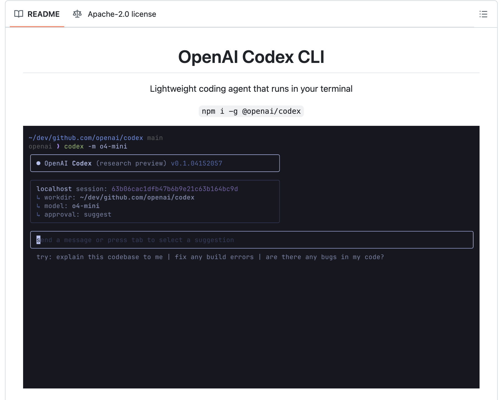

# OpenAI Releases Codex CLI: An Open-Source Local Coding Agent that Turns Natural Language into Working Code

> Command-line interfaces (CLIs) are indispensable tools for developers, offering powerful capabilities for system management and automation. However, they require precise syntax and a thorough understanding of commands, which can be a barrier for newcomers and a source of inefficiency for experienced users. The necessity to recall exact command structures and the potential for errors can […]

Command-line interfaces (CLIs) are indispensable tools for developers, offering powerful capabilities for system management and automation. However, they require precise syntax and a thorough understanding of commands, which can be a barrier for newcomers and a source of inefficiency for experienced users. The necessity to recall exact command structures and the potential for errors can hinder productivity and increase the learning curve associated with CLI usage.​

### Codex CLI: Bridging Natural Language and Code

To mitigate these challenges, OpenAI has introduced Codex CLI, an open-source tool designed to operate within terminal environments. Codex CLI enables users to input natural language commands, which are then translated into executable code by OpenAI’s language models. This functionality allows developers to perform tasks such as building features, debugging code, or understanding complex codebases through intuitive, conversational interactions. By integrating natural language processing into the CLI, Codex CLI aims to streamline development workflows and reduce the cognitive load associated with traditional command-line operations.​

### Technical Overview and Benefits

Codex CLI leverages OpenAI’s advanced language models, including the o3 and o4-mini, to interpret user inputs and execute corresponding actions within the local environment. The tool supports multimodal inputs, allowing users to provide screenshots or sketches alongside textual prompts, enhancing its versatility in handling diverse development tasks. Operating locally ensures that code execution and file manipulations occur within the user’s system, maintaining data privacy and reducing latency. Additionally, Codex CLI offers configurable autonomy levels through the `--approval-mode` flag, enabling users to control the extent of automated actions, ranging from suggestion-only to full auto-approval modes. This flexibility allows developers to tailor the tool’s behavior to their specific needs and comfort levels.​

While Codex CLI represents a significant step towards AI-assisted development, OpenAI envisions further evolution towards an “agentic software engineer”—a comprehensive system capable of autonomously handling entire development cycles, from conception to deployment. This future direction suggests a continued focus on enhancing the capabilities of AI tools to support more complex and integrated development tasks.​

### Conclusion

OpenAI’s Codex CLI offers a novel approach to software development by integrating natural language processing into terminal-based workflows. By translating conversational inputs into executable code, it simplifies interactions with complex systems and reduces the barriers associated with traditional CLI usage. The tool’s open-source nature and community-focused initiatives further support its potential for widespread adoption and continuous improvement. As Codex CLI and its surrounding ecosystem evolve, it may become an essential component in the toolkit of modern developers seeking more intuitive and efficient development experiences.

---

Here is the **_[GitHub Repo](https://github.com/openai/codex)_**. Also, don’t forget to follow us on **[Twitter](https://x.com/intent/follow?screen_name=marktechpost)** and join our **[Telegram Channel](https://arxiv.org/abs/2406.09406)** and [**LinkedIn Gr**](https://www.linkedin.com/groups/13668564/)[**oup**](https://www.linkedin.com/groups/13668564/). Don’t Forget to join our **[90k+ ML SubReddit](https://www.reddit.com/r/machinelearningnews/)**.

[**🔥 [Register Now] miniCON Virtual Conference on AGENTIC AI: FREE REGISTRATION + Certificate of Attendance + 4 Hour Short Event (May 21, 9 am- 1 pm PST) + Hands on Workshop**](https://minicon.marktechpost.com/)
