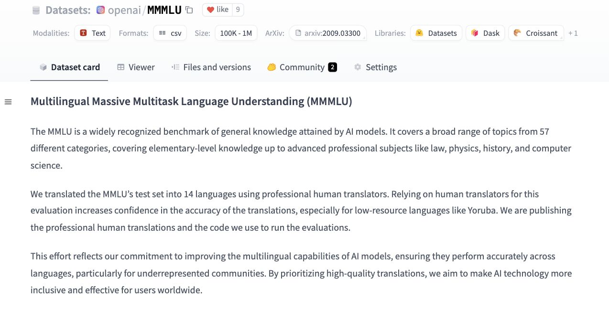

# OpenAI Releases Multilingual Massive Multitask Language Understanding (MMMLU) Dataset on Hugging Face to Easily Evaluate Multilingual LLMs

> OpenAI released the Multilingual Massive Multitask Language Understanding (MMMLU) dataset on Hugging Face. As language models grow increasingly powerful, the necessity of evaluating their capabilities across diverse linguistic, cognitive, and cultural contexts has become a pressing concern. OpenAI’s decision to introduce the MMMLU dataset addresses this challenge by offering a robust, multilingual, and multitask dataset […]

OpenAI released the [**Multilingual Massive Multitask Language Understanding (MMMLU) dataset**](https://huggingface.co/datasets/openai/MMMLU) on Hugging Face. As language models grow increasingly powerful, the necessity of evaluating their capabilities across diverse linguistic, cognitive, and cultural contexts has become a pressing concern. OpenAI’s decision to introduce the MMMLU dataset addresses this challenge by offering a robust, multilingual, and multitask dataset designed to assess the performance of large language models (LLMs) on various tasks.

This dataset comprises a comprehensive collection of questions covering various topics, subject areas, and languages. It is structured to evaluate a model’s performance on tasks that require general knowledge, reasoning, problem-solving, and comprehension across different fields of study. The creation of MMMLU reflects OpenAI’s focus on measuring models’ real-world proficiency, especially in languages that are underrepresented in NLP research. Including diverse languages ensures that models are effective in English and can perform competently in other languages spoken globally.

**Core Features of the MMMLU Dataset**

The MMMLU dataset is one of the most extensive benchmarks of its kind, representing multiple tasks that range from high-school-level questions to advanced professional and academic knowledge. It offers researchers and developers a means of testing their models across various subjects, such as humanities, sciences, and technical topics, with questions that span difficulty levels. These questions are carefully curated to ensure they test models on more than surface-level understanding. Instead, MMMLU delves into deeper cognitive abilities, including critical reasoning, interpretation, and problem-solving across various fields.

Another noteworthy feature of the MMMLU dataset is its multilingual scope. This dataset supports various languages, enabling comprehensive evaluation across linguistic boundaries. In the past, many language models, including those developed by OpenAI, have demonstrated proficiency primarily in English due to the abundance of training data in this language. However, models trained on English data often need help maintaining accuracy and coherence when working in other languages. The MMMLU dataset helps bridge this gap by offering a framework for testing models in languages traditionally underrepresented in NLP research.

The release of MMMLU addresses several pertinent challenges in the AI community. It provides a more diverse and culturally inclusive approach to evaluating models, ensuring they perform well in high-resource and low-resource languages. MMMLU’s multitasking nature pushes the boundaries of existing benchmarks by assessing the same model across various tasks, from trivia-like factual recall to complex reasoning and problem-solving. This allows for a more granular understanding of a model’s strengths and weaknesses across different domains.

**OpenAI’s Commitment to Responsible AI Development**

The MMMLU dataset also reflects OpenAI’s broader commitment to transparency, accessibility, and fairness in AI research. By releasing the dataset on Hugging Face, OpenAI ensures it is available to the wider research community. Hugging Face, a popular platform for hosting machine learning models and datasets is a collaborative space for developers and researchers to access and contribute to the latest advancements in NLP and AI. The availability of the MMMLU dataset on this platform underscores OpenAI’s belief in open science and the need for community-wide participation in advancing AI.

OpenAI’s decision to release MMMLU publicly also highlights its commitment to fairness and inclusivity in AI. By providing researchers and developers with a tool to evaluate their models across multiple languages and tasks, OpenAI enables more equitable progress in NLP. Benchmarks have been criticized for favoring English and other widely spoken languages, leaving lower-resource languages underrepresented. The multilingual nature of MMMLU helps address this disparity, allowing for a more comprehensive evaluation of models in diverse linguistic contexts.

MMMLU’s multitask framework ensures that language models are tested not just on factual recall but also on reasoning, problem-solving, and comprehension, making it a more robust tool for assessing the practical capabilities of AI systems. As AI technologies are increasingly integrated into everyday applications, from virtual assistants to automated decision-making systems, ensuring that these systems can perform well across a wide range of tasks is critical. MMMLU, in this regard, serves as a crucial benchmark for evaluating the real-world applicability of these models.

**Implications for Future NLP Research**

The release of the MMMLU dataset is expected to have far-reaching implications for future research in natural language processing. With the dataset’s diverse range of tasks and languages, researchers now have a more reliable way to measure the performance of LLMs across various domains. This will likely spur further innovations in developing multilingual models that simultaneously understand and process multiple languages. The multitasking nature of the dataset encourages researchers to build models that are not just linguistically diverse but also proficient in performing a wide range of tasks.

The MMMLU dataset will also play a pivotal role in improving AI fairness. As models are tested across different languages and subject areas, researchers can identify biases in the models’ training data or architecture. This will lead to more targeted efforts to reduce AI bias, particularly regarding underrepresented languages and cultures.

OpenAI’s release of the Multilingual Massive Multitask Language Understanding (MMMLU) dataset is a landmark moment in developing more robust, fair, and capable language models. OpenAI addresses important concerns about linguistic inclusivity and fairness in AI research by offering a comprehensive, multilingual, multitask dataset.

---

Check out the **[Dataset](https://huggingface.co/datasets/openai/MMMLU)**. All credit for this research goes to the researchers of this project. Also, don’t forget to follow us on **[Twitter](https://twitter.com/Marktechpost)** and join our **[Telegram Channel](https://pxl.to/at72b5j)** and [**LinkedIn Gr**](https://www.linkedin.com/groups/13668564/)[**oup**](https://www.linkedin.com/groups/13668564/). **If you like our work, you will love our**[** newsletter..**](https://marktechpost-newsletter.beehiiv.com/subscribe)

Don’t Forget to join our **[50k+ ML SubReddit](https://www.reddit.com/r/machinelearningnews/)**

**[⏩ ⏩ FREE AI WEBINAR: ‘SAM 2 for Video: How to Fine-tune On Your Data’ (Wed, Sep 25, 4:00 AM – 4:45 AM EST)](https://encord.com/webinar/sam2-for-video/?utm_medium=affiliate&utm_source=newsletter&utm_campaign=marktechpost&utm_content=sam2video)**
