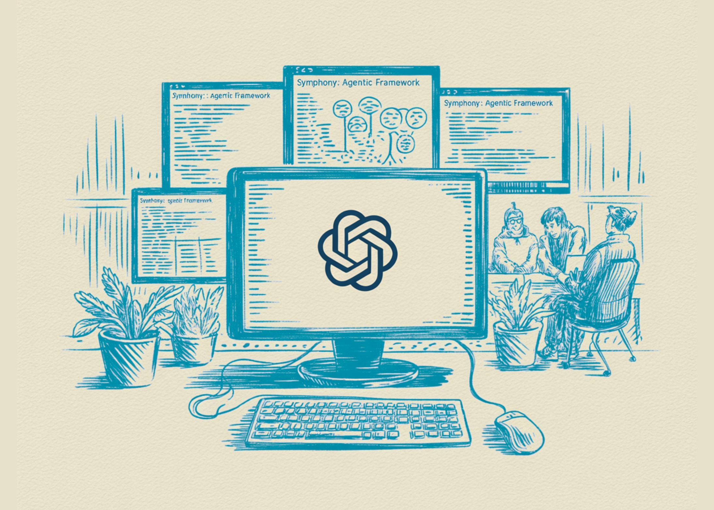

# OpenAI Releases Symphony: An Open Source Agentic Framework for Orchestrating Autonomous AI Agents through Structured, Scalable Implementation Runs

> OpenAI has released Symphony, an open-source framework designed to manage autonomous AI coding agents through structured ‘implementation runs.’ The project provides a system for automating software development tasks by connecting issue trackers to LLM-based agents. System Architecture: Elixir and the BEAM Symphony is built using Elixir and the Erlang/BEAM runtime. The choice of stack focuses […]

OpenAI has released **Symphony**, an open-source framework designed to manage autonomous AI coding agents through structured ‘implementation runs.’ The project provides a system for automating software development tasks by connecting issue trackers to LLM-based agents.

### System Architecture: Elixir and the BEAM

Symphony is built using **Elixir** and the **Erlang/BEAM** runtime. The choice of stack focuses on fault tolerance and concurrency. Since autonomous agents often perform long-running tasks that may fail or require retries, the BEAM’s supervision trees allow Symphony to manage hundreds of isolated implementation runs simultaneously.

The system uses **PostgreSQL** (via Ecto) for state persistence and is designed to run as a persistent daemon. It operates by polling an issue tracker—currently defaulting to **Linear**—to identify tasks that are ready for an agent to address.

### The Implementation Run Lifecycle

The core unit of work in Symphony is the **implementation run**. **The lifecycle of a run follows a specific sequence:**

- **Polling and Triggering:** Symphony monitors a specific state in the issue tracker (e.g., ‘Ready for Agent’).

- **Sandbox Isolation:** For each issue, the framework creates a deterministic, per-issue workspace. This ensures the agent’s actions are confined to a specific directory and do not interfere with other concurrent runs.

- **Agent Execution:** An agent (typically using OpenAI’s models) is initialized to perform the task described in the issue.

- **Proof of Work:** Before a task is considered complete, the agent must provide ‘proof of work.’ This includes generating CI status reports, passing unit tests, providing PR review feedback, and creating a walkthrough of the changes.

- **Landing:** If the proof of work is verified, the agent ‘lands’ the code by submitting or merging a Pull Request (PR) into the repository.

### Configuration via WORKFLOW.md

Symphony utilizes an in-repo configuration file named **`WORKFLOW.md`**. This file serves as the technical contract between the developer team and the agent. **It contains:**

- The agent’s primary system instructions and prompts.

- Runtime settings for the implementation environment.

- Specific rules for how the agent should interact with the codebase.

By keeping these instructions in the repository, teams can version-control their agent policies alongside their source code, ensuring that the agent’s behavior remains consistent with the specific version of the codebase it is modifying.

### Harness Engineering Requirements

The documentation specifies that Symphony is most effective in environments that practice **[harness engineering](https://openai.com/index/harness-engineering/)**. This refers to a repository structure that is optimized for machine interaction. **Key requirements include:**

- **Hermetic Testing:** Tests that can run locally and reliably without external dependencies.

- **Machine-Readable Docs:** Documentation and scripts that allow an agent to discover how to build, test, and deploy the project autonomously.

- **Modular Architecture:** Codebases where side effects are minimized, allowing agents to make changes with high confidence.

### Key Takeaways

- **Fault-Tolerant Orchestration via Elixir:** Symphony utilizes **Elixir and the Erlang/BEAM runtime** to manage agent lifecycles. This architectural choice provides the high concurrency and fault tolerance necessary for supervising long-running, independent ‘implementation runs’ without system-wide failures.

- **State-Managed Implementation Runs:** The framework transitions AI coding from manual prompting to an automated loop: it **polls issue trackers (like Linear)**, creates isolated sandboxed workspaces, executes the agent, and requires ‘Proof of Work’ (CI passes and walkthroughs) before code is merged.

- **Version-Controlled Agent Contracts:** Through the **`WORKFLOW.md`** specification, agent prompts and runtime configurations are stored directly in the repository. This treats the AI’s operating instructions as code, ensuring that agent behavior is versioned and synchronized with the specific branch it is modifying.

- **Dependency on Harness Engineering:** For the system to be effective, repositories must adopt **harness engineering**. This involves structuring codebases for machine legibility, including hermetic (self-contained) test suites and modular architectures that allow agents to verify their own work autonomously.

- **Focused Scheduler Scope:** Symphony is defined strictly as a **scheduler, runner, and tracker reader**. It is designed specifically to bridge the gap between project management tools and code execution, rather than serving as a general-purpose multi-tenant platform or a broad workflow engine.

---

Check out the **[Repo here](https://github.com/openai/symphony?tab=readme-ov-file). **Also, feel free to follow us on **[Twitter](https://x.com/intent/follow?screen_name=marktechpost)** and don’t forget to join our **[120k+ ML SubReddit](https://www.reddit.com/r/machinelearningnews/)** and Subscribe to **[our Newsletter](https://www.aidevsignals.com/)**. Wait! are you on telegram? **[now you can join us on telegram as well.](https://t.me/machinelearningresearchnews)**
