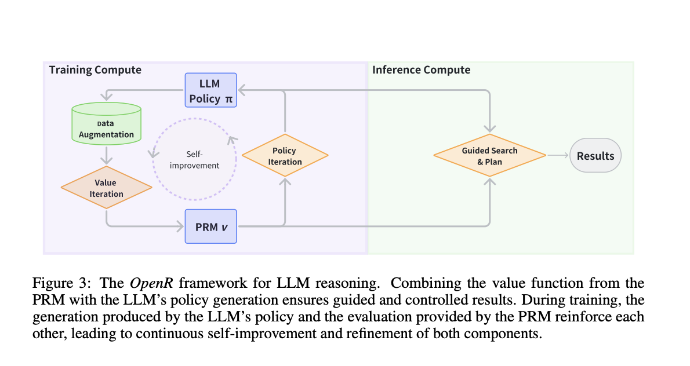

# OpenR: An Open-Source AI Framework Enhancing Reasoning in Large Language Models

> Large language models (LLMs) have made significant progress in language generation, but their reasoning skills remain insufficient for complex problem-solving. Tasks such as mathematics, coding, and scientific questions continue to pose a significant challenge. Enhancing LLMs’ reasoning abilities is crucial for advancing their capabilities beyond simple text generation. The key challenge lies in integrating advanced […]

Large language models (LLMs) have made significant progress in language generation, but their reasoning skills remain insufficient for complex problem-solving. Tasks such as mathematics, coding, and scientific questions continue to pose a significant challenge. Enhancing LLMs’ reasoning abilities is crucial for advancing their capabilities beyond simple text generation. The key challenge lies in integrating advanced learning techniques with effective inference strategies to address these reasoning deficiencies.

### Introducing OpenR

Researchers from University College London, the University of Liverpool, Shanghai Jiao Tong University, The Hong Kong University of Science and Technology (Guangzhou), and Westlake University introduce OpenR, an open-source framework that integrates test-time computation, reinforcement learning, and process supervision to improve LLM reasoning. Inspired by OpenAI’s o1 model, OpenR aims to replicate and advance the reasoning abilities seen in these next-generation LLMs. By focusing on core techniques such as data acquisition, process reward models, and efficient inference methods, OpenR stands as the first open-source solution to provide such sophisticated reasoning support for LLMs. OpenR is designed to unify various aspects of the reasoning process, including both online and offline reinforcement learning training and non-autoregressive decoding, with the goal of accelerating the development of reasoning-focused LLMs.

### Key features: 

- Process-Supervision Data

- Online Reinforcement Learning (RL) Training

- Gen & Discriminative PRM

- Multi-Search Strategies

- Test-time Computation & Scaling

### Structure and Key Components of OpenR

The structure of OpenR revolves around several key components. At its core, it employs data augmentation, policy learning, and inference-time-guided search to reinforce reasoning abilities. OpenR uses a Markov Decision Process (MDP) to model the reasoning tasks, where the reasoning process is broken down into a series of steps that are evaluated and optimized to guide the LLM towards an accurate solution. This approach not only allows for direct learning of reasoning skills but also facilitates the exploration of multiple reasoning paths at each stage, enabling a more robust reasoning process. The framework relies on Process Reward Models (PRMs) that provide granular feedback on intermediate reasoning steps, allowing the model to fine-tune its decision-making more effectively than relying solely on final outcome supervision. These elements work together to refine the LLM’s ability to reason step by step, leveraging smarter inference strategies at test time rather than merely scaling model parameters.

In their experiments, the researchers demonstrated significant improvements in the reasoning performance of LLMs using OpenR. Using the MATH dataset as a benchmark, OpenR achieved around a 10% improvement in reasoning accuracy compared to traditional approaches. Test-time guided search, and the implementation of PRMs played a crucial role in enhancing accuracy, especially under constrained computational budgets. Methods like “Best-of-N” and “Beam Search” were used to explore multiple reasoning paths during inference, with OpenR showing that both methods significantly outperformed simpler majority voting techniques. The framework’s reinforcement learning techniques, especially those leveraging PRMs, proved to be effective in online policy learning scenarios, enabling LLMs to improve steadily in their reasoning over time.

### Conclusion

OpenR presents a significant step forward in the pursuit of improved reasoning abilities in large language models. By integrating advanced reinforcement learning techniques and inference-time guided search, OpenR provides a comprehensive and open platform for LLM reasoning research. The open-source nature of OpenR allows for community collaboration and the further development of reasoning capabilities, bridging the gap between fast, automatic responses and deep, deliberate reasoning. Future work on OpenR will aim to extend its capabilities to cover a wider range of reasoning tasks and further optimize its inference processes, contributing to the long-term vision of developing self-improving, reasoning-capable AI agents.

---

Check out the **[Paper](https://github.com/openreasoner/openr/blob/main/reports/OpenR-Wang.pdf)** and **[GitHub](https://github.com/openreasoner/openr?tab=readme-ov-file)**. All credit for this research goes to the researchers of this project. Also, don’t forget to follow us on **[Twitter](https://twitter.com/Marktechpost)** and join our **[Telegram Channel](https://pxl.to/at72b5j)** and [**LinkedIn Gr**](https://www.linkedin.com/groups/13668564/)[**oup**](https://www.linkedin.com/groups/13668564/). **If you like our work, you will love our**[** newsletter..**](https://marktechpost-newsletter.beehiiv.com/subscribe) Don’t Forget to join our **[50k+ ML SubReddit](https://www.reddit.com/r/machinelearningnews/)**

**[[Upcoming Event- Oct 17, 2024] RetrieveX – The GenAI Data Retrieval Conference (Promoted)](https://www.retrievex.co/application?utm_source=print&utm_medium=markettechpost&utm_campaign=retrievex&utm_term=speakers&utm_content=SIZE)**
