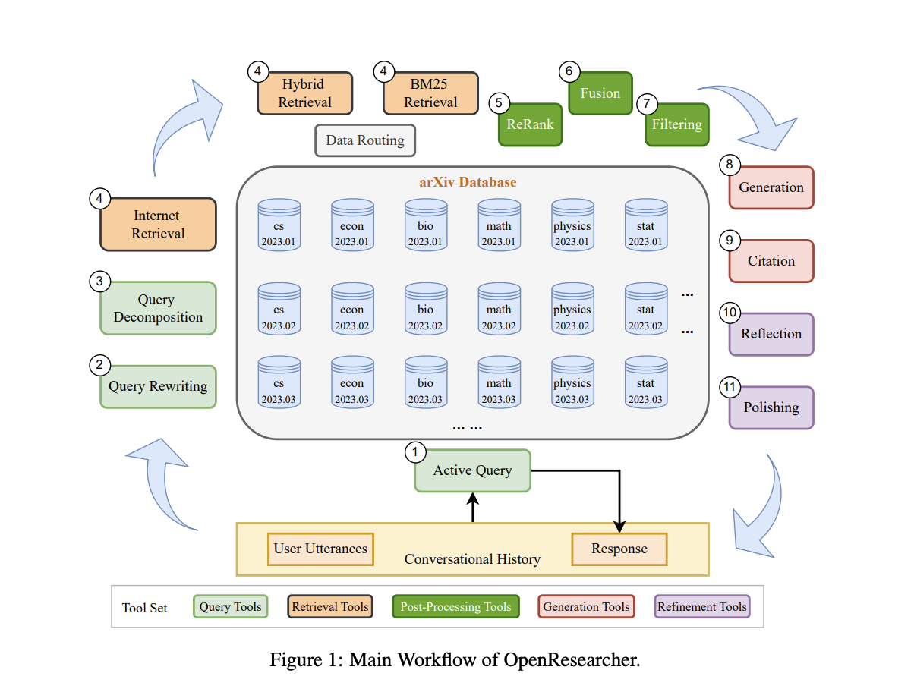

# OpenResearcher: An Open-Source Project that Harnesses AI to Accelerate Scientific Research

> The number of scientific publications is rapidly growing, increasing each year by 4%-5%. This poses a major challenge for researchers who spend most of their time reviewing numerous academic papers to keep updated with their fields. This is essential for staying relevant and innovative in research but can be inefficient and time-consuming. To tackle these […]

The number of scientific publications is rapidly growing, increasing each year by 4%-5%. This poses a major challenge for researchers who spend most of their time reviewing numerous academic papers to keep updated with their fields. This is essential for staying relevant and innovative in research but can be inefficient and time-consuming. To tackle these challenges, the academic community is rapidly turning to AI to assist with scientific research. These AI tools aim to help researchers in three main areas, (a) Scientific Question Answering, (b) Scientific Text Summarization, and (c) Scientific Paper Recommendation. However, a major limitation is that most academic tools focus on a single task, failing to provide a unified solution that allows researchers to ask any type of question across all categories.

Recent industry applications like Perplexity AI, iAsk, You.com, phind, and SearchGPT have extended the possibilities for AI-assisted research by allowing users to ask about anything, not just a single task. These tools use the Retrieval-Augmented Generation (RAG) technique, which combines generative Large Language Models (LLMs) with web search features. This method provides users with the most accurate and relevant information available. Moreover, Academic Works and Industry Research Applications are discussed in this paper to understand the current methods more clearly. However, the exclusivity of industry applications has affected academic research. A major limitation of academic and industry applications is their passive nature in responding to user queries and lack of active communication with researchers.

Researchers from Shanghai Jiao Tong University, Shanghai Artificial Intelligence Laboratory, Fudan University, The Hong Kong Polytechnic University, Hong Kong University of Science and Technology, Westlake University, Tsinghua University, and Generative AI Research Lab (GAIR) have proposed OpenResearcher, an open-source project designed to accelerate scientific research through AI. This unified application handles diverse researcher questions, competing with industry tools while remaining open-source. The OpenResearcher differentiates itself as an active assistant, asking guiding questions to understand user queries better. It uses retrieval augmentation from the Internet and the arXiv corpus to deliver current, domain-specific knowledge. The system also features custom tools, such as one for refining initial results, and supports in-depth discussions through follow-up questions, generating a complete solution for AI-assisted research.

The performance of OpenResearcher is evaluated using a diverse set of 109 research questions gathered from over 20 graduate students. These questions spanned various research areas, including scientific paper recommendation, scientific text summarization, multimodal learning, agent systems, LLM alignment, tool learning, LLM safety, and RAG. The evaluation used a pairwise comparison method for a given complexity and length of the answers needed, which often requires reviewing multiple papers, rather than relying on annotated ground truths. The comparison included recent industry applications like Perplexity AI, iAsk, You.com, and Phind, and a basic RAG system that only used hybrid retrieval and LLM generation tools.

The results show that the OpenResearcher method outperforms all other applications evaluated across key metrics, including information correctness, relevance, and richness. The OpenResearcher significantly outperformed Perplexity AI with an overall agreement of 90.67%, recording more “Win” than “Lose” outcomes. It shows better performance than the Naive RAG system, across all metrics, highlighting the effectiveness of its various tools in enhancing answer quality. A supplemental LLM evaluation further confirmed these findings, with OpenResearcher achieving the best information relevance and richness among all applications. This evaluation underscores the system’s powerful performance and the success of its design in surpassing both industry applications and the baseline Naive RAG system.

In conclusion, researchers have introduced OpenResearcher, an active AI assistant designed to accelerate scientific research through AI. This method uniquely combines RAG with Large LLMs to provide the latest, verified, and domain-specific knowledge. A key feature of OpenResearcher is its interactive capability, which helps users clarify queries and ensure accurate understanding. The system uses specialized tools for query comprehension, literature search, information filtering, answer generation, and refinement. The OpenResearcher delivers accurate and comprehensive answers by flexibly utilizing these tools to create customized pipelines, outperforming industry applications as evaluated by human experts and GPT-4.

---

Check out the **[Paper](https://arxiv.org/abs/2408.06941) and [GitHub](https://github.com/GAIR-NLP/OpenResearcher).** All credit for this research goes to the researchers of this project. Also, don’t forget to follow us on **[Twitter](https://twitter.com/Marktechpost)** and join our **[Telegram Channel](https://pxl.to/at72b5j)** and [**LinkedIn Gr**](https://www.linkedin.com/groups/13668564/)[**oup**](https://www.linkedin.com/groups/13668564/). **If you like our work, you will love our**[** newsletter..**](https://marktechpost-newsletter.beehiiv.com/subscribe)

Don’t Forget to join our **[48k+ ML SubReddit](https://www.reddit.com/r/machinelearningnews/)**

**Find Upcoming [AI Webinars here](https://www.marktechpost.com/ai-webinars-list-llms-rag-generative-ai-ml-vector-database/)**

---

> [Arcee AI Introduces Arcee Swarm: A Groundbreaking Mixture of Agents MoA Architecture Inspired by the Cooperative Intelligence Found in Nature Itself](https://www.marktechpost.com/2024/08/15/arcee-ai-introduces-arcee-swarm-a-groundbreaking-mixture-of-agents-moa-architecture-inspired-by-the-cooperative-intelligence-found-in-nature-itself/)
