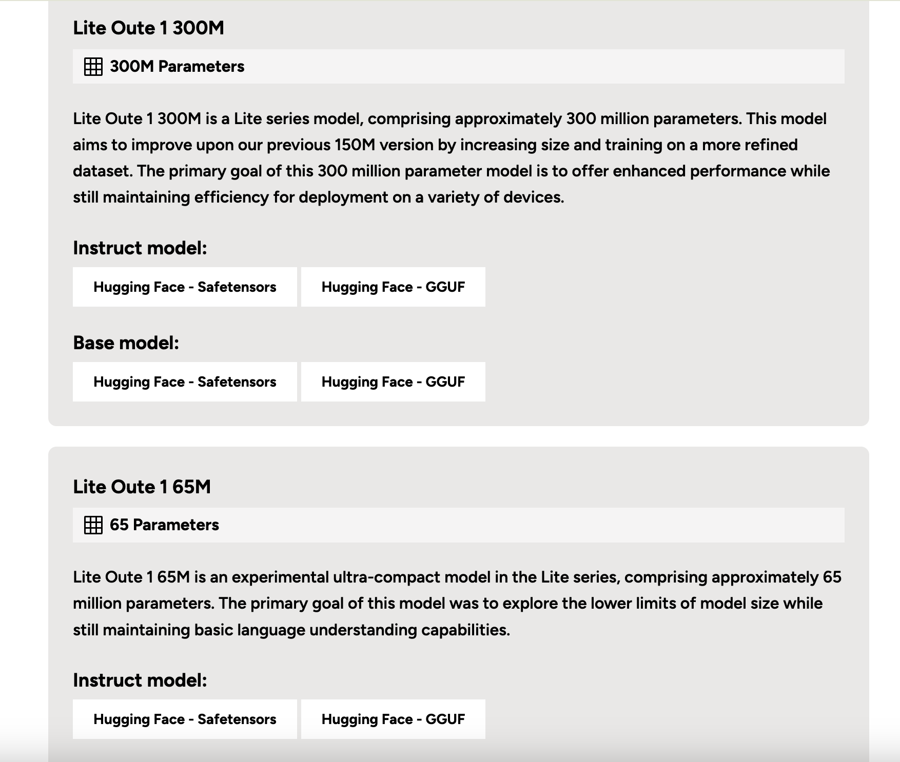

# OuteAI Unveils New Lite-Oute-1 Models: Lite-Oute-1-300M and Lite-Oute-1-65M As Compact Yet Powerful AI Solutions

> OuteAI has recently introduced its latest advancements in the Lite series models, Lite-Oute-1-300M and Lite-Oute-1-65M. These new models are designed to enhance performance while maintaining efficiency, making them suitable for deployment on various devices.  Lite-Oute-1-300M: Enhanced Performance The Lite-Oute-1-300M model, based on the Mistral architecture, comprises approximately 300 million parameters. This model aims to improve […]

[**OuteAI**](https://www.outeai.com/) has recently introduced its latest advancements in the Lite series models, Lite-Oute-1-300M and Lite-Oute-1-65M. These new models are designed to enhance performance while maintaining efficiency, making them suitable for deployment on various devices. 

**Lite-Oute-1-300M: Enhanced Performance**

The Lite-Oute-1-300M model, based on the Mistral architecture, comprises approximately 300 million parameters. This model aims to improve upon the previous 150 million parameter version by increasing its size and training on a more refined dataset. The primary goal of the Lite-Oute-1-300M model is to offer enhanced performance while still maintaining efficiency for deployment across different devices.

With a larger size, the Lite-Oute-1-300M model provides improved context retention and coherence. However, users should note that as a compact model, it still has limitations compared to larger language models. The model was trained on 30 billion tokens with a context length 4096, ensuring robust language processing capabilities.

**The Lite-Oute-1-300M model is available in several versions:**

- [Lite-Oute-1-300M-Instruct](https://huggingface.co/OuteAI/Lite-Oute-1-300M-Instruct)

- [Lite-Oute-1-300M-Instruct-GGUF](https://huggingface.co/OuteAI/Lite-Oute-1-300M-Instruct-GGUF)

- [Lite-Oute-1-300M (Base)](https://huggingface.co/OuteAI/Lite-Oute-1-300M)

- [Lite-Oute-1-300M-GGUF](https://huggingface.co/OuteAI/Lite-Oute-1-300M-GGUF)

**Benchmark Performance**

The Lite-Oute-1-300M model has been benchmarked across several tasks, demonstrating its capabilities:

- ARC Challenge: 26.37 (5-shot), 26.02 (0-shot)

- ARC Easy: 51.43 (5-shot), 49.79 (0-shot)

- CommonsenseQA: 20.72 (5-shot), 20.31 (0-shot)

- HellaSWAG: 34.93 (5-shot), 34.50 (0-shot)

- MMLU: 25.87 (5-shot), 24.00 (0-shot)

- OpenBookQA: 31.40 (5-shot), 32.20 (0-shot)

- PIQA: 65.07 (5-shot), 65.40 (0-shot)

- Winogrande: 52.01 (5-shot), 53.75 (0-shot)

**Usage with HuggingFace Transformers**

The Lite-Oute-1-300M model can be utilized with HuggingFace’s transformers library. Users can easily implement the model in their projects using Python code. The model supports the generation of responses with parameters such as temperature and repetition penalty to fine-tune the output.

**Lite-Oute-1-65M: Exploring Ultra-Compact Models**

In addition to the 300M model, OuteAI has also released the Lite-Oute-1-65M model. This experimental ultra-compact model is based on the LLaMA architecture and comprises approximately 65 million parameters. The primary goal of this model was to explore the lower limits of model size while still maintaining basic language understanding capabilities.

Due to its extremely small size, the Lite-Oute-1-65M model demonstrates basic text generation abilities but may struggle with instructions or maintaining topic coherence. Users should be aware of its significant limitations compared to larger models and expect inconsistent or potentially inaccurate responses.

The Lite-Oute-1-65M model is available in the following versions:

- [Lite-Oute-1-65M-Instruct](https://huggingface.co/OuteAI/Lite-Oute-1-65M-Instruct)

- [Lite-Oute-1-65M-Instruct-GGUF](https://huggingface.co/OuteAI/Lite-Oute-1-65M-Instruct-GGUF)

- [Lite-Oute-1-65M (Base)](https://huggingface.co/OuteAI/Lite-Oute-1-65M)

- [Lite-Oute-1-65M-GGUF](https://huggingface.co/OuteAI/Lite-Oute-1-65M-GGUF)

**Training and Hardware**

The Lite-Oute-1-300M and Lite-Oute-1-65M models were trained on NVIDIA RTX 4090 hardware. The 300M model was trained on 30 billion tokens with a context length of 4096, while the 65M model was trained on 8 billion tokens with a context length 2048.

**Conclusion**

In conclusion, OuteAI’s release of the Lite-Oute-1-300M and Lite-Oute-1-65M models aims to enhance performance while maintaining the efficiency required for deployment across various devices by increasing the size and refining the dataset. These models balance size and capability, making them suitable for multiple applications.
