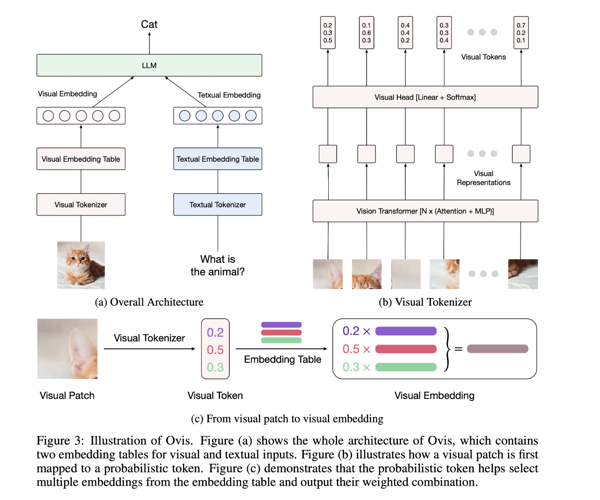

# Ovis-1.6: An Open-Source Multimodal Large Language Model (MLLM) Architecture Designed to Structurally Align Visual and Textual Embeddings

> Artificial intelligence (AI) is transforming rapidly, particularly in multimodal learning. Multimodal models aim to combine visual and textual information to enable machines to understand and generate content that requires inputs from both sources. This capability is vital for tasks such as image captioning, visual question answering, and content creation, where more than a single data […]

Artificial intelligence (AI) is transforming rapidly, particularly in multimodal learning. Multimodal models aim to combine visual and textual information to enable machines to understand and generate content that requires inputs from both sources. This capability is vital for tasks such as image captioning, visual question answering, and content creation, where more than a single data mode is required. While many models have been developed to address these challenges, only some have effectively aligned the disparate representations of visual and textual data, leading to inefficiencies and suboptimal performance in real-world applications.

A significant challenge in multimodal learning arises from how text and image data are encoded and represented. Textual data are typically defined using embeddings derived from a lookup table, ensuring a structured and consistent format. In contrast, visual data are encoded using vision transformers, which produce unstructured continuous embeddings. This discrepancy in representation makes it easier for existing multimodal models to fuse visual and textual data seamlessly. As a result, models struggle to interpret complex visual-textual relationships, limiting their capabilities in advanced AI applications that require coherent understanding across multiple data modalities.

Traditionally, researchers have attempted to mitigate this problem by using a connector, such as a multi-layer perceptron (MLP), to project visual embeddings into a space that can be aligned with textual embeddings. While effective in standard multimodal tasks, this architecture must resolve the fundamental misalignment between visual and textual embeddings. Leading models like LLaVA and Mini-Gemini incorporate advanced methods like cross-attention mechanisms and dual vision encoders to improve performance. However, they still face limitations due to the inherent differences in tokenization and embedding strategies, highlighting the need for a novel approach that addresses these issues at a structural level.

Researchers team from Alibaba Group and Nanjing University introduced a new version of [**Ovis**](https://github.com/AIDC-AI/Ovis): Ovis 1.6 is a new multimodal [large language model](https://www.marktechpost.com/2025/01/11/what-are-large-language-model-llms/) (MLLM) that structurally aligns visual and textual embeddings to address this challenge. Ovis employs a unique visual embedding look-up table, similar to the one used for textual embeddings, to create structured visual representations. This table enables the visual encoder to produce embeddings compatible with textual embeddings, resulting in more effective visual and textual information integration. The model also utilizes probabilistic tokens for visual patches mapped into the visual embedding table multiple times. This approach mirrors the structured representation used in textual data, facilitating a coherent combination of visual and textual inputs.

Ovis’s core innovation lies in using a visual embedding table that aligns visual tokens with their textual counterparts. A probabilistic token represents each image patch and indexes the visual embedding table multiple times to generate a final visual embedding. This process captures the rich semantics of each visual patch and results in embeddings structurally similar to textual tokens. In contrast to conventional methods, which rely on linear projections to map visual embeddings into a joint space, Ovis adopts a probabilistic approach to generate more meaningful visual embeddings. This method enables Ovis to overcome the limitations of connector-based architectures and achieve better performance in multimodal tasks.

Empirical evaluations of Ovis demonstrate its superiority over other open-source MLLMs of similar sizes. For instance, in the MathVista-Mini benchmark, Ovis scored 1808, significantly higher than its competitors. Similarly, in the RealWorldQA benchmark, Ovis outperformed leading proprietary models such as GPT4V and Qwen-VL-Plus, scoring 2230, compared to GPT4V’s 2038. These results highlight Ovis’s strength in handling complex multimodal tasks, making it a promising candidate for future advancements in the field. The researchers also evaluated Ovis on a series of general multimodal benchmarks, including MMBench and MMStar, where it consistently surpassed models like Mini-Gemini-HD and Qwen-VL-Chat by a margin of 7.8% to 14.1%, depending on the specific benchmark.

Key Takeaways from the research:

- **Structural Alignment:** Ovis introduces a novel visual embedding table that structurally aligns visual and textual embeddings, enhancing the model’s ability to process multimodal data.

- **Superior Performance:** Ovis outperforms open-source models of similar sizes in various benchmarks, achieving a 14.1% improvement over connector-based architectures.

- **High-Resolution Capabilities:** The model excels in tasks requiring visual understanding of high-resolution images, such as the RealWorldQA benchmark, where it scored 2230, surpassing GPT4V by 192 points.

- **Scalability:** Ovis demonstrates consistent performance across different parameter tiers (7B, 14B), making it adaptable to various model sizes and computational resources.

- **Practical Applications:** With its advanced multimodal capabilities, Ovis can be applied to complex and challenging real-world scenarios, including visual question answering and image captioning, where existing models struggle.

In conclusion, the researchers have successfully addressed the longstanding misalignment between visual and textual embeddings. By introducing a structured visual embedding strategy, Ovis enables more effective multimodal data integration, improving performance across various tasks. The model’s ability to outperform open-source and proprietary models of similar parameter scales, such as Qwen-VL-Max, underscores its potential as a new standard in multimodal learning. The research team’s approach offers a significant step forward in developing MLLMs, providing new avenues for future research and application.

---

Check out the **[Paper](https://arxiv.org/abs/2405.20797)**, **[GitHub](https://github.com/AIDC-AI/Ovis?tab=readme-ov-file)**, and **[HF Model](https://huggingface.co/AIDC-AI/Ovis1.6-Gemma2-9B)**. All credit for this research goes to the researchers of this project. Also, don’t forget to follow us on **[Twitter](https://twitter.com/Marktechpost)** and join our **[Telegram Channel](https://pxl.to/at72b5j)** and [**LinkedIn Gr**](https://www.linkedin.com/groups/13668564/)[**oup**](https://www.linkedin.com/groups/13668564/). **If you like our work, you will love our**[** newsletter..**](https://marktechpost-newsletter.beehiiv.com/subscribe)

Don’t Forget to join our **[52k+ ML SubReddit](https://www.reddit.com/r/machinelearningnews/)**.

We are inviting startups, companies, and research institutions who are working on [small language models](https://www.marktechpost.com/2025/01/12/what-are-small-language-models-slms/) to participate in this upcoming **‘Small Language Models’ Magazine/Report by Marketchpost.com**. This Magazine/Report will be released in late October/early November 2024. **[Click here to set up a call!](https://pxl.to/g7qpb3)**
