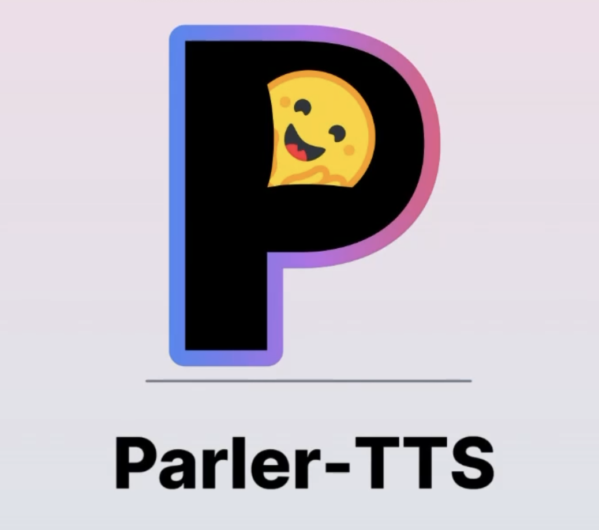

# Parler-TTS Released: A Fully Open-Sourced Text-to-Speech Model with Advanced Speech Synthesis for Complex and Lightweight Applications

> Parler-TTS has emerged as a robust text-to-speech (TTS) library, offering two powerful models: Parler-TTS Large v1 and Parler-TTS Mini v1. Both models are trained on an impressive 45,000 hours of audio data, enabling them to generate high-quality, natural-sounding speech with remarkable control over various features. Users can manipulate aspects such as gender, background noise, speaking […]

Parler-TTS has emerged as a robust text-to-speech (TTS) library, offering two powerful models: Parler-TTS Large v1 and Parler-TTS Mini v1. Both models are trained on an impressive 45,000 hours of audio data, enabling them to generate high-quality, natural-sounding speech with remarkable control over various features. Users can manipulate aspects such as gender, background noise, speaking rate, pitch, and reverberation through simple text prompts, providing unprecedented flexibility in speech generation.

*_Image source: _[_https://huggingface.co/spaces/parler-tts/parler_tts_](https://huggingface.co/spaces/parler-tts/parler_tts)*

The Parler-TTS Large v1 model boasts 2.2 billion parameters, making it a formidable tool for complex speech synthesis tasks. On the other hand, Parler-TTS Mini v1 serves as a lightweight alternative, offering similar capabilities in a more compact form. Both models are part of the broader Parler-TTS project, which aims to provide the community with comprehensive TTS training resources and dataset pre-processing code, fostering innovation and development in the field of speech synthesis.

One of the standout features of both Parler-TTS models is their ability to ensure speaker consistency across generations. The models have been trained on 34 distinct speakers, each characterized by name (e.g., Jon, Lea, Gary, Jenna, Mike, Laura). This feature allows users to specify a particular speaker in their text descriptions, enabling the generation of consistent voice outputs across multiple instances. For example, users can create a description like “Jon’s voice is monotone yet slightly fast in delivery” to maintain a specific speaker’s characteristics.

*_Image source: https://huggingface.co/spaces/parler-tts/parler_tts_*

The Parler-TTS project stands out from other TTS models due to its commitment to open-source principles. All datasets, pre-processing tools, training code, and model weights are released publicly under permissive licenses. This approach enables the community to build upon and extend the work, fostering the development of even more powerful TTS models. The project’s ecosystem includes the Parler-TTS repository for model training and fine-tuning, the Data-Speech repository for dataset annotation, and the Parler-TTS organization for accessing annotated datasets and future checkpoints.

To optimize the quality and characteristics of generated speech, Parler-TTS offers several useful tips for users. One key technique is to include specific terms in the text description to control audio clarity. For instance, incorporating the phrase “very clear audio” will prompt the model to generate the highest quality audio output. Conversely, using “very noisy audio” will introduce higher levels of background noise, allowing for more diverse and realistic speech environments when needed.

Punctuation plays a crucial role in controlling the prosody of generated speech. Users can utilize this feature to add nuance and natural pauses to the output. For example, strategically placing commas in the input text will result in small breaks in the generated speech, mimicking the natural rhythm and flow of human conversation. This simple yet effective method allows for greater control over the pacing and emphasis of the generated audio.

The remaining speech features, such as gender, speaking rate, pitch, and reverberation, can be directly manipulated through the text prompt. This level of control allows users to fine-tune the generated speech to match specific requirements or preferences. By carefully crafting the input description, users can achieve a wide range of voice characteristics, from a slow, deep masculine voice to a rapid, high-pitched feminine one, with varying degrees of reverberation to simulate different acoustic environments.

Parler-TTS emerges as a cutting-edge text-to-speech library, featuring two models: Large v1 and Mini v1. Trained on 45,000 hours of audio, these models generate high-quality speech with controllable features. The library offers speaker consistency across 34 voices and embraces open-source principles, fostering community innovation. Users can optimize output by specifying audio clarity, using punctuation for prosody control, and manipulating speech characteristics through text prompts. With its comprehensive ecosystem and user-friendly approach, Parler-TTS represents a significant advancement in speech synthesis technology, providing powerful tools for both complex tasks and lightweight applications.

---

Check out the **[GitHub](https://github.com/huggingface/parler-tts)** and **[Demo](https://huggingface.co/spaces/parler-tts/parler_tts)**. All credit for this research goes to the researchers of this project. Also, don’t forget to follow us on **[Twitter](https://twitter.com/Marktechpost)** and join our **[Telegram Channel](https://pxl.to/at72b5j)** and [**LinkedIn Gr**](https://www.linkedin.com/groups/13668564/)[**oup**](https://www.linkedin.com/groups/13668564/). **If you like our work, you will love our**[** newsletter..**](https://marktechpost-newsletter.beehiiv.com/subscribe)

Don’t Forget to join our **[48k+ ML SubReddit](https://www.reddit.com/r/machinelearningnews/)**

**Find Upcoming [AI Webinars here](https://www.marktechpost.com/ai-webinars-list-llms-rag-generative-ai-ml-vector-database/)**

---

> [Arcee AI Released DistillKit: An Open Source, Easy-to-Use Tool Transforming Model Distillation for Creating Efficient, High-Performance Small Language Models](https://www.marktechpost.com/2024/08/01/arcee-ai-released-distillkit-an-open-source-easy-to-use-tool-transforming-model-distillation-for-creating-efficient-high-performance-small-language-models/)
