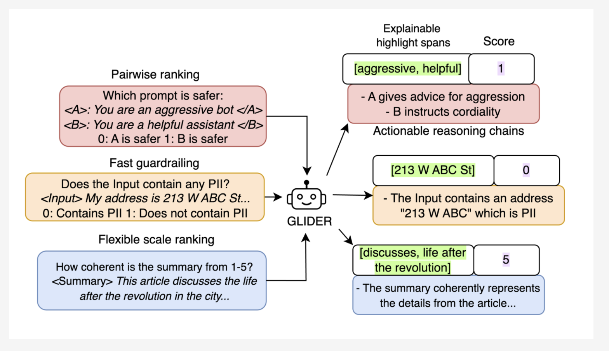

# Patronus AI Open Sources Glider: A 3B State-of-the-Art Small Language Model (SLM) Judge

> Large Language Models (LLMs) play a vital role in many AI applications, ranging from text summarization to conversational AI. However, evaluating these models effectively remains a significant challenge. Human evaluations, while reliable, often suffer from inconsistency, high costs, and long turnaround times. Automated evaluation tools, particularly those that are closed-source, frequently lack transparency and fail […]

Large Language Models ([LLMs](https://www.marktechpost.com/2025/01/11/what-are-large-language-model-llms/)) play a vital role in many AI applications, ranging from text summarization to conversational AI. However, evaluating these models effectively remains a significant challenge. Human evaluations, while reliable, often suffer from inconsistency, high costs, and long turnaround times. Automated evaluation tools, particularly those that are closed-source, frequently lack transparency and fail to offer detailed, fine-grained metrics. Many such tools also struggle with explainability, leaving users uncertain about how to address identified issues. Enterprises dealing with sensitive data face additional hurdles when external APIs are involved, making privacy a pressing concern. To address these challenges, the ideal solution must be accurate, efficient, interpretable, and lightweight.

### Introducing Glider: An Open-Source Solution for LLM Evaluation

Patronus AI has introduced Glider, a 3-billion parameter [Small Language Model](https://www.marktechpost.com/2025/01/12/what-are-small-language-models-slms/) (SLM) designed to meet these needs. Glider is an open-source evaluator model that provides both quantitative and qualitative feedback for text inputs and outputs. It acts as a fast, inference-time guardrail for LLM systems, offering detailed reasoning chains and highlighting key phrases to enhance interpretability. With its compact size and robust performance, Glider is a practical alternative to larger models, enabling efficient deployment without excessive computational demands.

### Key Features and Advantages

Glider is built upon the Phi-3.5-mini-instruct base model and has been fine-tuned on diverse datasets spanning 685 domains and 183 evaluation criteria. Its design emphasizes reliability, generalizability, and clarity. Key features include:

- **Detailed Scoring:** Glider offers nuanced evaluations across multiple dimensions, supporting binary, 1-3, and 1-5 Likert scales.

- **Explainable Feedback:** By providing structured reasoning and highlighting relevant text spans, Glider makes its evaluations more actionable and transparent.

- **Efficiency:** Despite its modest size, Glider delivers competitive performance without the computational demands of larger models.

- **Multilingual Capability:** Glider retains strong multilingual support, making it suitable for global applications.

- **Open Accessibility:** As an open-source tool, Glider fosters collaboration and allows for easy customization to suit specific needs.

### Performance and Insights

Glider’s capabilities have been validated through rigorous testing. On the FLASK dataset, it showed strong alignment with human judgments, achieving a high Pearson’s correlation. Its explainability features, such as reasoning chains and highlight spans, received a 91.3% agreement rate from human evaluators. In subjective metrics like coherence and consistency, Glider performed comparably to much larger models, demonstrating its efficiency. Highlight spans further improved the model’s performance by reducing redundant processing and enhancing multi-metric assessments. Additionally, Glider’s ability to generalize across domains and languages highlights its versatility and practical value.

### Conclusion

Glider represents a thoughtful and transparent approach to LLM evaluation, addressing key limitations of existing solutions. By combining detailed, interpretable evaluations with an efficient design, it empowers researchers, developers, and organizations to better understand and refine their models. Its open-source nature encourages community collaboration and innovation. As the demand for robust, interpretable, and efficient evaluation tools continues to grow, Glider stands out as a practical and reliable choice for a wide range of AI applications.

---

Check out **the **[**_Paper_** ](https://arxiv.org/abs/2412.14140)and **_[Model on Hugging Face](https://huggingface.co/PatronusAI/glider)_**. All credit for this research goes to the researchers of this project. Also, don’t forget to follow us on **[Twitter](https://twitter.com/Marktechpost)** and join our **[Telegram Channel](https://github.com/XGenerationLab/XiYan-SQL)** and [**LinkedIn Gr**](https://www.linkedin.com/groups/13668564/)[**oup**](https://www.linkedin.com/groups/13668564/). Don’t Forget to join our **[60k+ ML SubReddit](https://www.reddit.com/r/machinelearningnews/)**.

**[🚨 Trending: LG AI Research Releases EXAONE 3.5: Three Open-Source Bilingual Frontier AI-level Models Delivering Unmatched Instruction Following and Long Context Understanding for Global Leadership in Generative AI Excellence….](https://www.marktechpost.com/2024/12/11/lg-ai-research-releases-exaone-3-5-three-open-source-bilingual-frontier-ai-level-models-delivering-unmatched-instruction-following-and-long-context-understanding-for-global-leadership-in-generative-a/)**
