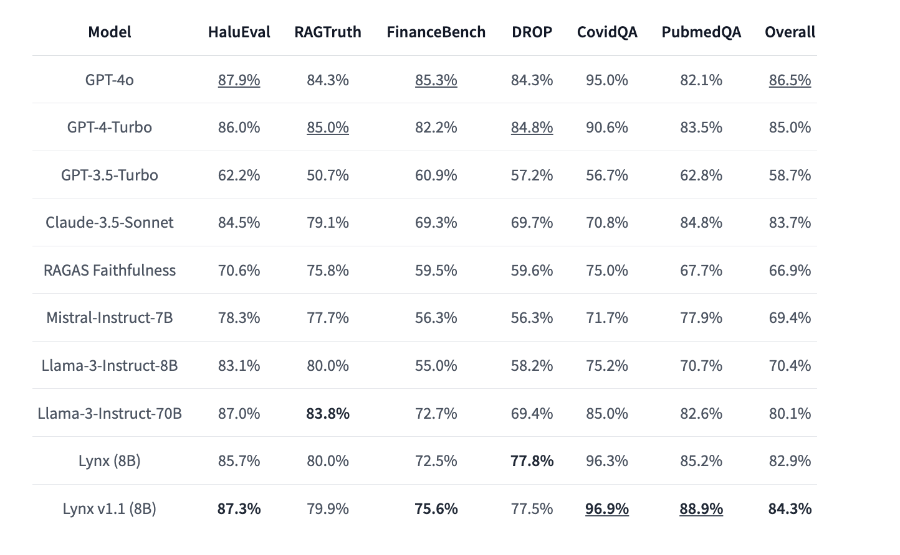

# Patronus AI Releases Lynx v1.1: An 8B State-of-the-Art RAG Hallucination Detection Model

> Patronus AI released the LYNX v1.1 series, representing a significant step forward in artificial intelligence, particularly in detecting hallucinations in AI-generated content. Hallucinations, in the context of AI, refer to the generation of information that is unsupported or contradictory to the provided data, which poses a considerable challenge for applications relying on accurate and reliable […]

Patronus AI released the LYNX v1.1 series, representing a significant step forward in artificial intelligence, particularly in detecting hallucinations in AI-generated content. Hallucinations, in the context of AI, refer to the generation of information that is unsupported or contradictory to the provided data, which poses a considerable challenge for applications relying on accurate and reliable responses. The LYNX models address this problem using retrieval-augmented generation (RAG), a method that helps ensure the answers generated by the AI are faithful to the given documents.

The 70B version of LYNX v1.1 has already demonstrated exceptional performance in this area. On the HaluBench evaluation, which tests for hallucination detection in real-world scenarios, the 70B model achieved an impressive 87.4% accuracy. This performance surpasses other leading models, including GPT-4o and GPT-3.5-Turbo, and it has shown superior accuracy in specific tasks such as medical question answering in PubMedQA.

The 8B version of LYNX v1.1, known as Patronus-Lynx-8B-Instruct-v1.1, is a finely tuned model that balances efficiency and capability. Trained on a diverse set of datasets, including CovidQA, PubmedQA, DROP, and RAGTruth, this version supports a maximum sequence length of 128,000 tokens and is primarily focused on the English language. Advanced training techniques like mixed precision training and flash attention are employed to enhance efficiency without compromising accuracy. Evaluations were conducted on 8 Nvidia H100 GPUs to ensure precise performance metrics.

Since the release of Lynx v1.0, thousands of developers have integrated it into various real-world applications, demonstrating its practical utility. Despite efforts to reduce hallucinations using RAG, large language models (LLMs) can still produce errors. However, Lynx v1.1 significantly improves real-time hallucination detection, making it the best-performing RAG hallucination detection model of its size. The 8B model has shown substantial improvements over baseline models like Llama 3, with an 87.3% score on HaluBench. It outperforms models such as Claude-3.5-Sonnet by 3% and GPT-4o on medical questions by 6.8%. Additionally, compared to Lynx v1.0, it has a 1.4% higher accuracy on HaluBench and surpasses all open-source models on LLM-as-judge tasks.

In conclusion, the LYNX 8B model of the LYNX v1.1 series is a robust and efficient tool for detecting hallucinations in AI-generated content. While the 70B model leads in overall accuracy, the 8B version offers a compelling balance of efficiency and performance. Its advanced training techniques, coupled with substantial performance improvements, make it an excellent choice for various machine learning applications, especially where real-time hallucination detection is critical. Lynx v1.1 is open-source, with open weights and data, ensuring accessibility and transparency for all users.

---

Check out the **[Paper](https://arxiv.org/abs/2407.08488),** **[Try it out on HuggingFace Spaces](https://huggingface.co/spaces/PatronusAI/LynxDemo),** and **[Download Lynx v1.1 on HuggingFace.](https://huggingface.co/PatronusAI/Llama-3-Patronus-Lynx-8B-Instruct-v1.1)** All credit for this research goes to the researchers of this project. Also, don’t forget to follow us on **[Twitter](https://twitter.com/Marktechpost)** and join our **[Telegram Channel](https://pxl.to/at72b5j)** and [**LinkedIn Gr**](https://www.linkedin.com/groups/13668564/)[**oup**](https://www.linkedin.com/groups/13668564/). **If you like our work, you will love our**[** newsletter..**](https://marktechpost-newsletter.beehiiv.com/subscribe)

Don’t Forget to join our **[47k+ ML SubReddit](https://www.reddit.com/r/machinelearningnews/)**

**Find Upcoming [AI Webinars here](https://www.marktechpost.com/ai-webinars-list-llms-rag-generative-ai-ml-vector-database/)**
