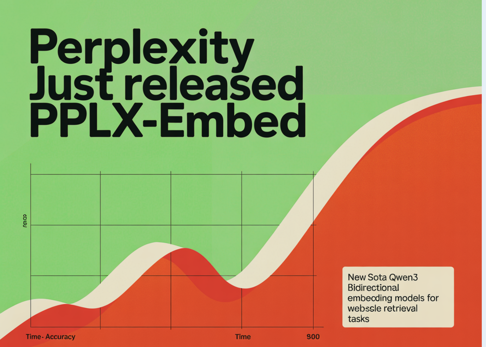

# Perplexity Just Released pplx-embed: New SOTA Qwen3 Bidirectional Embedding Models for Web-Scale Retrieval Tasks

> Perplexity has released pplx-embed, a collection of multilingual embedding models optimized for large-scale retrieval tasks. These models are designed to handle the noise and complexity of web-scale data, providing a production-ready alternative to proprietary embedding APIs. Architectural Innovations: Bidirectional Attention and Diffusion Most Large Language Models (LLMs) utilize causal, decoder-only architectures. However, for embedding tasks, […]

Perplexity has released **pplx-embed**, a collection of multilingual embedding models optimized for large-scale retrieval tasks. These models are designed to handle the noise and complexity of web-scale data, providing a production-ready alternative to proprietary embedding APIs.

### Architectural Innovations: Bidirectional Attention and Diffusion

Most Large Language Models (LLMs) utilize causal, decoder-only architectures. However, for embedding tasks, understanding the full context of a sentence is more critical than predicting the next token. Perplexity research team addressed this by implementing **bidirectional attention**. This allows the model to process all tokens in a sequence simultaneously, resulting in a more comprehensive hidden state representation.

Furthermore, the models utilize **diffusion-based pretraining**. While diffusion is frequently used in generative media, applying it to text embeddings helps the model learn to reconstruct clean semantic signals from noisy or fragmented input. This pretraining phase ensures the model is resilient when processing the unformatted text often found on the open web.

*https://arxiv.org/pdf/2602.11151*

### Optimized for RAG: Query vs. Context

A common challenge in Retrieval-Augmented Generation (RAG) is the ‘asymmetry’ between a user’s short search query and a long document chunk. **Perplexity team addresses this by providing two specialized model versions:**

- **pplx-embed-v1:** Optimized for independent text embeddings and search queries.

- **pplx-embed-context-v1:** Specifically tuned for document chunks used as the knowledge base in RAG pipelines.

By separating these roles, the models better align the vector space between what a user asks and the specific information stored in a database. These models have been validated on real-world search scenarios involving tens of millions of documents.

### Technical Specifications and Efficiency

**The models are available in two parameter scales to balance performance and computational cost:**

**Feature****0.6B Model****4B Model****Primary Use Case**High-throughput, low-latency tasksComplex semantic reasoning**Quantization**Native INT8 SupportNative INT8 Support**Architecture**Qwen3-basedQwen3-based**Attention**BidirectionalBidirectional

The inclusion of **native INT8 quantization** allows engineers to deploy these models with a significantly smaller memory footprint and faster inference speeds. This makes the 4B model viable for production environments that previously required smaller, less capable models.

### Key Takeaways

- **Bidirectional Architecture via Diffusion:** Unlike standard decoder-only models (like the original Qwen3), Perplexity team converted these into **bidirectional encoders** using diffusion-based pretraining. This allows the model to ‘see’ the entire context of a sentence at once, creating more accurate semantic representations for noisy, web-scale data.

- **Specialized RAG Variants:** The release provides two distinct models to optimize Retrieval-Augmented Generation: **`pplx-embed-v1`** is tuned for independent queries and standalone text, while **`pplx-embed-context-v1`** is specifically designed for document chunks, ensuring better alignment between what users ask and how information is stored.

- **Production-Ready Efficiency:** The models support **native INT8 and binary quantization**, significantly reducing storage and memory requirements (up to 32x for binary) without substantial loss in accuracy. They also utilize **Matryoshka Representation Learning (MRL)**, allowing developers to truncate vector dimensions to save costs while maintaining high performance.

---

Check out the **[Paper](https://arxiv.org/pdf/2602.11151)**, **[Model Weights](https://huggingface.co/collections/perplexity-ai/pplx-embed)** and **[Technical details](https://research.perplexity.ai/articles/pplx-embed-state-of-the-art-embedding-models-for-web-scale-retrieval). **Also, feel free to follow us on **[Twitter](https://x.com/intent/follow?screen_name=marktechpost)** and don’t forget to join our **[120k+ ML SubReddit](https://www.reddit.com/r/machinelearningnews/)** and Subscribe to **[our Newsletter](https://www.aidevsignals.com/)**. Wait! are you on telegram? **[now you can join us on telegram as well.](https://t.me/machinelearningresearchnews)**
