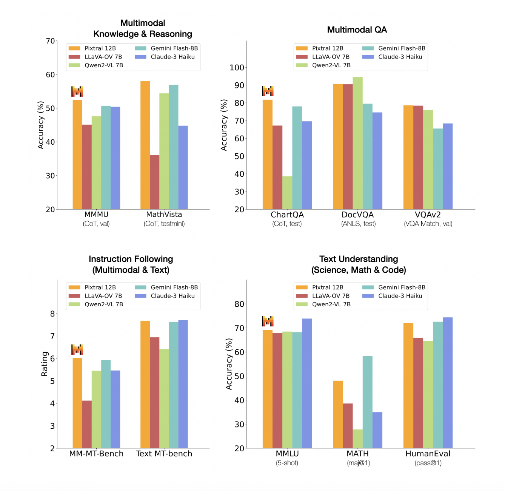

# Pixtral 12B Released by Mistral AI: A Revolutionary Multimodal AI Model Transforming Industries with Advanced Language and Visual Processing Capabilities

> The release of Pixtral 12B by Mistral AI represents a groundbreaking leap in the multimodal large language model powered by an impressive 12 billion parameters. This advanced AI model is designed to handle and generate textual and visual content, making it a versatile tool for various industries. Capable of processing massive datasets and delivering highly […]

The release of [**Pixtral 12B**](https://mistral.ai/news/pixtral-12b/)** **by Mistral AI represents a groundbreaking leap in the multimodal large language model powered by an impressive 12 billion parameters. This advanced AI model is designed to handle and generate textual and visual content, making it a versatile tool for various industries. Capable of processing massive datasets and delivering highly accurate results, Pixtral 12B outperforms its predecessors with its enhanced scalability and adaptability across platforms, from cloud-based applications to on-premise systems. With its multimodal capabilities, Pixtral 12B sets a new standard for AI solutions in healthcare, marketing, and education.

**Context of the Release**

Mistral AI’s strategic timing for releasing Pixtral 12B comes when demand for advanced language models has never been higher. The proliferation of large language models (LLMs) in recent years across healthcare and marketing industries has underscored the necessity for robust, efficient, and scalable AI solutions. Pixtral 12B has been engineered to meet these demands by integrating a vast array of language understanding and generation features, particularly excelling in multimodal capabilities. This means that Pixtral 12B can seamlessly process and generate textual and visual content, making it an invaluable tool for diverse applications.

Multimodal AI, which refers to the ability of an AI system to handle and process multiple forms of data, like text and images, simultaneously, is the next frontier in artificial intelligence. Mistral AI has prioritized this multimodal approach in Pixtral 12B, recognizing that real-world problems often involve complex interactions between various data types. By enabling the model to understand and generate responses considering visual and textual inputs, Mistral AI addresses the evolving needs of users who require sophisticated solutions to nuanced challenges.

**Technical Specifications and Capabilities**

Pixtral 12B is powered by an architecture that boasts 12 billion parameters, making it one of the most powerful models in Mistral AI’s lineup. This immense parameter size allows the model to process massive datasets and understand intricate language patterns, offering users responses that are contextually relevant and highly accurate. With Pixtral 12B’s deep learning architecture, users can expect superior performance in natural language understanding (NLU), natural language processing (NLP), image recognition, and even creative generation tasks like writing, drawing, and design recommendations.

The model has been pre-trained on a diverse corpus of text and image datasets, allowing it to recognize and understand a broad spectrum of topics, languages, and visual concepts. This ensures that Pixtral 12B can handle a variety of inputs and provide users with precise and actionable outputs. Furthermore, the model’s ability to fine-tune itself based on specific datasets or user requirements adds to its versatility, making it a suitable choice for businesses and institutions looking to implement AI in a targeted and efficient manner.

One of the most notable aspects of Pixtral 12B’s design is its focus on scalability. Mistral AI has developed the model to be highly adaptable, meaning it can be deployed across various platforms and devices without compromising performance. This level of flexibility is crucial for companies that need to integrate AI into their existing systems without undergoing extensive infrastructure changes. Whether used in cloud-based applications, on-premise servers, or edge devices, Pixtral 12B delivers consistent and reliable performance.

**Implications for Industry**

The launch of Pixtral 12B opens new possibilities for industries that rely heavily on data processing, interpretation, and generation. For instance, the healthcare sector can leverage Pixtral 12B’s multimodal capabilities to enhance diagnostic procedures by combining medical imaging data with patient records for a more comprehensive analysis. Meanwhile, marketing and advertising agencies can use the model to generate creative campaigns that blend textual content with visual assets, creating more engaging and effective messages for their audiences.

Education is another field poised to benefit from Pixtral 12B’s multimodal functionalities. The model’s ability to process and generate educational content that includes visual aids and textual explanations can significantly enhance learning outcomes. For students in STEM fields, where complex diagrams and visual representations are often essential, Pixtral 12B can provide real-time assistance and tailored study materials seamlessly combining these elements.

Beyond these examples, Pixtral 12B also holds potential for creative industries such as entertainment, design, and media production. Filmmakers, graphic designers, and writers can utilize the model to brainstorm ideas, generate scripts, or design visual content based on textual prompts. The model’s ability to switch effortlessly between text and images makes it an indispensable tool for anyone working at the intersection of multiple media forms.

**Challenges and Future Outlook**

While Pixtral 12B promises many benefits, deploying such advanced models is not challenging. One of the main hurdles that companies like Mistral AI face is the issue of responsible AI usage. As models grow in size and capability, ensuring they are used ethically and without bias becomes increasingly critical. Mistral AI has acknowledged this challenge and has implemented various safety measures & guidelines to ensure that Pixtral 12B is used responsibly. These include robust filtering systems to detect and prevent harmful outputs and ongoing efforts to improve the model’s transparency and explainability.

Looking ahead, Mistral AI has expressed its commitment to further advancing the field of multimodal AI. The company plans to refine Pixtral 12B’s architecture and capabilities, making it more efficient and accessible to a broader audience. Additionally, Mistral AI is actively exploring integrating more complex data types, like video and audio, into future iterations of their models. This would represent a significant leap forward, bringing the dream of general-purpose AI closer to reality.

In conclusion, Mistral AI’s release of Pixtral 12B is a landmark achievement in artificial intelligence. With its powerful multimodal capabilities, expansive parameter size, and flexible deployment options, Pixtral 12B is poised to profoundly impact industries like healthcare and entertainment. As Mistral AI continues to innovate, the possibilities for what AI can achieve will likely expand, offering new tools and solutions to address the complex challenges of the modern world.

---

Check out the **[Model Card on HF](https://huggingface.co/mistralai/Pixtral-12B-2409)**, **[Blog](https://mistral.ai/news/pixtral-12b/)**, and **[GitHub](https://github.com/mistralai/mistral-inference)**. All credit for this research goes to the researchers of this project. Also, don’t forget to follow us on **[Twitter](https://twitter.com/Marktechpost)** and join our **[Telegram Channel](https://pxl.to/at72b5j)** and [**LinkedIn Gr**](https://www.linkedin.com/groups/13668564/)[**oup**](https://www.linkedin.com/groups/13668564/). **If you like our work, you will love our**[** newsletter..**](https://marktechpost-newsletter.beehiiv.com/subscribe)

Don’t Forget to join our **[50k+ ML SubReddit](https://www.reddit.com/r/machinelearningnews/)**

**[⏩ ⏩ FREE AI WEBINAR: ‘SAM 2 for Video: How to Fine-tune On Your Data’ (Wed, Sep 25, 4:00 AM – 4:45 AM EST)](https://encord.com/webinar/sam2-for-video/?utm_medium=affiliate&utm_source=newsletter&utm_campaign=marktechpost&utm_content=sam2video)**
