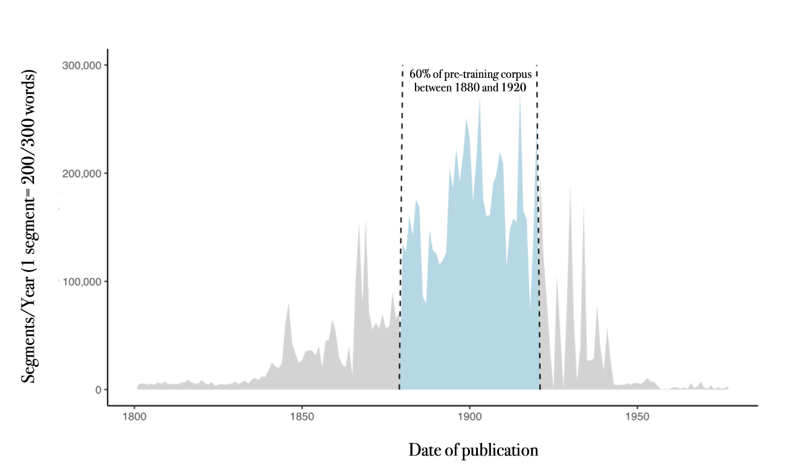

# PleIAs Released OCRonos-Vintage: A 124 Million Parameter Model Trained on 18 Billion Tokens for Superior OCR Correction in Cultural Heritage Archives

> PleIAs recently announced the release of OCRonos-Vintage, a specialized pre-trained model designed specifically for Optical Character Recognition (OCR) correction. This innovative model represents a significant milestone in OCR technology, particularly in its application to cultural heritage archives. OCRonos-Vintage is a 124 million-parameter model uniquely trained on 18 billion tokens from cultural heritage archives. This specialized […]

PleIAs recently announced the release of [**OCRonos-Vintage**](https://huggingface.co/blog/Pclanglais/specialized-pre-training), a specialized pre-trained model designed specifically for Optical Character Recognition (OCR) correction. This innovative model represents a significant milestone in OCR technology, particularly in its application to cultural heritage archives.

OCRonos-Vintage is a 124 million-parameter model uniquely trained on 18 billion tokens from cultural heritage archives. This specialized training aims to enhance the model’s performance in correcting OCR errors in historical documents. OCRonos-Vintage has demonstrated exceptional efficacy in this niche application despite its relatively small size compared to other models. Its development highlights the growing trend of creating highly specialized models tailored to specific tasks instead of relying solely on large, generalist models.

The training of OCRonos-Vintage was conducted using the new H100 cluster on Jean Zay, supported by a compute grant. The model was trained with llm.c, a new pre-training library developed by Andrej Karpathy. Created for pedagogical purposes, this library has proven highly effective for training models from scratch. The combination of advanced data preprocessing pipelines and the efficient performance of llm.c allowed the training process to proceed smoothly and efficiently.

*[**Image Source**](https://huggingface.co/blog/Pclanglais/specialized-pre-training)*

Specialized pre-training, as exemplified by OCRonos-Vintage, is becoming increasingly viable and attractive for several reasons. One of the primary advantages is cost efficiency. Models with 100-300 million parameters, like OCRonos-Vintage, can be deployed on most CPU infrastructures without extensive adaptation or quantization. In GPU environments, these models offer significantly higher throughput. This efficiency is particularly important for processing large volumes of data, such as the vast cultural heritage archives targeted by OCRonos-Vintage.

Another key benefit of specialized pre-training is the increased customization it allows. The architecture and tokenizer of a model can be specifically designed with the target task and data in mind. For OCR correction, a tokenizer trained on a small sample of noisy data can outperform more generalist models. This approach allows optimizing the model for specific requirements, such as handling long contexts or improving comprehension in non-English languages. The potential for fast inference and enhanced performance, even at the letter or byte level tokenization, makes specialized models highly adaptable and efficient.

*[**Image Source**](https://huggingface.co/blog/Pclanglais/specialized-pre-training)*

Specialized pre-training offers full control over the data used. In regulated environments, deploying or fine-tuning existing models can raise concerns about data liabilities. Specialized models like OCRonos-Vintage, trained end-to-end on selected datasets, avoid these issues. All training data for OCRonos-Vintage comes from cultural heritage archives in the public domain, ensuring compliance with data use regulations and promoting transparency.

As PleIAs continue experimenting with and iterating on other tasks, such as summarization and classification, the insights gained from OCRonos-Vintage will likely inform the development of future specialized models. The broader implications of this approach suggest that small, efficient models can achieve remarkable performance in reasoning-intensive tasks, challenging the conventional emphasis on large parameter counts for logical consistency.

In conclusion, PleIAs’ launch of OCRonos-Vintage marks a significant milestone in the evolution of specialized AI models. By focusing on specific tasks and optimizing models, PleIAs demonstrate that specialized pre-training can deliver exceptional performance while maintaining efficiency and cost-effectiveness. This approach advances the OCR correction field and sets a precedent for developing specialized AI models across various applications.

---

Check out the **[Model ](https://huggingface.co/PleIAs/OCRonos-Vintage)**and **[Details](https://huggingface.co/blog/Pclanglais/specialized-pre-training)**. All credit for this research goes to the researchers of this project. Also, don’t forget to follow us on **[Twitter](https://twitter.com/Marktechpost)** and join our **[Telegram Channel](https://pxl.to/at72b5j)** and [**LinkedIn Gr**](https://www.linkedin.com/groups/13668564/)[**oup**](https://www.linkedin.com/groups/13668564/). **If you like our work, you will love our**[** newsletter..**](https://marktechpost-newsletter.beehiiv.com/subscribe)

Don’t Forget to join our **[47k+ ML SubReddit](https://www.reddit.com/r/machinelearningnews/)**

**Find Upcoming [AI Webinars here](https://www.marktechpost.com/ai-webinars-list-llms-rag-generative-ai-ml-vector-database/)**

---

> [Arcee AI Released DistillKit: An Open Source, Easy-to-Use Tool Transforming Model Distillation for Creating Efficient, High-Performance Small Language Models](https://www.marktechpost.com/2024/08/01/arcee-ai-released-distillkit-an-open-source-easy-to-use-tool-transforming-model-distillation-for-creating-efficient-high-performance-small-language-models/)
