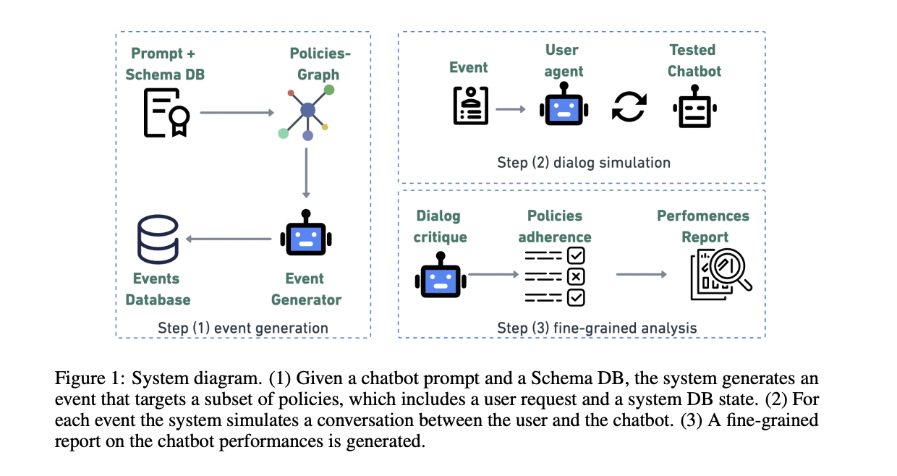

# Plurai Introduces IntellAgent: An Open-Source Multi-Agent Framework to Evaluate Complex Conversational AI System

> Evaluating conversational AI systems powered by large language models (LLMs) presents a critical challenge in artificial intelligence. These systems must handle multi-turn dialogues, integrate domain-specific tools, and adhere to complex policy constraints—capabilities that traditional evaluation methods struggle to assess. Existing benchmarks rely on small-scale, manually curated datasets with coarse metrics, failing to capture the dynamic […]

Evaluating conversational AI systems powered by [large language models](https://www.marktechpost.com/2025/01/11/what-are-large-language-model-llms/) (LLMs) presents a critical challenge in artificial intelligence. These systems must handle multi-turn dialogues, integrate domain-specific tools, and adhere to complex policy constraints—capabilities that traditional evaluation methods struggle to assess. Existing benchmarks rely on small-scale, manually curated datasets with coarse metrics, failing to capture the dynamic interplay of policies, user interactions, and real-world variability. This gap limits the ability to diagnose weaknesses or optimize agents for deployment in high-stakes environments like healthcare or finance, where reliability is non-negotiable.  

Current evaluation frameworks, such as _τ-bench_ or _ALMITA_, focus on narrow domains like customer support and use static, limited datasets. For example, τ-bench evaluates airline and retail chatbots but includes only 50–115 manually crafted samples per domain. These benchmarks prioritize end-to-end success rates, overlooking granular details like policy violations or dialogue coherence. Other tools, such as those assessing retrieval-augmented generation ([RAG](https://www.marktechpost.com/2024/11/25/retrieval-augmented-generation-rag-deep-dive-into-25-different-types-of-rag/)) systems, lack support for multi-turn interactions. The reliance on human curation restricts scalability and diversity, leaving conversational AI evaluations incomplete and impractical for real-world demands. To address these limitations, **Plurai researchers have introduced IntellAgent, an open-source, multi-agent framework designed to automate the creation of diverse, policy-driven scenarios. Unlike prior methods, IntellAgent combines graph-based policy modeling, synthetic event generation, and interactive simulations to evaluate agents holistically.  **

At its core, IntellAgent employs a **policy graph** to model the relationships and complexities of domain-specific rules. Nodes in this graph represent individual policies (e.g., “refunds must be processed within 5–7 days”), each assigned a complexity score. Edges between nodes denote the likelihood of policies co-occurring in a conversation. For instance, a policy about modifying flight reservations might link to another about refund timelines. The graph is constructed using an LLM, which extracts policies from system prompts, ranks their difficulty, and estimates co-occurrence probabilities. This structure enables IntellAgent to generate synthetic events as shown in Figure 4—user requests paired with valid database states—through a weighted random walk. Starting with a uniformly sampled initial policy, the system traverses the graph, accumulating policies until the total complexity reaches a predefined threshold. This approach ensures events span a uniform distribution of complexities while maintaining realistic policy combinations.  

Once events are generated, IntellAgent simulates dialogues between a **user agent** and the chatbot under testa as shown in Figure 5. The user agent initiates requests based on event details and monitors the chatbot’s adherence to policies. If the chatbot violates a rule or completes the task, the interaction terminates. A **critique component** then analyzes the dialogue, identifying which policies were tested and violated. For example, in an airline scenario, the critique might flag failures to verify user identity before modifying a reservation. This step produces fine-grained diagnostics, revealing not just overall performance but specific weaknesses, such as struggles with user consent policies—a category overlooked by τ-bench.  

To validate IntellAgent, researchers compared its synthetic benchmarks against τ-bench using state-of-the-art LLMs like GPT-4o, Claude-3.5, and Gemini-1.5. Despite relying entirely on automated data generation, IntellAgent achieved Pearson correlations of 0.98 (airline) and 0.92 (retail) with τ-bench’s manually curated results. More importantly, it uncovered nuanced insights: all models faltered on user consent policies, and performance declined predictably as complexity increased, though degradation patterns varied between models. For instance, Gemini-1.5-pro outperformed GPT-4o-mini at lower complexity levels but converged with it at higher tiers. These findings highlight IntellAgent’s ability to guide model selection based on specific operational needs. The framework’s modular design allows seamless integration of new domains, policies, and tools, supported by an open-source implementation built on the LangGraph library.  

In conclusion, IntellAgent addresses a critical bottleneck in conversational [AI](https://www.marktechpost.com/2025/01/13/what-is-artificial-intelligence-ai-2/) development by replacing static, limited evaluations with dynamic, scalable diagnostics. Its policy graph and automated event generation enable comprehensive testing across diverse scenarios, while fine-grained critiques pinpoint actionable improvements. By correlating closely with existing benchmarks and exposing previously undetected weaknesses, the framework bridges the gap between research and real-world deployment. Future enhancements, such as incorporating real user interactions to refine policy graphs, could further elevate its utility, solidifying IntellAgent as a foundational tool for advancing reliable, policy-aware conversational agents.

---

Check out **_the [Paper](https://arxiv.org/abs/2501.11067) and [GitHub Page](https://github.com/plurai-ai/intellagent)._** All credit for this research goes to the researchers of this project. Also, don’t forget to follow us on **[Twitter](https://x.com/intent/follow?screen_name=marktechpost)** and join our **[Telegram Channel](https://arxiv.org/abs/2406.09406)** and [**LinkedIn Gr**](https://www.linkedin.com/groups/13668564/)[**oup**](https://www.linkedin.com/groups/13668564/). Don’t Forget to join our **[70k+ ML SubReddit](https://www.reddit.com/r/machinelearningnews/)**.

**🚨[ [Recommended Read] Nebius AI Studio expands with vision models, new language models, embeddings and LoRA](https://nebius.com/blog/posts/studio-embeddings-vision-and-language-models?utm_medium=newsletter&utm_source=marktechpost&utm_campaign=embedding-post-ai-studio) **_(Promoted)_
