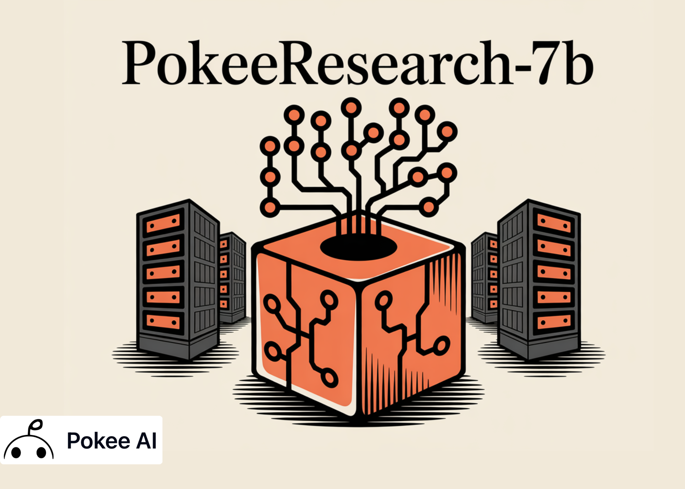

# PokeeResearch-7B: An Open 7B Deep-Research Agent Trained with Reinforcement Learning from AI Feedback (RLAIF) and a Robust Reasoning Scaffold

> Pokee AI has open sourced PokeeResearch-7B, a 7B parameter deep research agent that executes full research loops, decomposes a query, issues search and read calls, verifies candidate answers, then synthesizes multiple research threads into a final response. The agent runs a research and verification loop. In research, it calls external tools for web search and […]

**[Pokee AI](https://pokee.ai/)** has open sourced **[PokeeResearch-7B](https://huggingface.co/PokeeAI/pokee_research_7b)**, a 7B parameter deep research agent that executes full research loops, decomposes a query, issues search and read calls, verifies candidate answers, then synthesizes multiple research threads into a final response.

The agent runs a research and verification loop. In research, it calls external tools for web search and page reading or proposes an interim answer. In verification, it checks the answer against retrieved evidence, and either accepts or restarts research. This structure reduces brittle trajectories and catches obvious errors before finalization. The research team formalizes this loop and adds a test-time synthesis stage that merges several independent research threads.

### Training recipe, RLAIF with RLOO

PokeeResearch-7B is finetuned from Qwen2.5-7B-Instruct using an annotation-free **Reinforcement Learning from AI Feedback, called RLAIF**, with the **REINFORCE Leave-One-Out algorithm, called RLOO**. The reward targets semantic correctness, citation faithfulness, and instruction adherence, not token overlap. The Model’s[ Hugging Face card](https://huggingface.co/PokeeAI/pokee_research_7b) lists batch size 64, 8 research threads per prompt during RL, learning rate 3e-6, 140 steps, context 32,768 tokens, bf16 precision, and a checkpoint near 13 GB. The research team emphasizes that RLOO provides an unbiased on policy gradient and contrasts it with the PPO family that is approximately on policy and biased.

*https://arxiv.org/pdf/2510.15862*

### Reasoning scaffold and Research Threads Synthesis

The scaffold includes three mechanisms. Self correction, the agent detects malformed tool calls and retries. Self verification, the agent inspects its own answer against evidence. Research Threads Synthesis, the agent runs several independent threads per question, summarizes them, then synthesizes a final answer. The research team reports that synthesis improves accuracy on difficult benchmarks.

*https://arxiv.org/pdf/2510.15862*

### Evaluation protocol

The research team evaluates text only questions from 10 benchmarks, NQ, TriviaQA, PopQA, HotpotQA, 2WikiMultiHopQA, Musique, Bamboogle, GAIA, BrowseComp, and Humanity’s Last Exam. They sample 125 questions per dataset, except GAIA with 103, for a total of 1,228 questions. For each question, they run 4 research threads, then compute mean accuracy, mean at 4, using Gemini-2.5-Flash-lite to judge correctness. The maximum interaction turns are set to 100.

*https://github.com/Pokee-AI/PokeeResearchOSS*

*https://github.com/Pokee-AI/PokeeResearchOSS*

### Results at 7B scale

PokeeResearch-7B reports the best mean at 4 accuracy among 7B deep research agents across the 10 datasets. On HLE the model reports 15.2 without RTS and 17.6 with RTS. On GAIA the model reports 36.9 without RTS and 41.3 with RTS. On BrowseComp the model reports 5.4 without RTS and 8.4 with RTS. On the seven QA benchmarks, Bamboogle, 2WikiMultiHopQA, TriviaQA, NQ, PopQA, Musique, HotpotQA, the model improves over recent 7B baselines. Gains from RTS are largest on HLE, GAIA, and BrowseComp, and smaller on the QA sets.

### Key Takeaways

- **Training**: PokeeResearch-7B fine tunes Qwen2.5-7B-Instruct with RLAIF using the RLOO estimator, optimizing rewards for factual accuracy, citation faithfulness, and instruction adherence, not token overlap.

- **Scaffold**: The agent runs a research and verification loop with Research Threads Synthesis, executing multiple independent threads, then synthesizing evidence to a final answer.

- **Evaluation protocol**: Benchmarks span 10 datasets with 125 questions each, except GAIA with 103, 4 threads per question, mean@4 accuracy judged by Gemini-2.5-Flash-lite, with a 100 turn cap.

- **Results and release**: PokeeResearch-7B reports state of the art among 7B deep research agents, for example HLE 17.6 with RTS, GAIA 41.3 with RTS, BrowseComp 8.4 with RTS, and is released under Apache-2.0 with code and weights public.

### Editorial Comments

PokeeResearch-7B is a useful step for practical deep research agents. It aligns training with RLAIF using RLOO, so the objective targets semantic correctness, citation faithfulness, and instruction adherence. The reasoning scaffold includes self verification and Research Threads Synthesis, which improves difficult benchmarks. The evaluation uses mean at 4 with Gemini 2.5 Flash lite as the judge, across 10 datasets. The release ships Apache 2.0 code and weights with a clear tool stack using Serper and Jina. The setup runs on a single A100 80 GB and scales.

---

Check out the **[Paper](https://arxiv.org/pdf/2510.15862), [Model on HF](https://huggingface.co/PokeeAI/pokee_research_7b) **and** [GitHub Repo](https://github.com/Pokee-AI/PokeeResearchOSS)**. Feel free to check out our **[GitHub Page for Tutorials, Codes and Notebooks](https://github.com/Marktechpost/AI-Tutorial-Codes-Included)**. Also, feel free to follow us on **[Twitter](https://x.com/intent/follow?screen_name=marktechpost)** and don’t forget to join our **[100k+ ML SubReddit](https://www.reddit.com/r/machinelearningnews/)** and Subscribe to **[our Newsletter](https://www.aidevsignals.com/)**. Wait! are you on telegram? **[now you can join us on telegram as well.](https://t.me/machinelearningresearchnews)**
