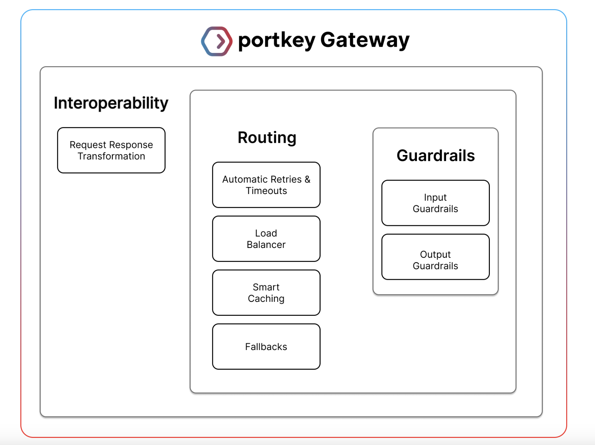

# Portkey AI Open-Sourced AI Guardrails Framework to Enhance Real-Time LLM Validation, Ensuring Secure, Compliant, and Reliable AI Operations

> On Portkey AI, the Gateway Framework is replaced by a significant component, Guardrails, installed to make interacting with the large language model more reliable and safe. Specifically, Guardrails can ensure that requests and responses are formatted according to predefined standards, reducing the risks associated with variable or harmful LLM outputs. On the other side, Portkey […]

On Portkey AI, the Gateway Framework is replaced by a significant component, Guardrails, installed to make interacting with the large language model more reliable and safe. Specifically, Guardrails can ensure that requests and responses are formatted according to predefined standards, reducing the risks associated with variable or harmful LLM outputs.

On the other side, Portkey AI offers an integrated, fully-guardrailed platform that works in real-time to ensure the behaviors of LLM at all times pass all the prescribed checks. This would be important because LLMs are inherently brittle, often failing in the most unexpected ways. Traditional failures may manifest through API downtimes or inexplicable error codes, such as 400 or 500. More insidious are failures whereby a response with a 200 status code still disrupts an app’s workflow because the output is mismatched or wrong. The Guardrails on the Gateway Framework are designed to meet the challenges of validation at input and output against predefined checks.

The Guardrail system includes a set of predefined regex matching, JSON schema validation, and code detection in languages like SQL, Python, and TypeScript. Besides these deterministic checks, Portkey AI also supports LLM-based Guardrails that could detect Gibberish or scan for prompt injections, thus protecting against even more insidious types of failure. More than 20 kinds of Guardrail checks are currently supported, each configurable per need. It integrates with any Guardrail platform, including Aporia, SydeLabs, and Pillar Security. By adding the API keys, the user can include the policies of those other platforms in its Portkey calls.

*[**Image Source**](https://github.com/Portkey-AI/gateway/wiki/Guardrails-on-the-Gateway-Framework)*

It becomes quite easy to put Guardrails into production with the four steps: creating Guardrail checks, defining the Guardrail actions, enabling the Guardrails through configurations, and attaching these configurations to requests. A user can make a Guardrail by selecting from the given checks and then further defining what actions to take based on the result outcomes. These may include logging the result, denying the request, creating an evaluation dataset, falling back to another model, or retrying the request.

Built into the Portkey Guardrail system is the ability to be very configurable, based on the outcome of the various checks that Guardrail performs on an application. This means that, for example, the configuration can ensure that should a check fail, the request will either not proceed at all or with a particular status code. This is key flexibility if any organization will strike a balance between security concerns and operational efficiency.

*[**Image Source**](https://github.com/Portkey-AI/gateway/wiki/Guardrails-on-the-Gateway-Framework)*

One of Portkey’s Guardrails’ most potent aspects is its relation to the wider Gateway Framework, which orchestrates handling requests. That orchestration considers whether the Guardrail is configured to run asynchronously or synchronously. On the former count, Portkey logs the result of the Guardrail, which does not affect the request; on the latter count, a verdict from the Guardrail directly impacts how a request will be handled. For instance, synchronous mode checking may return a specially defined status code, like 446, that says not to process the request should it fail.

Portkey AI keeps logs of the results from Guardrail, including the number of checks that pass or fail, how long each check takes, and the feedback provided for each request. This logging ability is very important to an organization building an evaluation dataset to continuously improve the quality of AI models and protect them with Guardrails.

In conclusion, the guardrails on the Gateway Framework in Portkey AI embody one of the robust solutions for the intrinsic risk factors associated with running LLMs within a production environment. With complete checks and actions, Portkey ensures that AI applications are secure, compliant, and reliable against LLMs’ unpredictable behavior.

---

Check out the **[GitHub](https://github.com/Portkey-AI/gateway/wiki/Guardrails-on-the-Gateway-Framework) and [Details](https://docs.portkey.ai/docs/product/guardrails).** All credit for this research goes to the researchers of this project. Also, don’t forget to follow us on **[Twitter](https://twitter.com/Marktechpost)** and join our **[Telegram Channel](https://pxl.to/at72b5j)** and [**LinkedIn Gr**](https://www.linkedin.com/groups/13668564/)[**oup**](https://www.linkedin.com/groups/13668564/). **If you like our work, you will love our**[** newsletter..**](https://marktechpost-newsletter.beehiiv.com/subscribe)

Don’t Forget to join our **[48k+ ML SubReddit](https://www.reddit.com/r/machinelearningnews/)**

**Find Upcoming [AI Webinars here](https://www.marktechpost.com/ai-webinars-list-llms-rag-generative-ai-ml-vector-database/)**

---

> [Arcee AI Introduces Arcee Swarm: A Groundbreaking Mixture of Agents MoA Architecture Inspired by the Cooperative Intelligence Found in Nature Itself](https://www.marktechpost.com/2024/08/15/arcee-ai-introduces-arcee-swarm-a-groundbreaking-mixture-of-agents-moa-architecture-inspired-by-the-cooperative-intelligence-found-in-nature-itself/)
