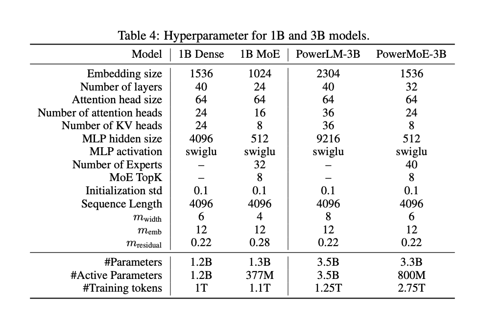

# PowerLM-3B and PowerMoE-3B Released by IBM: Revolutionizing Language Models with 3 Billion Parameters and Advanced Power Scheduler for Efficient Large-Scale AI Training

> IBM’s release of PowerLM-3B and PowerMoE-3B signifies a significant leap in effort to improve the efficiency and scalability of language model training. IBM has introduced these models based on innovative methodologies that address some of the key challenges researchers and developers face in training large-scale models. These models, built on top of IBM’s Power scheduler, […]

IBM’s release of [**PowerLM-3B**](https://huggingface.co/ibm/PowerLM-3b) and [**PowerMoE-3B**](https://huggingface.co/ibm/PowerMoE-3b) signifies a significant leap in effort to improve the efficiency and scalability of language model training. IBM has introduced these models based on innovative methodologies that address some of the key challenges researchers and developers face in training large-scale models. These models, built on top of [**IBM’s Power scheduler**](https://arxiv.org/pdf/2408.13359), demonstrate IBM’s commitment to advancing AI capabilities while optimizing computational costs.

**Background on Large Language Models**

Language models have become foundational to many artificial intelligence applications, from automated customer support to advanced natural language understanding systems. Large-scale language models, such as GPT, LLaMA, and others, have proven effective at generating coherent text, understanding context, and solving complex problems requiring reasoning. However, training these models requires an enormous amount of computational resources. The optimal setting of hyperparameters, such as learning rate, batch size, and token numbers, is crucial for ensuring the effectiveness of these models during training. Despite the improvements made by earlier models, optimizing these hyperparameters remains a challenging task, especially when scaling to billions of parameters.

**The Problem of Learning Rate Scheduling**

The learning rate is one of the most crucial hyperparameters when training deep neural networks, especially LLMs. A well-chosen learning rate ensures faster convergence while avoiding overfitting. Traditional learning rate schedulers, such as the cosine scheduler, have been widely adopted in training large models. However, they often require pre-defining the number of training steps and are not flexible enough to accommodate changing data during training. Furthermore, the intermediate checkpoints during training are usually suboptimal, leading to inefficiencies when resuming training after interruptions. This problem becomes even more complex as model size, batch size, and training tokens increase.

IBM’s Power scheduler aims to solve these issues by introducing a learning rate scheduler agnostic to batch size and token numbers. This ensures that the model can be trained efficiently regardless of these variables. The Power scheduler is based on a power-law relationship between the learning rate and the number of training tokens. It enables the model to adjust its learning rate dynamically during training without specifying the number of training steps in advance.

**IBM’s Power Scheduler**

The Power scheduler was developed to overcome the limitations of existing learning rate schedulers. One of the primary issues with traditional schedulers like the cosine scheduler is that they require the number of training steps to be defined in advance. This inflexibility is particularly problematic for large-scale models where predicting how many training tokens or steps will be needed for optimal performance is difficult.

The Power scheduler introduces a flexible approach that adjusts the learning rate based on the number of training tokens and batch sizes. A power-law equation models the relationship between these variables, ensuring that the learning rate remains optimal throughout the training process, even as the number of training tokens changes.

One key benefit of the Power scheduler is that it allows continual training without sacrificing performance. This is particularly useful for organizations that want to fine-tune their models after the initial training phase or adjust the training data during the training process. The ability to resume training from any checkpoint without re-optimizing the learning rate ensures that training can be both efficient and effective.

**PowerLM-3B and PowerMoE-3B Models**

The introduction of PowerLM-3B and PowerMoE-3B models is a practical demonstration of the benefits of the Power scheduler. Both models were trained using IBM’s Power scheduler and exhibit state-of-the-art performance across various natural language processing tasks.

[**PowerLM-3B**](https://huggingface.co/ibm/PowerLM-3b)

PowerLM-3B is a dense transformer model with 3 billion parameters. It was trained using a mix of high-quality open-source datasets and synthetic corpora over a training run of 1.25 trillion tokens. The dense model architecture ensures that all model parameters are active during inference, providing consistent performance across various tasks.

Despite being trained with fewer tokens than other state-of-the-art models, PowerLM-3B demonstrates comparable performance to larger models. This highlights the efficiency of the Power scheduler in ensuring that the model can learn effectively even with a limited number of training tokens.

*[**Image Source**](https://arxiv.org/pdf/2408.13359)*

[**PowerMoE-3B**](https://huggingface.co/ibm/PowerMoE-3b)

PowerMoE-3B is a mixture-of-experts (MoE) model that uses IBM’s innovative MoE architecture. In contrast to dense models, MoE models activate only a subset of the model’s parameters during inference, making them more computationally efficient. PowerMoE-3B, with its 3 billion parameters, activates only 800 million parameters during inference, significantly reducing computational costs while maintaining high performance.

PowerMoE-3B was trained on 2.5 trillion tokens, using a similar data mix as PowerLM-3B. The mixture-of-experts architecture, combined with the Power scheduler, allows this model to achieve performance comparable to dense models with many more parameters, demonstrating the scalability and efficiency of the MoE approach.

*[**Image Source**](https://arxiv.org/pdf/2408.13359)*

**Real-World Applications and Performance**

PowerLM-3B and PowerMoE-3B were evaluated on various natural language processing tasks, including multiple-choice question answering, common sense reasoning, and code generation. The results show that these models perform competitively with other state-of-the-art models despite being trained with fewer tokens and using fewer active parameters during inference in the case of PowerMoE-3B.

For example, PowerLM-3B achieved high scores on tasks such as ARC (AI2 Reasoning Challenge) and PIQA (Physical Interaction Question Answering), outperforming many models with a similar parameter count. PowerMoE-3B, on the other hand, excelled in tasks that required computational efficiency, achieving competitive results with much lower inference costs.

These results highlight the potential of IBM’s Power scheduler and MoE architecture to revolutionize how large language models are trained and deployed. By optimizing the learning rate and reducing computational requirements, these models provide a path forward for organizations looking to leverage advanced language models without incurring the massive costs associated with traditional dense models.

**Conclusion**

IBM’s release of PowerLM-3B and PowerMoE-3B marks a pivotal advancement in LLMs and NLP. IBM’s innovative Power scheduler has proven to be a highly effective tool for optimizing the training process of these models, allowing for more efficient training and better scalability. With the combination of dense and mixture-of-experts architectures, IBM has provided a robust framework for building powerful AI models that can perform well across various tasks while reducing computational overhead.

---

Check out the **[Model](https://huggingface.co/collections/ibm/power-lm-66be64ae647ddf11b9808000)** and [**Related** **Paper**](https://arxiv.org/pdf/2408.13359). All credit for this research goes to the researchers of this project. Also, don’t forget to follow us on **[Twitter](https://twitter.com/Marktechpost)** and join our **[Telegram Channel](https://pxl.to/at72b5j)** and [**LinkedIn Gr**](https://www.linkedin.com/groups/13668564/)[**oup**](https://www.linkedin.com/groups/13668564/). **If you like our work, you will love our**[** newsletter..**](https://marktechpost-newsletter.beehiiv.com/subscribe)

Don’t Forget to join our **[50k+ ML SubReddit](https://www.reddit.com/r/machinelearningnews/)**

> [FPT Software AI Center Introduces HyperAgent: A Groundbreaking Generalist Agent System to Resolve Various Software Engineering Tasks at Scale, Achieving SOTA Performance on SWE-Bench and Defects4J](https://www.marktechpost.com/2024/09/11/fpt-software-ai-center-introduces-hyperagent-a-groundbreaking-generalist-agent-system-to-resolve-various-software-engineering-tasks-at-scale-achieving-sota-performance-on-swe-bench-and-defects4j/)
