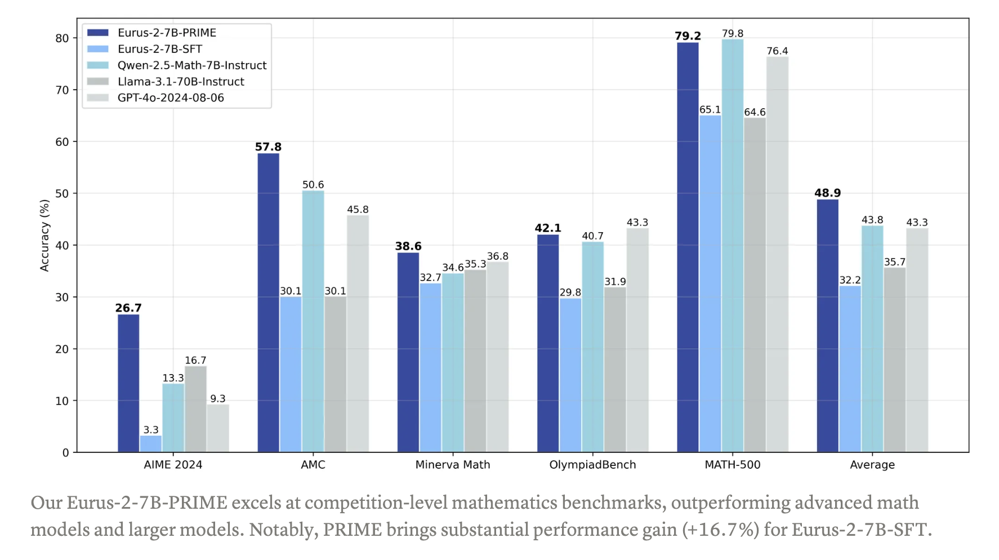

# PRIME: An Open-Source Solution for Online Reinforcement Learning with Process Rewards to Advance Reasoning Abilities of Language Models Beyond Imitation or Distillation

> Large Language Models (LLMs) face significant scalability limitations in improving their reasoning capabilities through data-driven imitation, as better performance demands exponentially more high-quality training examples. Exploration-based methods, particularly reinforcement learning (RL), offer a promising alternative to overcome these limitations. The transformation from data-driven to exploration-based approaches presents two key challenges: developing efficient methods to generate […]

Large Language Models (LLMs) face significant scalability limitations in improving their reasoning capabilities through data-driven imitation, as better performance demands exponentially more high-quality training examples. Exploration-based methods, particularly reinforcement learning (RL), offer a promising alternative to overcome these limitations. The transformation from data-driven to exploration-based approaches presents two key challenges: developing efficient methods to generate precise reward signals and designing effective RL algorithms that maximize the utility of these signals. This shift represents a crucial step toward enhancing LLM reasoning capabilities.

A team of researchers introduces PRIME (Process Reinforcement through IMplicit Rewards), a novel approach to enhance language model reasoning through online RL with process rewards. The system employs implicit process reward modeling (PRM), which functions without requiring process labels and operates as an outcome reward model. This approach enables the development of Eurus-2-7B-PRIME, a powerful reasoning model that demonstrates significant improvements through both online RL training and inference-time scaling. The innovation of implicit PRM lies in its dual capability to enhance performance and facilitate effective RL training.

The research team selected Qwen2.5-Math-7B-Base as their foundation model and evaluated performance using high-level mathematics and programming benchmarks. The initial phase involves supervised fine-tuning (SFT) using an action-centric chain-of-thought framework where models choose from seven predefined actions. The team constructed a 230K dataset from various open-source materials, deliberately excluding high-quality datasets with ground-truth answers to reserve them for RL. Despite these efforts, the SFT model’s performance fell short of Qwen2.5-Math-7B-Instruct across mathematics benchmarks.

The research utilizes a comprehensive approach to dataset curation for RL, combining 457K math problems from NuminaMath-CoT and 27K coding problems from various sources, including APPS, CodeContests, TACO, and Codeforces. The team implements an innovative online prompt filtering strategy that dynamically selects prompts based on difficulty levels. By sampling multiple trajectories and maintaining prompts with accuracy scores between 0.2 and 0.8, they effectively balanced the training data distribution, eliminating both overly simple and excessively challenging problems. Here is the flow of the algorithm for the proposed method PRIME:
                                                  

PRIME’s implementation follows a systematic process where the policy model and PRM initialize from the SFT model. The algorithm operates through sequential steps of generating rollouts, scoring them, and updating both models using combined outcome and process rewards. With PRIME, starting from Qwen2.5-Math-7B-Base, the trained model Eurus-2-7B-PRIME achieves 26.7% pass@1, surpassing GPT-4o and Qwen2.5-Math-7B-Instruct. This is achieved using only 1/10 data of Qwen Math (230K SFT + 150K RL). Moreover, PRIME achieves significant improvements over sparse reward approaches using specific hyperparameters and the results show 2.5 times faster training, 6.9% higher final rewards, and notably, Eurus-2-7B-PRIME demonstrated a 16.7% average improvement across benchmarks, with over 20% enhancement in AMC&AIME competitions. 

Lastly, the validation process for PRIME utilizes advanced mathematical reasoning models (QwQ-32B-Preview and Qwen2.5-Math-72B-Instruct) to evaluate problem solvability and solution correctness. Using insights from analyzing sample problems and synthetic unsolvable cases, the team developed specialized prompts to enhance validation accuracy. Each problem undergoes five comprehensive validation attempts, containing step-by-step LaTeX solutions, unsolvability checks, reasoning traces, standardized answer formatting, and documentation of solution impediments. This rigorous validation framework ensures the quality and reliability of the question-answer pairs.

---

Check out **_the [Hugging Face Page](https://huggingface.co/PRIME-RL)_**, **_[Technical Details](https://curvy-check-498.notion.site/Process-Reinforcement-through-Implicit-Rewards-15f4fcb9c42180f1b498cc9b2eaf896f)_**, and [**_GitHub_** **_Page_**](https://github.com/PRIME-RL/PRIME). All credit for this research goes to the researchers of this project. Also, don’t forget to follow us on **[Twitter](https://twitter.com/Marktechpost)** and join our **[Telegram Channel](https://github.com/XGenerationLab/XiYan-SQL)** and [**LinkedIn Gr**](https://www.linkedin.com/groups/13668564/)[**oup**](https://www.linkedin.com/groups/13668564/). Don’t Forget to join our **[60k+ ML SubReddit](https://www.reddit.com/r/machinelearningnews/)**.

**🚨 FREE UPCOMING AI WEBINAR (JAN 15, 2025): [Boost LLM Accuracy with Synthetic Data and Evaluation Intelligence](https://info.gretel.ai/boost-llm-accuracy-with-sd-and-evaluation-intelligence?utm_source=marktechpost&utm_medium=newsletter&utm_campaign=202501_gretel_galileo_webinar)**–**[Join this webinar to gain actionable insights into boosting LLM model performance and accuracy while safeguarding data privacy](https://info.gretel.ai/boost-llm-accuracy-with-sd-and-evaluation-intelligence?utm_source=marktechpost&utm_medium=newsletter&utm_campaign=202501_gretel_galileo_webinar).**
