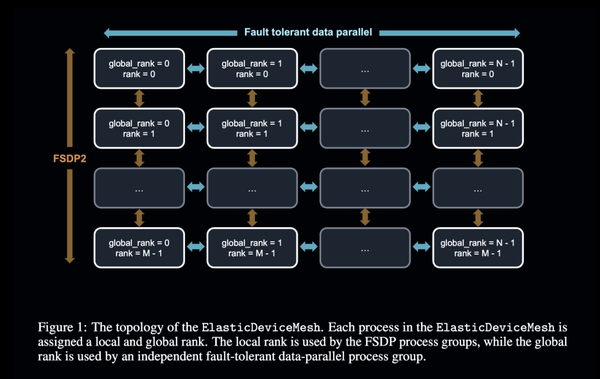

# PRIME Intellect Releases INTELLECT-1 (Instruct + Base): The First 10B Parameter Language Model Collaboratively Trained Across the Globe

> In recent years, the evolution of artificial intelligence has brought forth increasingly sophisticated large language models (LLMs). However, training these models remains a complex challenge due to their immense computational requirements. Traditionally, training such models has been possible only in centralized environments with high-bandwidth interconnects, typically within large data centers controlled by a few tech […]

In recent years, the evolution of artificial intelligence has brought forth increasingly sophisticated large language models (LLMs). However, training these models remains a complex challenge due to their immense computational requirements. Traditionally, training such models has been possible only in centralized environments with high-bandwidth interconnects, typically within large data centers controlled by a few tech giants. This centralized paradigm limits accessibility, as it requires significant resources that only a few organizations can afford. These restrictions have raised concerns about equitable access to advanced AI technologies and their potential monopolization. To address these barriers, researchers have begun exploring collaborative, decentralized training approaches. The challenge lies in overcoming issues such as low inter-node bandwidth and unpredictable node availability, which make decentralized training more complex than its centralized counterpart.

### The Release of INTELLECT-1

PRIME Intellect has released INTELLECT-1 (Instruct + Base), the first 10-billion-parameter language model collaboratively trained across the globe. This model demonstrates the feasibility of using decentralized, community-driven resources for training advanced LLMs. PRIME Intellect utilized their _[PRIME framework](https://github.com/PrimeIntellect-ai/prime)_, specifically designed to overcome the challenges of decentralized training, including network unreliability and the dynamic addition or removal of compute nodes. The framework utilized up to 112 H100 GPUs across three continents and achieved a compute utilization rate of up to 96% under optimal conditions, demonstrating that decentralized training can match the performance levels of traditional setups. This approach broadens access to high-performance AI models and fosters a collaborative research environment where contributors worldwide can participate in AI development.

### Technical Details

According to the official release, INTELLECT-1 was developed using a diverse mix of high-quality datasets, including publicly available data and proprietary datasets curated by PRIME Intellect and their partners. The model was trained on 1 trillion tokens, ensuring it has a broad understanding of various domains. The training process involved 14 concurrent nodes distributed across three continents, with compute sponsors dynamically joining and leaving as needed. This dynamic approach allowed for significant flexibility, which is crucial for real-world deployment scenarios. PRIME Intellect also ensured training stability through innovations like live checkpointing and fault-tolerant communication, enabled by the PRIME framework.

Technically, INTELLECT-1’s training was made possible through innovations in the PRIME framework, which addressed the constraints of geographically distributed nodes. PRIME features the ElasticDeviceMesh, an abstraction that manages both internet-wide communication and local, fault-tolerant data-sharing across nodes. Hybrid training approaches combining Fully Sharded Data Parallel (FSDP) techniques for intra-node efficiency and Distributed Low-Communication (DiLoCo) algorithms for minimal inter-node communication were implemented. To minimize bandwidth requirements, the PRIME framework included an 8-bit quantization strategy for gradient transfers, reducing the communication payload by up to 400 times compared to traditional data-parallel training. Fault tolerance was managed through dynamic node management, allowing new nodes to join seamlessly and failed nodes to be removed with minimal disruption. These innovations facilitated effective decentralized model training while maintaining high computational efficiency.

### Benchmark Results and Implications

The release of INTELLECT-1 marks a significant step forward in making LLM training accessible beyond large corporations. Results from the training process reveal a model that competes with similarly sized models trained in centralized settings. For instance, INTELLECT-1 achieved 37.5% accuracy on the MMLU benchmark and 72.26% on HellaSwag. Additionally, INTELLECT-1 outperformed several other open-source models in specific benchmarks, including 65.82% on the WinoGrande challenge. Although these figures slightly lag behind some state-of-the-art centralized models, the results are notable given the challenges of decentralized training. More importantly, this experiment sets a precedent for large-scale collaborations and paves the way for further developments in community-led AI projects. The global network of 30 independent compute contributors not only ensured the success of the project but also highlighted the scalability of such efforts. As decentralized models grow in scale and as communication strategies improve, the gap between centralized and decentralized training will likely continue to close.

### Conclusion

The release of INTELLECT-1 represents a milestone in the pursuit of more accessible AI research. By leveraging decentralized resources to train a 10-billion-parameter language model, PRIME Intellect and its collaborators have demonstrated that advanced AI development need not be limited to a few elite corporations. Through innovations in distributed training frameworks and global collaboration, INTELLECT-1 sets a new standard for what is possible in open and inclusive AI research. The PRIME framework, along with the publicly available INTELLECT-1 model and training data, will hopefully inspire more community-driven projects, helping to level the playing field in the AI space and opening doors for more diverse contributions. This is an important step towards making AI an accessible and inclusive resource for everyone.

---

Check out **the [Paper](https://github.com/PrimeIntellect-ai/prime/blob/main/INTELLECT_1_Technical_Report.pdf), [Details](https://www.primeintellect.ai/blog/intellect-1-release), and Models on Hugging Face ([Instruct](https://huggingface.co/PrimeIntellect/INTELLECT-1-Instruct) and [Base](https://huggingface.co/PrimeIntellect/INTELLECT-1)).** All credit for this research goes to the researchers of this project. Also, don’t forget to follow us on **[Twitter](https://twitter.com/Marktechpost)** and join our **[Telegram Channel](https://github.com/XGenerationLab/XiYan-SQL)** and [**LinkedIn Gr**](https://www.linkedin.com/groups/13668564/)[**oup**](https://www.linkedin.com/groups/13668564/). **If you like our work, you will love our**[** newsletter..**](https://marktechpost-newsletter.beehiiv.com/subscribe) Don’t Forget to join our **[59k+ ML SubReddit](https://www.reddit.com/r/machinelearningnews/)**.

**🎙️ 🚨 ‘[Evaluation of Large Language Model Vulnerabilities: A Comparative Analysis of Red Teaming Techniques’ Read the Full Report _(Promoted)_](https://hubs.li/Q02Y39sh0)**
