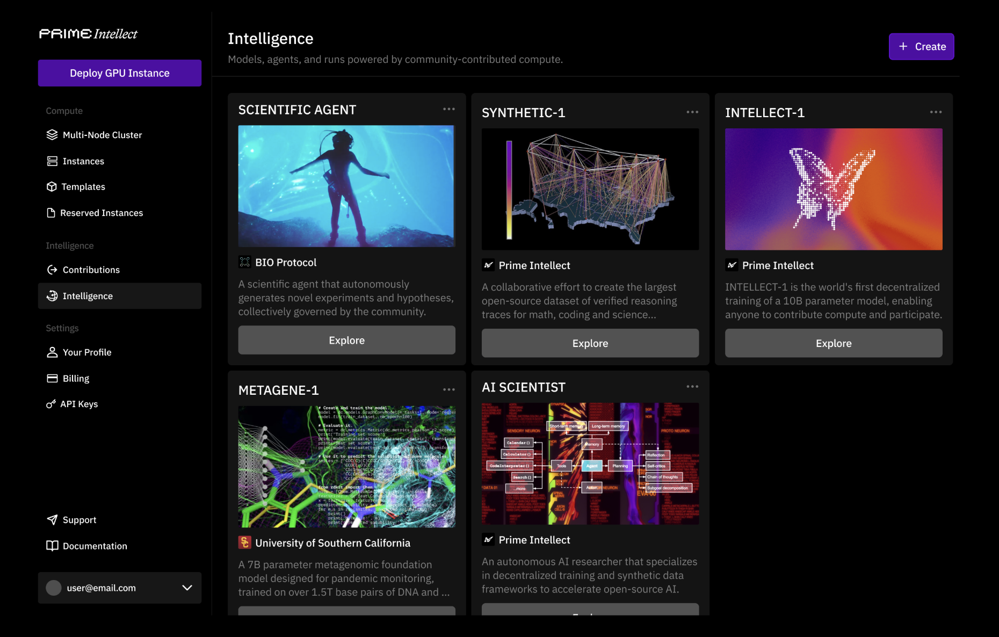

# Prime Intellect Releases SYNTHETIC-1: An Open-Source Dataset Consisting of 1.4M Curated Tasks Spanning Math, Coding, Software Engineering, STEM, and Synthetic Code Understanding

> In artificial intelligence and machine learning, high-quality datasets play a crucial role in developing accurate and reliable models. However, collecting extensive, verified data—particularly in specialized domains like mathematics, coding, and science—remains a challenge. Traditional data-gathering methods often fail to produce datasets that effectively train models for complex reasoning tasks. This gap highlights the need for […]

In artificial intelligence and machine learning, high-quality datasets play a crucial role in developing accurate and reliable models. However, collecting extensive, verified data—particularly in specialized domains like mathematics, coding, and science—remains a challenge. Traditional data-gathering methods often fail to produce datasets that effectively train models for complex reasoning tasks. This gap highlights the need for new approaches to dataset creation and verification.

Prime Intellect has introduced SYNTHETIC-1, an open-source dataset designed to provide verified reasoning traces in math, coding, and science. Built with the support of DeepSeek-R1, this dataset consists of 1.4 million structured tasks and verifiers. The objective of SYNTHETIC-1 is to improve reasoning models by supplying them with well-organized, reliable data, addressing the shortcomings of existing resources.

**SYNTHETIC-1 includes a range of task types, each designed to ensure quality and relevance:**

- **777,000 Math Problems with Symbolic Verifiers**: These problems, sourced from the NuminaMath dataset, focus on high school competition-level questions. An LLM-based filtering process removes non-verifiable problems, such as those requiring proofs, and reformulates multiple-choice questions into direct-answer formats.

- **144,000 Coding Problems with Unit Tests**: Extracted from datasets like Apps, Codecontests, Codeforces, and TACO, these problems come with unit tests to verify solutions. The dataset initially contained Python problems, which were later expanded to include JavaScript, Rust, and C++, increasing the variety and depth of challenges.

- **313,000 Open-Ended STEM Questions with LLM Evaluation**: Using the StackExchange dataset, this subset covers a broad spectrum of technical and scientific topics. The selection process prioritizes questions requiring reasoning rather than simple information retrieval. An LLM judge scores answers based on their alignment with top-voted community responses.

- **70,000 Real-World Software Engineering Tasks**: These tasks, drawn from GitHub commits in the CommitPack dataset, involve modifying code files based on commit instructions. An LLM judge evaluates solutions by comparing them with actual post-commit code states.

- **61,000 Code Output Prediction Tasks**: Focused on predicting the output of code transformations on strings, this subset challenges models with increasingly complex string manipulation tasks. These problems are designed to be particularly difficult for modern AI models.

The structured nature of SYNTHETIC-1 makes it a valuable resource for training models in structured reasoning. By including programmatically verifiable problems, such as coding tasks with unit tests, the dataset ensures clear correctness criteria. Additionally, open-ended reasoning questions verified by LLM judges provide challenges that push the limits of current AI capabilities. The dataset’s collaborative framework also allows for continuous improvement and expansion, fostering a shared effort to refine AI training resources.

SYNTHETIC-1 represents a step forward in creating high-quality datasets for reasoning-based AI models. By addressing gaps in existing datasets, it provides a structured foundation for improving machine reasoning in math, coding, and science. The project also encourages ongoing contributions, making it an evolving resource for researchers and developers working to advance AI’s capabilities in structured problem-solving.

---

Check out **_the [Details](https://www.primeintellect.ai/blog/synthetic-1) and [Dataset on Hugging Face](https://huggingface.co/collections/PrimeIntellect/synthetic-1-67a2c399cfdd6c9f7fae0c37)._** All credit for this research goes to the researchers of this project. Also, don’t forget to follow us on **[Twitter](https://x.com/intent/follow?screen_name=marktechpost)** and join our **[Telegram Channel](https://arxiv.org/abs/2406.09406)** and [**LinkedIn Gr**](https://www.linkedin.com/groups/13668564/)[**oup**](https://www.linkedin.com/groups/13668564/). Don’t Forget to join our **[75k+ ML SubReddit](https://www.reddit.com/r/machinelearningnews/)**.

**[🚨 Recommended Open-Source AI Platform: ‘IntellAgent is a An Open-Source Multi-Agent Framework to Evaluate Complex Conversational AI System’ (Promoted)](https://pxl.to/82homag)**
