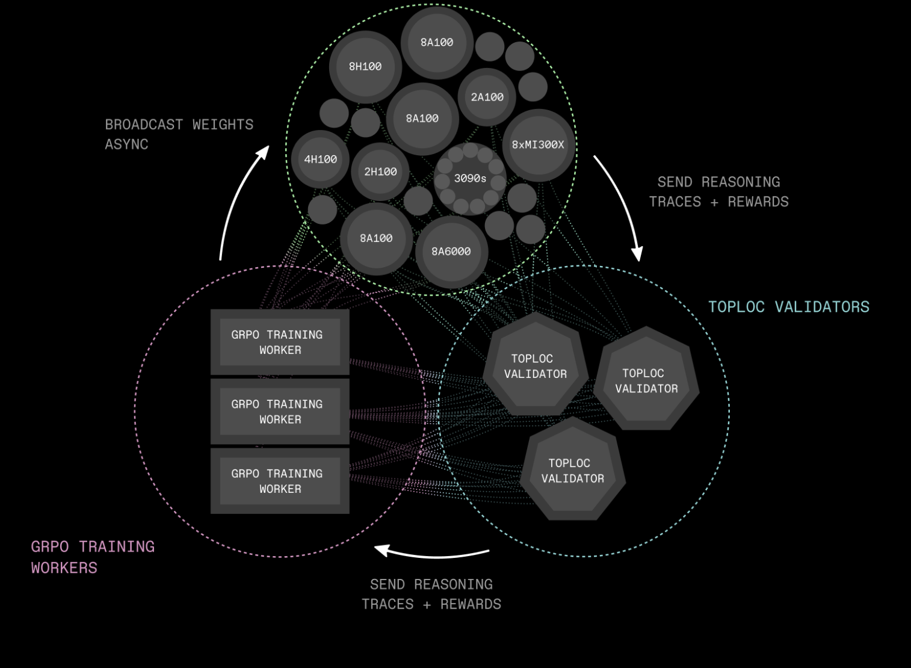

# PrimeIntellect Releases INTELLECT-2: A 32B Reasoning Model Trained via Distributed Asynchronous Reinforcement Learning

> As language models scale in parameter count and reasoning complexity, traditional centralized training pipelines face increasing constraints. High-performance model training often depends on tightly coupled compute clusters with fast interconnects, which are costly, limited in availability, and prone to scalability bottlenecks. Furthermore, centralized architectures restrict the possibility of widespread collaboration and experimentation, particularly in open-source […]

As language models scale in parameter count and reasoning complexity, traditional centralized training pipelines face increasing constraints. High-performance model training often depends on tightly coupled compute clusters with fast interconnects, which are costly, limited in availability, and prone to scalability bottlenecks. Furthermore, centralized architectures restrict the possibility of widespread collaboration and experimentation, particularly in open-source research environments. A shift toward decentralized methods could mitigate these challenges, enabling broader participation and more fault-tolerant training regimes.

### PrimeIntellect Open Sources INTELLECT-2, a 32B Reasoning Model

PrimeIntellect has released INTELLECT-2, a 32-billion parameter reasoning model post-trained using Generalized Reinforcement Policy Optimization (GRPO) within a fully decentralized, asynchronous reinforcement learning framework. Licensed under Apache 2.0, the release includes not only the model weights but also the full codebase and training logs. INTELLECT-2 exceeds the performance of the previously leading QwQ-32B model in key reasoning benchmarks. The open-source nature of the release is intended to support reproducibility, extensibility, and ongoing research.

### Architecture and Technical Innovations

INTELLECT-2 is developed within a novel training stack purpose-built for distributed environments. Three primary components underpin this system:

- **PRIME-RL**: An asynchronous RL engine that separates the stages of rollout generation, training, and parameter distribution. This decoupling removes the need for synchronous updates and allows the system to operate over variable and unreliable network conditions.

- **SHARDCAST**: A tree-topology HTTP protocol that supports rapid propagation of model weights across distributed workers, improving communication efficiency without requiring specialized infrastructure.

- **TOPLOC**: A verification mechanism based on locality-sensitive hashing, which detects modifications in inference outputs. This is critical for ensuring integrity in distributed and potentially non-deterministic hardware environments.

This architecture enables INTELLECT-2 to be trained across heterogeneous systems with minimal coordination overhead while preserving model quality and inference consistency.

### Training Data, Methodology, and Performance

The post-training process for INTELLECT-2 used approximately 285,000 verifiable tasks with a focus on reasoning, coding, and mathematical problem solving. Sources included datasets such as NuminaMath-1.5, Deepscaler, and SYNTHETIC-1. The model underwent reinforcement learning fine-tuning using GRPO with asynchronous updates.

The system applied a two-phase training strategy: new policy weights were broadcast while the existing rollout and training pipelines remained active, minimizing idle time across the network. Stability was improved through two-sided clipping of token probability ratios, reducing the variance associated with large updates.

A combination of heuristics and automated filters was used to select high-quality demonstrations, and a tailored reward model was employed to rank completions. The reinforcement learning loop consistently favored completions with better reasoning structure, contributing to measurable performance improvements over baseline models.

In terms of evaluation, INTELLECT-2 outperforms QwQ-32B on multiple reasoning-centric benchmarks, indicating improved generalization and reasoning accuracy. The gains are particularly evident in math and coding tasks, where the use of asynchronous GRPO fine-tuning and curated reward modeling produced more structured and verifiable outputs. These results suggest that decentralized post-training pipelines can achieve comparable or superior performance to traditional RLHF pipelines while offering improved flexibility and scalability.

### Conclusion

INTELLECT-2 represents a methodologically sound step toward decentralizing large-scale model training. By demonstrating that a 32B parameter model can be post-trained with high performance using distributed, asynchronous reinforcement learning, PrimeIntellect contributes a practical and extensible alternative to centralized RLHF pipelines. The architecture’s modular components—PRIME-RL, SHARDCAST, and TOPLOC—address key challenges in scalability, communication efficiency, and inference verification. As research interest grows in open, decentralized AI development, INTELLECT-2 serves as a reproducible benchmark and a framework for further experimentation in distributed model training.

---

Check out **_[Paper](https://storage.googleapis.com/public-technical-paper/INTELLECT_2_Technical_Report.pdf), [Model on Hugging Face](https://huggingface.co/collections/PrimeIntellect/intellect-2-68205b03343a82eabc802dc2) and [Official Release](https://www.primeintellect.ai/blog/intellect-2-release)._** All credit for this research goes to the researchers of this project. Also, feel free to follow us on **[Twitter](https://x.com/intent/follow?screen_name=marktechpost)** and don’t forget to join our **[90k+ ML SubReddit](https://www.reddit.com/r/machinelearningnews/)**.

**Here’s a brief overview of what we’re building at Marktechpost:**

- **ML News Community –[ r/machinelearningnews](https://www.reddit.com/r/machinelearningnews/) (92k+ members)**

- **Newsletter– [airesearchinsights.com/](https://minicon.marktechpost.com/)(30k+ subscribers)**

- **miniCON AI Events – [minicon.marktechpost.com](https://minicon.marktechpost.com/)**

- **AI Reports & Magazines – [magazine.marktechpost.com](https://magazine.marktechpost.com/)**

- **AI Dev & Research News – [marktechpost.com](https://marktechpost.com/) (1M+ monthly readers)**

- **[Partner with us](https://forms.gle/cnXafrh6Be8UigQ68)**
