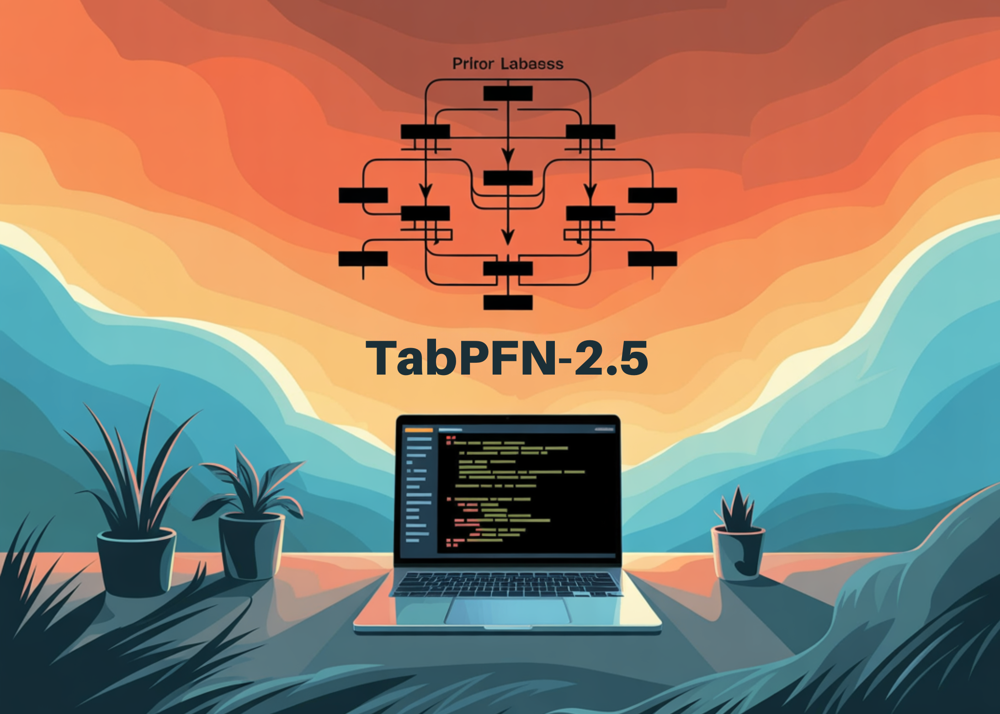

# Prior Labs Releases TabPFN-2.5: The Latest Version of TabPFN that Unlocks Scale and Speed for Tabular Foundation Models

> Tabular data is still where many important models run in production. Finance, healthcare, energy and industry teams work with tables of rows and columns, not images or long text. Prior Labs now extends this space with TabPFN-2.5, a new tabular foundation model that scales in context learning to 50,000 samples and 2,000 features while keeping […]

Tabular data is still where many important models run in production. Finance, healthcare, energy and industry teams work with tables of rows and columns, not images or long text. **[Prior Labs ](https://priorlabs.ai/)**now extends this space with **TabPFN-2.5**, a new tabular foundation model that scales in context learning to 50,000 samples and 2,000 features while keeping a training free workflow.

*https://priorlabs.ai/technical-reports/tabpfn-2-5-model-report*

### From TabPFN And TabPFNv2 To TabPFN-2.5

The first TabPFN showed that a transformer can learn a Bayesian like inference procedure on synthetic tabular tasks. It handled up to about 1,000 samples and clean numerical features. TabPFNv2 extended this to messy real world data. It added support for categorical features, missing values and outliers, and was practical up to 10,000 samples and 500 features.

TabPFN-2.5 is the next generation in this line. Prior Labs describes it as best for datasets with up to 50,000 samples and 2,000 features, which is a 5 times increase in rows and a 4 times increase in columns over TabPFNv2. That gives roughly 20 times more data cells in the supported regime. The model is exposed through the `tabpfn` Python package and also through an API.

AspectTabPFN (v1)TabPFNv2TabPFN-2.5Max Rows (recommended)1,00010,00050,000Max Features (recommended)1005002,000Supported data typesNumeric onlyMixedMixed

### In Context Learning For Tables

TabPFN-2.5 follows the same prior data fitted network idea as earlier versions. It is a transformer based foundation model that uses in context learning to solve tabular prediction problems in a forward pass. At training time, the model is meta trained on large synthetic distributions of tabular tasks. At inference time, you pass training rows and labels and the test rows together. The model runs one forward pass and outputs predictions, so there is no dataset specific gradient descent or hyperparameter search.

*https://priorlabs.ai/technical-reports/tabpfn-2-5-model-report*

### Benchmark Results On TabArena And RealCause

The research team uses the TabArena Lite benchmark to measure medium sized tasks up to 10,000 samples and 500 features. TabPFN-2.5 in a forward pass outperforms any other model in the comparison. When the Real-TabPFN-2.5 variant is fine tuned on real datasets, the lead increases further. AutoGluon 1.4 in extreme mode is the baseline ensemble, tuned for 4 hours and even including TabPFNv2.

On industry standard benchmarks with up to 50,000 data points and 2,000 features, TabPFN-2.5 substantially outperforms tuned tree based models such as XGBoost and CatBoost. On the same benchmarks it matches the accuracy of AutoGluon 1.4, which runs a complex four hour tuned ensemble that includes previous methods.

### Model Architecture And Training Setup

The model architecture follows TabPFNv2 with alternating attention and 18 to 24 layers. Alternating attention means that the network attends along the sample axis and along the feature axis in separate stages, which enforces permutation invariance over rows and columns. This design is important for tabular data where the order of rows and the order of columns do not carry information.

The training setup keeps the prior data based learning idea. TabPFN-2.5 uses synthetic tabular tasks with different priors over functions and data distributions as its meta training source. Real-TabPFN-2.5 uses continued pre training on a set of real world tabular datasets from repositories like OpenML and Kaggle, while the team carefully avoids overlap with evaluation benchmarks.

### Key Takeaways

- TabPFN 2.5 scales prior data fitted tabular transformers to about 50,000 samples and 2,000 features while keeping a one forward pass, no tuning workflow.

- The model is trained on synthetic tabular tasks and evaluated on TabArena, internal industry benchmarks and RealCause, where it substantially outperforms tuned tree based baselines and matches AutoGluon 1.4 on benchmarks in this size range.

- TabPFN 2.5 keeps the TabPFNv2 style alternating attention transformer for rows and features, which enables permutation invariance over tables and in context learning without task specific training.

- A distillation engine turns TabPFN 2.5 into compact MLP or tree ensemble students that preserve most of the accuracy while giving much lower latency and plug in deployment in existing tabular stacks.

### Editorial Comments

TabPFN 2.5 is an important release for tabular machine learning because it turns model selection and hyperparameter tuning into a single forward pass workflow on datasets with up to 50,000 samples and 2,000 features. It combines synthetic meta training, Real-TabPFN-2.5 fine tuning and a distillation engine into MLP and TreeEns students, with a clear non commercial license and enterprise path. Overall, this release makes prior data fitted networks practical for real tabular problems.

---

Check out the **[Paper](https://storage.googleapis.com/prior-labs-tabpfn-public/reports/TabPFN_2_5_tech_report.pdf?date=2025-11-06)**, **[Model Weights](https://huggingface.co/Prior-Labs/tabpfn_2_5), [Repo](https://github.com/PriorLabs/TabPFN) **and **[Technical Details](https://priorlabs.ai/technical-reports/tabpfn-2-5-model-report)**. Feel free to check out our **[GitHub Page for Tutorials, Codes and Notebooks](https://github.com/Marktechpost/AI-Tutorial-Codes-Included)**. Also, feel free to follow us on **[Twitter](https://x.com/intent/follow?screen_name=marktechpost)** and don’t forget to join our **[100k+ ML SubReddit](https://www.reddit.com/r/machinelearningnews/)** and Subscribe to **[our Newsletter](https://www.aidevsignals.com/)**. Wait! are you on telegram? **[now you can join us on telegram as well.](https://t.me/machinelearningresearchnews)**
