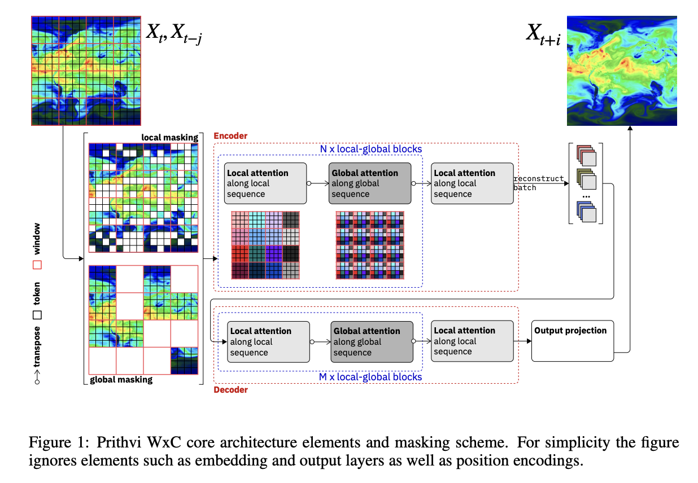

# Prithvi WxC Released by IBM and NASA: A 2.3 Billion Parameter Foundation Model for Weather and Climate

> Climate and weather prediction has experienced rapid advancements through machine learning and deep learning models. Researchers have started to rely on artificial intelligence (AI) to enhance predictions’ accuracy and computational efficiency. Traditional numerical weather prediction (NWP) models have been effective but require substantial computational resources, making them less accessible and harder to apply at larger […]

Climate and weather prediction has experienced rapid advancements through machine learning and deep learning models. Researchers have started to rely on artificial intelligence (AI) to enhance predictions’ accuracy and computational efficiency. Traditional numerical weather prediction (NWP) models have been effective but require substantial computational resources, making them less accessible and harder to apply at larger scales. Meanwhile, deep learning models can capture complex patterns and relationships within the atmosphere using significantly fewer computational resources. This paradigm shift allows researchers to develop more scalable and versatile models, facilitating predictions critical for both short-term weather forecasting & long-term climate modeling.

A fundamental problem in weather and climate forecasting is the need for traditional models to capture non-linear atmospheric processes, especially at finer resolutions. The lack of a unified model that simultaneously addresses various use cases, such as regional weather predictions, extreme event forecasting, and climate impact analysis, poses a significant challenge. Also, there is a need for models that can work effectively across different spatial and temporal scales. This gap is further highlighted when dealing with localized extreme events, which require high-resolution data that many models struggle to process without incurring high computational costs. Thus, developing a single, large-scale AI model that addresses multiple forecasting challenges can substantially improve existing approaches.

Current deep-learning models for atmospheric sciences, like FourCastNet, Pangu, and GraphCast, are largely designed for specific forecasting tasks. These models focus on issues such as near-term forecasting but need more flexibility for a broader range of applications. Furthermore, most of these models utilize task-specific architectures and objectives, limiting their ability to perform under diverse forecasting scenarios, especially in long-term predictions or complex climate modeling tasks. As a result, these models, while advanced, often need more generalizability for comprehensive climate research.

Researchers from IBM Research and NASA have introduced **Prithvi WxC**, a 2.3 billion parameter foundation model for weather and climate forecasting. The Prithvi WxC model incorporates 160 variables from the Modern-Era Retrospective Analysis for Research and Applications, Version 2 (MERRA-2), a high-resolution dataset covering global atmospheric conditions. This model employs a state-of-the-art encoder-decoder transformer-based architecture, allowing it to capture local and global dependencies in the atmospheric data efficiently. Using a transformer model facilitates handling long-range dependencies in the data, making it possible to model complex atmospheric interactions at various scales, from local to global.

Prithvi WxC’s core architecture features a combination of local and global attention mechanisms that enable it to process large token counts, effectively capturing spatial and temporal patterns in the input data. It also employs a mixed objective function that integrates masked reconstruction and forecasting tasks. This unique approach allows the model to generalize well across different applications, ranging from autoregressive rollout forecasting to estimating extreme weather events. Also, the model incorporates a pretraining phase with 25 encoder and 5 decoder blocks, utilizing advanced AI techniques such as masked autoencoding and variable lead-time prediction. The model’s flexibility is further enhanced by its ability to incorporate additional tokens from off-grid measurements during fine-tuning, making it adaptable for various downstream applications.

During the evaluation, Prithvi WxC showed superior performance in several benchmarks. One of the highlights was its ability to accurately predict the track and intensity of Hurricane Ida, achieving a mean track error of just 63.9 km compared to 201.9 km for other leading models. The model was also tested on downstream tasks like downscaling, where it demonstrated a remarkable spatial root mean square error (RMSE) of 0.73 K when predicting 2-meter air temperature, outperforming traditional methods by a factor of four. Its capabilities extend to gravity wave flux parameterization, where it outperformed baseline models by successfully predicting momentum fluxes in the upper troposphere.

**Key Takeaways from the Research:**

- Prithvi WxC is a 2.3 billion parameter foundation model incorporating 160 atmospheric variables.

- The model utilizes a transformer-based architecture with local and global attention mechanisms.

- It achieved a mean track error of 63.9 km for Hurricane Ida, significantly outperforming other models.

- Prithvi WxC has shown a spatial RMSE of 0.73 K in downscaling tasks, surpassing traditional methods by four.

- The model’s unique training approach integrates masked reconstruction and forecasting, making it adaptable to various atmospheric applications.

- Researchers have demonstrated its effectiveness in multiple downstream tasks, including extreme event prediction and gravity wave flux parameterization.

In conclusion, the development of Prithvi WxC signifies a significant leap in weather and climate modeling, providing a scalable and versatile solution that addresses the limitations of current models. Its ability to handle multiple tasks using a unified architecture positions it as a potential cornerstone for future advancements in climate science. The model’s success across various benchmarks and its superior handling of complex atmospheric interactions indicates that foundation models like Prithvi WxC could revolutionize the way weather and climate predictions are made, improving accuracy and reducing computational costs.

---

Check out the **[Paper](https://arxiv.org/abs/2409.13598)**, **[Model Card on Hugging Face](https://huggingface.co/Prithvi-WxC/prithvi.wxc.2300m.v1)**, and **[GitHub Page](https://github.com/NASA-IMPACT/Prithvi-WxC)**. All credit for this research goes to the researchers of this project. Also, don’t forget to follow us on **[Twitter](https://twitter.com/Marktechpost)** and join our **[Telegram Channel](https://pxl.to/at72b5j)** and [**LinkedIn Gr**](https://www.linkedin.com/groups/13668564/)[**oup**](https://www.linkedin.com/groups/13668564/). **If you like our work, you will love our**[** newsletter..**](https://marktechpost-newsletter.beehiiv.com/subscribe)

Don’t Forget to join our **[50k+ ML SubReddit](https://www.reddit.com/r/machinelearningnews/)**

Want to get in front of 1 Million+ AI Readers? _**[Work with us here](https://docs.google.com/forms/d/e/1FAIpQLSejG1xG7RnIV6AJmVCfzmH3y0_pliALNo9ZIgjVeJdPAFTcwQ/viewform?utm_source=www.airesearchinsights.com&utm_medium=referral&utm_campaign=marktechpost-ai-newsletter-alignment-lab-ai-releases-buzz-dataset-snowflake-introduces-arctic-embed-openai-released-gpt-4o-and-many-more)**_
