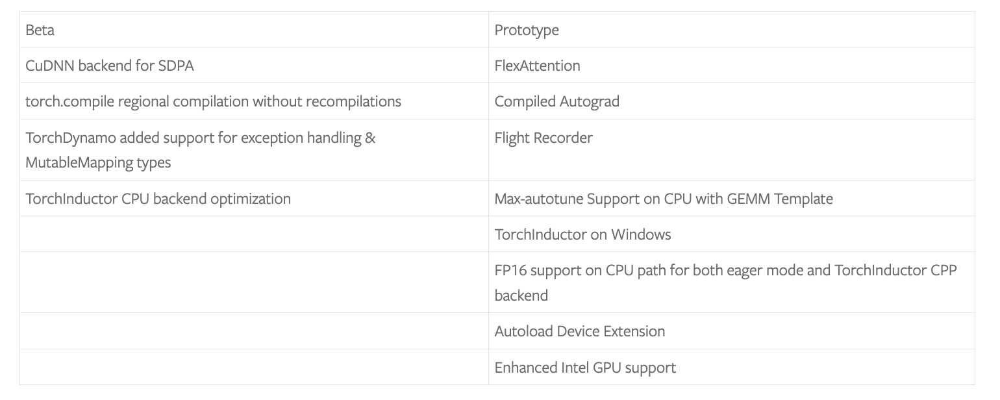

# PyTorch 2.5 Released: Advancing Machine Learning Efficiency and Scalability

> The PyTorch community has continuously been at the forefront of advancing machine learning frameworks to meet the growing needs of researchers, data scientists, and AI engineers worldwide. With the latest PyTorch 2.5 release, the team aims to address several challenges faced by the ML community, focusing primarily on improving computational efficiency, reducing start up times, […]

The PyTorch community has continuously been at the forefront of advancing machine learning frameworks to meet the growing needs of researchers, data scientists, and AI engineers worldwide. With the latest PyTorch 2.5 release, the team aims to address several challenges faced by the ML community, focusing primarily on improving computational efficiency, reducing start up times, and enhancing performance scalability for newer hardware. In particular, the release targets bottlenecks experienced in transformer models and LLMs (Large Language Models), the ongoing need for GPU optimizations, and the efficiency of training and inference for both research and production settings. These updates help PyTorch stay competitive in the fast-moving field of AI infrastructure.

The new PyTorch release brings exciting new features to its widely adopted deep learning framework. This release is centered around improvements such as a new CuDNN backend for Scaled Dot Product Attention (SDPA), regional compilation of `torch.compile`, and the introduction of a TorchInductor CPP backend. The CuDNN backend aims to improve performance for users leveraging SDPA on H100 GPUs or newer, while regional compilation helps reduce the start up time of `torch.compile`. This feature is especially useful for repeated neural network modules like those commonly used in transformers. The TorchInductor CPP backend provides several optimizations, including FP16 support and other performance enhancements, thereby offering a more efficient computational experience.

*https://pytorch.org/blog/pytorch2-5/?*

One of the most significant technical updates in PyTorch 2.5 is the CuDNN backend for SDPA. This new backend is optimized for GPUs like NVIDIA’s H100, providing substantial speedups for models using scaled dot product attention—a crucial component of transformer models. Users working with these newer GPUs will find that their workflows can achieve greater throughput with reduced latency, thereby enhancing training and inference times for large-scale models. The regional compilation for `torch.compile` is another key enhancement that offers a more modular approach to compiling neural networks. Instead of recompiling the entire model repeatedly, users can compile smaller, repeated components (such as transformer layers) in isolation. This approach drastically reduces the cold start up times, leading to faster iterations during development. Additionally, the TorchInductor CPP backend brings in FP16 support and an AOT-Inductor mode, which, combined with max-autotune, provides a highly efficient path for achieving low-level performance gains, especially when running large models on distributed hardware setups.

PyTorch 2.5 is an important release for several reasons. Firstly, the introduction of CuDNN for SDPA addresses one of the biggest pain points for users running transformer models on high-end hardware. Benchmark results have shown significant performance improvements on H100 GPUs, where speedups for scaled dot product attention are now available out of the box without additional user tuning. Secondly, the regional compilation of `torch.compile` is particularly impactful for those working with large models, such as language models, which have many repeating layers. Reducing the time needed to compile and optimize these repeated sections means a faster experimentation cycle, allowing data scientists to iterate on model architectures more effectively. Lastly, the TorchInductor CPP backend represents a shift towards providing an even more optimized, lower-level experience for developers who need maximum control over performance and resource allocation, further broadening PyTorch’s usability in both research and production settings.

In conclusion, PyTorch 2.5 is a substantial step forward for the machine learning community, bringing enhancements that cater to both high-level usability and low-level performance optimization. By addressing the specific pain points of GPU efficiency, compilation latency, and overall computational speed, this release ensures that PyTorch remains a top choice for ML practitioners. With its focus on SDPA optimizations, regional compilation, and an improved CPP backend, PyTorch 2.5 aims to provide faster, more efficient tools for those working on cutting-edge AI technologies. As machine learning models continue to grow in complexity, these types of updates are crucial for enabling the next wave of innovations.

---

Check out the**[Details](https://pytorch.org/blog/pytorch2-5/?) and [GitHub Release](https://github.com/pytorch/pytorch/releases/tag/v2.5.0)**. All credit for this research goes to the researchers of this project. Also, don’t forget to follow us on **[Twitter](https://twitter.com/Marktechpost)** and join our **[Telegram Channel](https://pxl.to/at72b5j)** and [**LinkedIn Gr**](https://www.linkedin.com/groups/13668564/)[**oup**](https://www.linkedin.com/groups/13668564/). **If you like our work, you will love our**[** newsletter..**](https://marktechpost-newsletter.beehiiv.com/subscribe) Don’t Forget to join our **[50k+ ML SubReddit](https://www.reddit.com/r/machinelearningnews/)**.

**[[Upcoming Live Webinar- Oct 29, 2024] ](https://go.predibase.com/predibase-inference-engine-102924-lp?utm_medium=3rdparty&utm_source=marktechpost)****[The Best Platform for Serving Fine-Tuned Models: Predibase Inference Engine (Promoted)](https://go.predibase.com/predibase-inference-engine-102924-lp?utm_medium=3rdparty&utm_source=marktechpost)**
