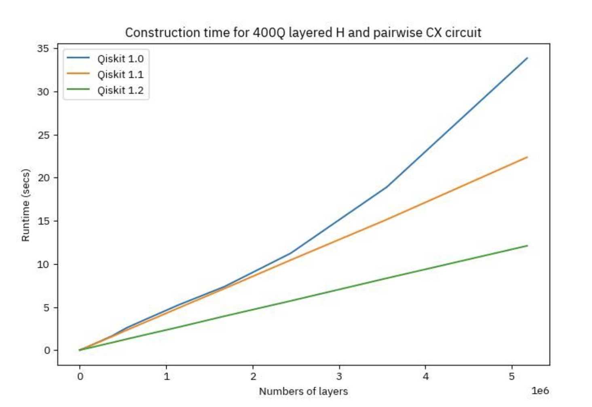

# Qiskit SDK v1.2 Released by IBM: Enhancing Quantum Circuit Optimization and Expanding Quantum Computing Capabilities

> IBM releases a new version of Qiskit SDK to address the challenge of optimizing the performance and functionality of the existing version. Qiskit SDK is a leading quantum computing software development kit. As quantum computing evolves, the need for more efficient tools to handle complex quantum workloads becomes increasingly critical. The latest version, Qiskit SDK […]

IBM releases a new version of Qiskit SDK to address the challenge of optimizing the performance and functionality of the existing version. Qiskit SDK is a leading quantum computing software development kit. As quantum computing evolves, the need for more efficient tools to handle complex quantum workloads becomes increasingly critical. The latest version, Qiskit SDK v1.2, aims to enhance the performance of quantum circuit construction, synthesis, and transpilation, making it easier and faster for researchers and developers to run utility-scale quantum workloads.

Before the release of Qiskit SDK v1.2, the Qiskit SDK already provided robust tools for quantum circuit construction and manipulation. However, there was room for improvement, especially in the areas of speed and efficiency. The earlier versions relied heavily on Python for circuit construction, which limited the performance due to Python’s slower execution speed compared to lower-level languages like Rust. IBM recognized these limitations, and the development team has transitioned critical components of the Qiskit SDK’s circuit infrastructure to Rust in the new v1.2 release.

The primary enhancement in this release is the “oxidization” of the Qiskit SDK’s circuit infrastructure, which means that core functionalities like gates, operations, and synthesis libraries are now implemented in Rust, which significantly speeds up circuit construction and manipulation. This shift from Python to Rust also opens up new possibilities for future optimizations, allowing more components of Qiskit to execute within the Rust domain, thus avoiding the performance bottlenecks associated with Python. The rewritten gate library in Rust has enabled nearly a 2.8x improvement in the speed of constructing large circuits with deep entangling layers. Additionally, Rust’s memory management efficiencies have significantly reduced the runtime for copying large circuits, further boosting performance.

Regarding circuit synthesis and transpilation, the integration of Rust has resulted in remarkable speedups. For example, the synthesis of two-qubit unitary operations is now almost 100 times faster than earlier versions, and the synthesis of Clifford circuits has seen a nearly 500-fold improvement in runtime. The Qiskit SDK v1.2 also includes a new unitary peephole optimization and enhancements to the Sabre algorithm, improving both the runtime and quality of transpiled circuits. These optimizations allow for more efficient layout and routing of qubits, ultimately leading to shallower and faster circuits.

In conclusion, the Qiskit SDK v1.2 release takes a step forward in optimizing quantum computing software. By leveraging the power of Rust, the development team has successfully enhanced the performance and functionality of the Qiskit SDK. This update accelerates quantum circuit construction and synthesis and improves the quality of transpilation, making Qiskit a more robust and efficient tool for researchers and developers. These improvements position Qiskit as a leading platform for handling complex quantum workloads faster and more efficiently.

---

Check out the **[Details](https://www.ibm.com/quantum/blog/qiskit-1-2-release-summary).** All credit for this research goes to the researchers of this project. Also, don’t forget to follow us on **[Twitter](https://twitter.com/Marktechpost)** and join our **[Telegram Channel](https://www.zyphra.com/post/zamba2-mini)** and [**LinkedIn Gr**](https://www.linkedin.com/groups/13668564/)[**oup**](https://www.linkedin.com/groups/13668564/). **If you like our work, you will love our**[** newsletter..**](https://marktechpost-newsletter.beehiiv.com/subscribe)

Don’t Forget to join our **[50k+ ML SubReddit](https://www.reddit.com/r/machinelearningnews/)**

Here is a highly recommended webinar from our sponsor: **[‘Building Performant AI Applications with NVIDIA NIMs and Haystack’](https://landing.deepset.ai/webinar-nvidia-nims-and-haystack?utm_campaign=2409-campaign-nvidia-nims-and-haystack-&utm_source=marktechpost&utm_medium=banner-ad-desktop)**
