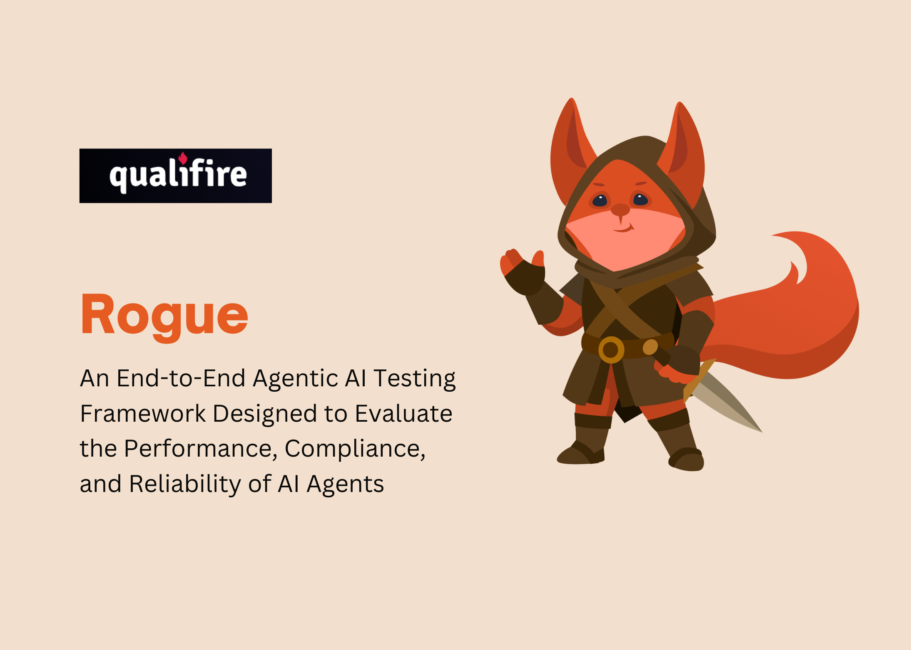

# Qualifire AI Releases Rogue: An End-to-End Agentic AI Testing Framework, Evaluating the Performance of AI Agents

> Agentic systems are stochastic, context-dependent, and policy-bounded. Conventional QA—unit tests, static prompts, or scalar “LLM-as-a-judge” scores—fails to expose multi-turn vulnerabilities and provides weak audit trails. Developer teams need protocol-accurate conversations, explicit policy checks, and machine-readable evidence that can gate releases with confidence. Qualifire AI has open-sourced Rogue, a Python framework that evaluates AI agents over […]

Agentic systems are stochastic, context-dependent, and policy-bounded. Conventional QA—unit tests, static prompts, or scalar “LLM-as-a-judge” scores—fails to expose multi-turn vulnerabilities and provides weak audit trails. Developer teams need protocol-accurate conversations, explicit policy checks, and machine-readable evidence that can gate releases with confidence.

**Qualifire AI has open-sourced **[**Rogue**](https://pxllnk.co/y1zp1rf), a Python framework that evaluates AI agents over the Agent-to-Agent (A2A)** **protocol. Rogue converts business policies into executable scenarios, drives multi-turn interactions against a target agent, and outputs deterministic reports suitable for CI/CD and compliance reviews.

## Quick Start

### Prerequisites

- uvx – If not installed, follow [uv installation guide](https://docs.astral.sh/uv/getting-started/installation/)

- Python 3.10+

- An API key for an LLM provider (e.g., OpenAI, Google, Anthropic).

### Installation

#### Option 1: Quick Install (Recommended)

Use our automated install script to get up and running quickly:

Copy CodeCopiedUse a different Browser
```
# TUI
uvx rogue-ai
# Web UI
uvx rogue-ai ui
# CLI / CI/CD
uvx rogue-ai cli
```

#### Option 2: Manual Installation

(a) Clone the repository:

Copy CodeCopiedUse a different Browser
```
git clone https://github.com/qualifire-dev/rogue.git
cd rogue
```

(b) Install dependencies:

If you are using uv:

Copy CodeCopiedUse a different Browser
```
uv sync
```

Or, if you are using pip:

Copy CodeCopiedUse a different Browser
```
pip install -e .
```

(c) OPTIONALLY: Set up your environment variables: Create a .env file in the root directory and add your API keys. Rogue uses LiteLLM, so you can set keys for various providers.

Copy CodeCopiedUse a different Browser
```
OPENAI_API_KEY="sk-..."
ANTHROPIC_API_KEY="sk-..."
GOOGLE_API_KEY="..."

```

### Running Rogue

Rogue operates on a client-[server](https://www.marktechpost.com/2025/08/08/proxy-servers-explained-types-use-cases-trends-in-2025-technical-deep-dive/) architecture where the core evaluation logic runs in a backend server, and various clients connect to it for different interfaces.

#### Default Behavior

**When you run uvx rogue-ai without any mode specified, it:**

- Starts the Rogue server in the background

- Launches the TUI (Terminal User Interface) client

Copy CodeCopiedUse a different Browser
```
uvx rogue-ai
```

#### Available Modes

- **Default (Server + TUI)**: uvx rogue-ai – Starts server in background + TUI client

- **Server**: uvx rogue-ai server – Runs only the backend server

- **TUI**: uvx rogue-ai tui – Runs only the TUI client (requires server running)

- **Web UI:** uvx rogue-ai ui – Runs only the Gradio web interface client (requires server running)

- **CLI**: uvx rogue-ai cli – Runs non-interactive command-line evaluation (requires server running, ideal for CI/CD)

#### Mode Arguments

##### Server Mode

Copy CodeCopiedUse a different Browser
```
uvx rogue-ai server [OPTIONS]
```

**Options:**

- –host HOST – Host to run the server on (default: 127.0.0.1 or HOST env var)

- –port PORT – Port to run the server on (default: 8000 or PORT env var)

- –debug – Enable debug logging

**TUI Mode**

Copy CodeCopiedUse a different Browser
```
uvx rogue-ai tui [OPTIONS]
Web UI Mode
uvx rogue-ai ui [OPTIONS]
```

**Options:**

- –rogue-server-url URL – Rogue server URL (default: [http://localhost:8000](http://localhost:8000))

- –port PORT – Port to run the UI on

- –workdir WORKDIR – Working directory (default: ./.rogue)

- –debug – Enable debug logging

**Example: Testing the T-Shirt Store Agent**

This repository includes a simple example agent that sells T-shirts. You can use it to see Rogue in action.

Install example dependencies:

**If you are using uv:**

Copy CodeCopiedUse a different Browser
```
 uv sync --group examples
```

**or, if you are using pip:**

Copy CodeCopiedUse a different Browser
```
pip install -e .[examples]
```

**(a) Start the example agent server in a separate terminal:**

If you are using uv:

Copy CodeCopiedUse a different Browser
```
uv run examples/tshirt_store_agent
```

If not:

Copy CodeCopiedUse a different Browser
```
python examples/tshirt_store_agent
```

This will start the agent on http://localhost:10001.

**(b) Configure [Rogue](https://pxllnk.co/y1zp1rf) in the UI to point to the example agent:**

- Agent URL: http://localhost:10001

- Authentication: no-auth

**(c) Run the evaluation and watch [Rogue](https://pxllnk.co/y1zp1rf) test the T-Shirt agent’s policies!**

You can use either the TUI (uvx rogue-ai) or Web UI (uvx rogue-ai ui) mode.

## Where Rogue Fits: Practical Use Cases

- **Safety & Compliance Hardening**: Validate PII/PHI handling, refusal behavior, secret-leak prevention, and regulated-domain policies with transcript-anchored evidence.

- **E-Commerce & Support Agents**: Enforce OTP-gated discounts, refund rules, SLA-aware escalation, and tool-use correctness (order lookup, ticketing) under adversarial and failure conditions.

- **Developer/DevOps Agents**: Assess code-mod and CLI copilots for workspace confinement, rollback semantics, rate-limit/backoff behavior, and unsafe command prevention.

- **Multi-Agent Systems**: Verify planner↔executor contracts, capability negotiation, and schema conformance over A2A; evaluate interoperability across heterogeneous frameworks.

- **Regression & Drift Monitoring**: Nightly suites against new model versions or prompt changes; detect behavioral drift and enforce policy-critical pass criteria before release.

## What Exactly Is Rogue—and Why Should Agent Dev Teams Care?

[Rogue](https://pxllnk.co/y1zp1rf) is an end-to-end testing framework designed to evaluate the performance, compliance, and reliability of AI agents. [Rogue](https://pxllnk.co/y1zp1rf) synthesizes business context and risk into structured tests with clear objectives, tactics and success criteria. The EvaluatorAgent runs protocol correct conversations in fast single turn or deep multi turn adversarial modes. Bring your own model, or let [Rogue](https://pxllnk.co/y1zp1rf) use Qualifire’s bespoke SLM judges to drive the tests. Streaming observability and deterministic artifacts: live transcripts,pass/fail verdicts, rationales tied to transcript spans, timing and model/version lineage.

## Under the Hood: How Rogue Is Built

Rogue operates on a client-server architecture:

- **Rogue Server:** Contains the core evaluation logic

- **Client Interfaces**: Multiple interfaces that connect to the server:

**TUI** (Terminal UI): Modern terminal interface built with Go and Bubble Tea

- **Web UI**: Gradio-based web interface

- **CLI**: Command-line interface for automated evaluation and CI/CD

This architecture allows for flexible deployment and usage patterns, where the server can run independently and multiple clients can connect to it simultaneously.

## Summary

[Rogue](https://pxllnk.co/y1zp1rf) helps developer teams test agent behavior the way it actually runs in production. It turns written policies into concrete scenarios, exercises those scenarios over A2A, and records what happened with transcripts you can audit. The result is a clear, repeatable signal you can use in CI/CD to catch policy breaks and regressions before they ship.

[Find Rogue on GitHub](https://pxllnk.co/y1zp1rf)

---

_Thanks to the Qualifire team for the thought leadership/ Resources for this article. Qualifire team has supported this content/article._
