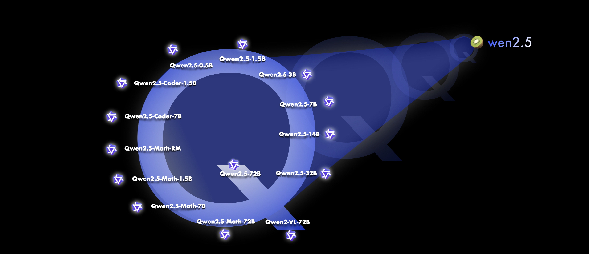

# Qwen 2.5 Models Released: Featuring Qwen2.5, Qwen2.5-Coder, and Qwen2.5-Math with 72B Parameters and 128K Context Support

> The Qwen team from Alibaba has recently made waves in the AI/ML community by releasing their latest series of large language models (LLMs), Qwen2.5. These models have taken the AI landscape by storm, boasting significant capabilities, benchmarks, and scalability upgrades. From 0.5 billion to 72 billion parameters, Qwen2.5 has introduced notable improvements across several key […]

The Qwen team from Alibaba has recently made waves in the AI/ML community by releasing their latest series of large language models (LLMs), [**Qwen2.5**](https://huggingface.co/collections/Qwen/qwen25-66e81a666513e518adb90d9e). These models have taken the AI landscape by storm, boasting significant capabilities, benchmarks, and scalability upgrades. From 0.5 billion to 72 billion parameters, Qwen2.5 has introduced notable improvements across several key areas, including coding, mathematics, instruction-following, and multilingual support. The release includes specialized models, such as [**Qwen2.5-Coder**](https://huggingface.co/collections/Qwen/qwen25-coder-66eaa22e6f99801bf65b0c2f) and [**Qwen2.5-Math**](https://huggingface.co/collections/Qwen/qwen25-math-66eaa240a1b7d5ee65f1da3e), further diversifying the range of applications for which these models can be optimized.

**Overview of the Qwen2.5 Series**

One of the most exciting aspects of Qwen2.5 is its versatility and performance, which allows it to challenge some of the most powerful models on the market, including Llama 3.1 and Mistral Large 2. Qwen2.5’s top-tier variant, the 72 billion parameter model, directly rivals Llama 3.1 (405 billion parameters) and Mistral Large 2 (123 billion parameters) in terms of performance, demonstrating the strength of its underlying architecture despite having fewer parameters.

The Qwen2.5 models were trained on an extensive dataset containing up to 18 trillion tokens, providing them with vast knowledge and data for generalization. Qwen2.5’s benchmark results show massive improvements over its predecessor, Qwen2, across several key metrics. The models have achieved significantly higher scores on the MMLU (Massive Multitask Language Understanding) benchmark, exceeding 85. HumanEval with scores over 85, and MATH benchmarks where it scored above 80. These improvements make Qwen2.5 one of the most capable models in domains requiring structured reasoning, coding, and mathematical problem-solving.

**Long-Context and Multilingual Capabilities**

One of Qwen2.5’s defining features is its long-context processing ability, supporting a context length of up to 128,000 tokens. This is crucial for tasks requiring extensive and complex inputs, such as legal document analysis or long-form content generation. Additionally, the models can generate up to 8,192 tokens, making them ideal for generating detailed reports, narratives, or even technical manuals.

The Qwen2.5 series supports 29 languages, making it a robust tool for multilingual applications. This range includes major global languages like Chinese, English, French, Spanish, Portuguese, German, Italian, Russian, Japanese, Korean, Vietnamese, Thai, and Arabic. This extensive multilingual support ensures that Qwen2.5 can be used for various tasks across diverse linguistic and cultural contexts, from content generation to translation services.

**Specialization with Qwen2.5-Coder and Qwen2.5-Math**

Alibaba has also released specialized variants with base models: Qwen2.5-Coder and Qwen2.5-Math. These specialized models focus on domains like coding and mathematics, with configurations optimized for these specific use cases. 

- The [**Qwen2.5-Coder**](https://huggingface.co/collections/Qwen/qwen25-coder-66eaa22e6f99801bf65b0c2f) variant will be available in 1.5 billion, 7 billion, and 32 billion parameter configurations. These models are designed to excel in programming tasks and are expected to be powerful tools for software development, automated code generation, and other related activities.

- The [**Qwen2.5-Math**](https://huggingface.co/collections/Qwen/qwen25-math-66eaa240a1b7d5ee65f1da3e) variant, on the other hand, is specifically tuned for mathematical reasoning and problem-solving. It comes in 1.5 billion, 7 billion, and 72 billion parameter sizes, catering to both lightweight and computationally intensive tasks in mathematics. This makes Qwen2.5-Math a prime candidate for academic research, educational platforms, and scientific applications.

**Qwen2.5: 0.5B, 1.5B, and 72B Models**

Three key variants stand out among the newly released models: Qwen2.5-0.5B, Qwen2.5-1.5B, and Qwen2.5-72B. These models cover a broad range of parameter scales and are designed to address varying computational and task-specific needs.

The Qwen2.5-0.5B model, with 0.49 billion parameters, serves as a base model for general-purpose tasks. It uses a transformer-based architecture with Rotary Position Embeddings (RoPE), SwiGLU activation, and RMSNorm for normalization, coupled with attention mechanisms featuring QKV bias. While this model is not optimized for dialogue or conversational tasks, it can still handle a range of text processing and generation needs.

The Qwen2.5-1.5B model, with 1.54 billion parameters, builds on the same architecture but offers enhanced performance for more complex tasks. This model is suited for applications requiring deeper understanding and longer context lengths, including research, data analysis, and technical writing.

Finally, the Qwen2.5-72B model represents the top-tier variant with 72 billion parameters, positioning it as a competitor to some of the most advanced LLMs. Its ability to handle large datasets and extensive context makes it ideal for enterprise-level applications, from content generation to business intelligence and advanced machine learning research.

**Key Architectural Features**

The Qwen 2.5 series shares several key architectural advancements that make these models highly efficient and adaptable:

- **RoPE (Rotary Position Embeddings): **RoPE allows for the efficient processing of long-context inputs, significantly enhancing the models’ ability to handle extended text sequences without losing coherence.

- **SwiGLU (Swish-Gated Linear Units): **This activation function enhances the models’ ability to capture complex patterns in data while maintaining computational efficiency.

- **RMSNorm: **RMSNorm is a normalization technique for stabilizing training and improving convergence times. It is useful when dealing with larger models and datasets.

- **Attention with QKV Bias:** This attention mechanism improves the models’ ability to focus on relevant information within the input data, ensuring more accurate and contextually appropriate outputs.

**Conclusion**

The release of Qwen2.5 and its specialized variants marks a significant leap in AI and machine learning capabilities. With its improvements in long-context handling, multilingual support, instruction-following, and structured data generation, Qwen2.5 is set to play a pivotal role in various industries. The specialized models, Qwen2.5-Coder and Qwen2.5-Math, further extend the series’ utility, offering targeted solutions for coding and mathematical applications.

The Qwen2.5 series is expected to challenge leading LLMs such as Llama 3.1 and Mistral Large 2, proving that Alibaba’s Qwen team continues to push the envelope in large-scale AI models. With parameter sizes ranging from 0.5 billion to 72 billion, the series caters to a broad array of use cases, from lightweight tasks to enterprise-level applications. As AI advances, models like Qwen2.5 will be instrumental in shaping the future of generative language technology.

---

Check out the **[Model Collection on HF](https://huggingface.co/Qwen) and [Details](https://qwenlm.github.io/blog/qwen2.5/)**. All credit for this research goes to the researchers of this project. Also, don’t forget to follow us on **[Twitter](https://twitter.com/Marktechpost)** and join our **[Telegram Channel](https://pxl.to/at72b5j)** and [**LinkedIn Gr**](https://www.linkedin.com/groups/13668564/)[**oup**](https://www.linkedin.com/groups/13668564/). **If you like our work, you will love our**[** newsletter..**](https://marktechpost-newsletter.beehiiv.com/subscribe)

Don’t Forget to join our **[50k+ ML SubReddit](https://www.reddit.com/r/machinelearningnews/)**

**[⏩ ⏩ FREE AI WEBINAR: ‘SAM 2 for Video: How to Fine-tune On Your Data’ (Wed, Sep 25, 4:00 AM – 4:45 AM EST)](https://encord.com/webinar/sam2-for-video/?utm_medium=affiliate&utm_source=newsletter&utm_campaign=marktechpost&utm_content=sam2video)**
