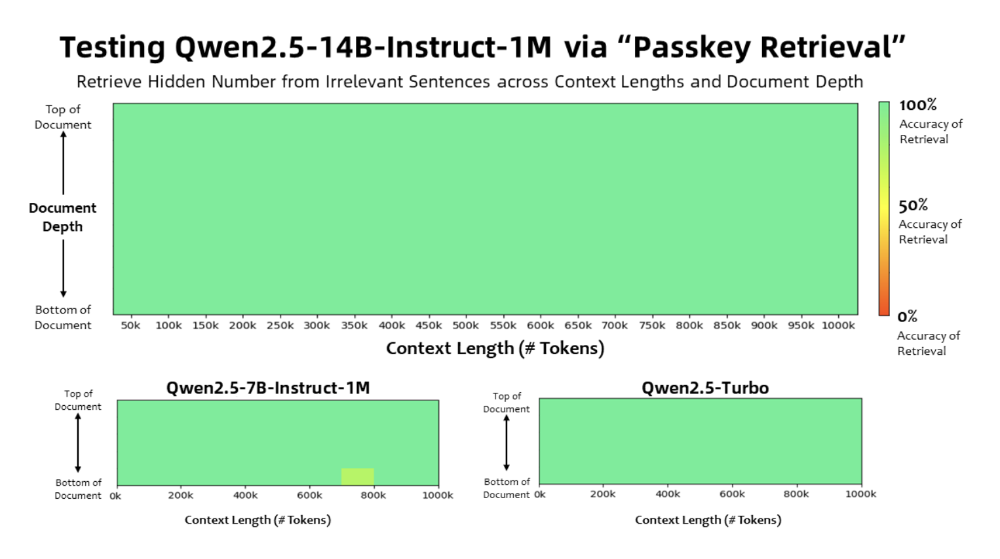

# Qwen AI Releases Qwen2.5-7B-Instruct-1M and Qwen2.5-14B-Instruct-1M: Allowing Deployment with Context Length up to 1M Tokens

> The advancements in large language models (LLMs) have significantly enhanced natural language processing (NLP), enabling capabilities like contextual understanding, code generation, and reasoning. However, a key limitation persists: the restricted context window size. Most LLMs can only process a fixed amount of text, typically up to 128K tokens, which limits their ability to handle tasks […]

The advancements in [large language models](https://www.marktechpost.com/2025/01/11/what-are-large-language-model-llms/) (LLMs) have significantly enhanced natural language processing (NLP), enabling capabilities like contextual understanding, code generation, and reasoning. However, a key limitation persists: the restricted context window size. Most LLMs can only process a fixed amount of text, typically up to 128K tokens, which limits their ability to handle tasks requiring extensive context, such as analyzing lengthy documents or debugging large codebases. These constraints often necessitate workarounds like text chunking, increasing computational complexity. Overcoming these challenges requires models that can extend context lengths efficiently without compromising performance.

### Qwen AI’s Latest Release

Qwen [AI](https://www.marktechpost.com/2025/01/13/what-is-artificial-intelligence-ai-2/) has introduced two new models, **Qwen2.5-7B-Instruct-1M** and **Qwen2.5-14B-Instruct-1M**, designed to support context lengths of up to **1 million tokens**. Developed by the Qwen team at Alibaba Group, these models also come with an open-sourced inference framework optimized for handling long contexts. This advancement enables developers and researchers to work with larger datasets in a single pass, offering a practical solution for applications that demand extended context processing. Additionally, the models feature improvements in sparse attention mechanisms and kernel optimization, resulting in faster processing times for extended inputs.

### Technical Details and Benefits

The Qwen2.5-1M series retains a Transformer-based architecture, incorporating features like **Grouped Query Attention (GQA)**, **Rotary Positional Embeddings (RoPE)**, and **RMSNorm** for stability over long contexts. Training involved both natural and synthetic datasets, with tasks like **Fill-in-the-Middle (FIM)**, paragraph reordering, and position-based retrieval enhancing the model’s ability to handle long-range dependencies. Sparse attention methods such as **Dual Chunk Attention (DCA)** allow for efficient inference by dividing sequences into manageable chunks. Progressive pre-training strategies, which gradually scale context lengths from 4K to 1M tokens, optimize efficiency while controlling computational demands. The models are fully compatible with vLLM’s open-source inference framework, simplifying integration for developers.

### Results and Insights

Benchmark results demonstrate the capabilities of the Qwen2.5-1M models. In the **Passkey Retrieval Test**, the 7B and 14B variants successfully retrieved hidden information from 1 million tokens, showcasing their effectiveness in long-context scenarios. In other benchmarks, including **RULER** and **Needle in a Haystack (NIAH)**, the 14B model outperformed alternatives like GPT-4o-mini and Llama-3. Sparse attention techniques contributed to reduced inference times, achieving speedups of up to **6.7x** on Nvidia H20 GPUs. These results highlight the models’ ability to combine efficiency with high performance, making them suitable for real-world applications requiring extensive context.

### Conclusion

The Qwen2.5-1M series addresses critical limitations in NLP by significantly extending context lengths while maintaining efficiency and accessibility. By overcoming constraints that have long hindered LLMs, these models open new possibilities for applications ranging from analyzing large datasets to processing entire code repositories. With innovations in sparse attention, kernel optimization, and long-context pre-training, Qwen2.5-1M offers a practical and effective tool for tackling complex, context-heavy tasks.

---

Check out **_the [Paper](https://qianwen-res.oss-cn-beijing.aliyuncs.com/Qwen2.5-1M/Qwen2_5_1M_Technical_Report.pdf), [Models on Hugging Face](https://huggingface.co/collections/Qwen/qwen25-1m-679325716327ec07860530ba) and [Technical Details](https://qwenlm.github.io/blog/qwen2.5-1m/)._** All credit for this research goes to the researchers of this project. Also, don’t forget to follow us on **[Twitter](https://x.com/intent/follow?screen_name=marktechpost)** and join our **[Telegram Channel](https://arxiv.org/abs/2406.09406)** and [**LinkedIn Gr**](https://www.linkedin.com/groups/13668564/)[**oup**](https://www.linkedin.com/groups/13668564/). Don’t Forget to join our **[70k+ ML SubReddit](https://www.reddit.com/r/machinelearningnews/)**.

**🚨[ [Recommended Read] Nebius AI Studio expands with vision models, new language models, embeddings and LoRA](https://nebius.com/blog/posts/studio-embeddings-vision-and-language-models?utm_medium=newsletter&utm_source=marktechpost&utm_campaign=embedding-post-ai-studio) **_(Promoted)_
