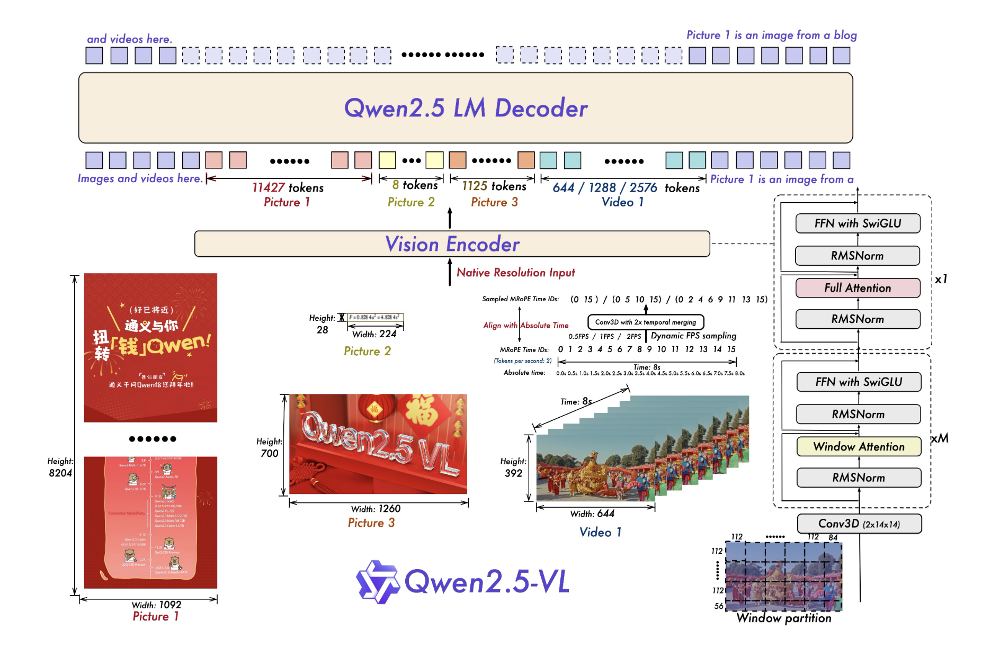

# Qwen AI Releases Qwen2.5-VL: A Powerful Vision-Language Model for Seamless Computer Interaction

> In the evolving landscape of artificial intelligence, integrating vision and language capabilities remains a complex challenge. Traditional models often struggle with tasks requiring a nuanced understanding of both visual and textual data, leading to limitations in applications such as image analysis, video comprehension, and interactive tool use. These challenges underscore the need for more sophisticated […]

In the evolving landscape of artificial intelligence, integrating vision and language capabilities remains a complex challenge. Traditional models often struggle with tasks requiring a nuanced understanding of both visual and textual data, leading to limitations in applications such as image analysis, video comprehension, and interactive tool use. These challenges underscore the need for more sophisticated vision-language models that can seamlessly interpret and respond to multimodal information.

Qwen AI has introduced Qwen2.5-VL, a new vision-language model designed to handle computer-based tasks with minimal setup. Building on its predecessor, Qwen2-VL, this iteration offers improved visual understanding and reasoning capabilities. Qwen2.5-VL can recognize a broad spectrum of objects, from everyday items like flowers and birds to more complex visual elements such as text, charts, icons, and layouts. Additionally, it functions as an intelligent visual assistant, capable of interpreting and interacting with software tools on computers and phones without extensive customization.

From a technical perspective, Qwen2.5-VL incorporates several advancements. It employs a Vision Transformer (ViT) architecture refined with SwiGLU and RMSNorm, aligning its structure with the Qwen2.5 language model. The model supports dynamic resolution and adaptive frame rate training, enhancing its ability to process videos efficiently. By leveraging dynamic frame sampling, it can understand temporal sequences and motion, improving its ability to identify key moments in video content. These enhancements make its vision encoding more efficient, optimizing both training and inference speeds.

Performance evaluations indicate that Qwen2.5-VL-72B-Instruct achieves strong results across multiple benchmarks, including mathematics, document comprehension, general question answering, and video analysis. It excels in processing documents and diagrams and operates effectively as a visual assistant without requiring task-specific fine-tuning. Smaller models within the Qwen2.5-VL family also demonstrate competitive performance, with Qwen2.5-VL-7B-Instruct surpassing GPT-4o-mini in specific tasks, and Qwen2.5-VL-3B outperforming the prior 7B version of Qwen2-VL, making it a compelling option for resource-constrained environments.

In summary, Qwen2.5-VL presents a refined approach to vision-language modeling, addressing prior limitations by improving visual understanding and interactive capabilities. Its ability to perform tasks on computers and mobile devices without extensive setup makes it a practical tool in real-world applications. As AI continues to evolve, models like Qwen2.5-VL are paving the way for more seamless and intuitive multimodal interactions, bridging the gap between visual and textual intelligence.

---

Check out **_the [Model on Hugging Face](https://huggingface.co/collections/Qwen/qwen25-vl-6795ffac22b334a837c0f9a5), [Try it here](https://chat.qwenlm.ai/) and [Technical Details](https://qwenlm.github.io/blog/qwen2.5-vl/)._** All credit for this research goes to the researchers of this project. Also, don’t forget to follow us on **[Twitter](https://x.com/intent/follow?screen_name=marktechpost)** and join our **[Telegram Channel](https://arxiv.org/abs/2406.09406)** and [**LinkedIn Gr**](https://www.linkedin.com/groups/13668564/)[**oup**](https://www.linkedin.com/groups/13668564/). Don’t Forget to join our **[70k+ ML SubReddit](https://www.reddit.com/r/machinelearningnews/)**.

**🚨[ [Recommended Read] Nebius AI Studio expands with vision models, new language models, embeddings and LoRA](https://nebius.com/blog/posts/studio-embeddings-vision-and-language-models?utm_medium=newsletter&utm_source=marktechpost&utm_campaign=embedding-post-ai-studio) **_(Promoted)_
