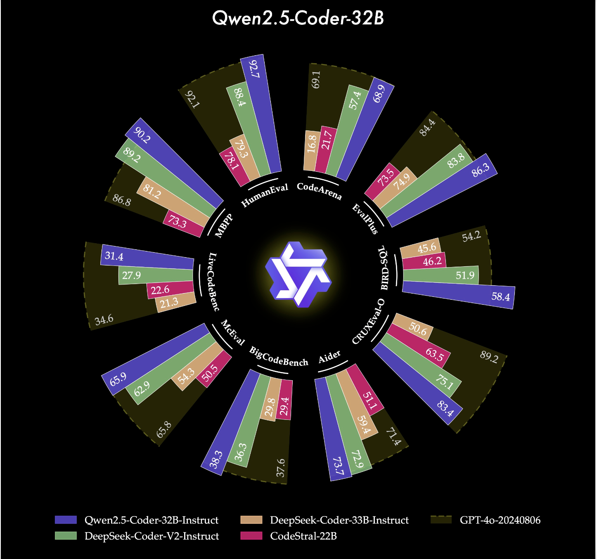

# Qwen Open Sources the Powerful, Diverse, and Practical Qwen2.5-Coder Series (0.5B/1.5B/3B/7B/14B/32B)

> In the world of software development, there is a constant need for more intelligent, capable, and specialized coding language models. While existing models have made significant strides in automating code generation, completion, and reasoning, several issues persist. The main challenges include inefficiency in dealing with a diverse range of coding tasks, lack of domain-specific expertise, […]

In the world of software development, there is a constant need for more intelligent, capable, and specialized coding language models. While existing models have made significant strides in automating code generation, completion, and reasoning, several issues persist. The main challenges include inefficiency in dealing with a diverse range of coding tasks, lack of domain-specific expertise, and difficulty in applying models to real-world coding scenarios. Despite the rise of many large language models (LLMs), code-specific models have often struggled to compete with their proprietary counterparts, especially in terms of versatility and applicability. The need for a model that not only performs well on standard benchmarks but also adapts to diverse environments has never been greater.

**Qwen2.5-Coder: A New Era of Open CodeLLMs**

Qwen has open-sourced the “Powerful,” “Diverse,” and “Practical” Qwen2.5-Coder series, dedicated to continuously promoting the development of open CodeLLMs. The Qwen2.5-Coder series is built upon the Qwen2.5 architecture, leveraging its advanced architecture and expansive tokenizer to enhance the efficiency and accuracy of coding tasks. Qwen has made a significant stride by open-sourcing these models, making them accessible to developers, researchers, and industry professionals. This family of coder models offers a range of sizes from 0.5B to 32B parameters, providing flexibility for a wide variety of coding needs. The release of Qwen2.5-Coder-32B-Instruct comes at an opportune moment, presenting itself as the most capable and practical coder model of the Qwen series. It highlights Qwen’s commitment to fostering innovation and advancing the field of open-source coding models.

**Technical Details **

Technically, Qwen2.5-Coder models have undergone extensive pretraining on a vast corpus of over 5.5 trillion tokens, which includes public code repositories and large-scale web-crawled data containing code-related texts. The model architecture is shared across different model sizes—1.5B and 7B parameters—featuring 28 layers with variances in hidden sizes and attention heads. Moreover, Qwen2.5-Coder has been fine-tuned using synthetic datasets generated by its predecessor, CodeQwen1.5, incorporating an executor to ensure only executable code is retained, thereby reducing hallucination risks. The models have also been designed to be versatile, supporting various pretraining objectives such as code generation, completion, reasoning, and editing.

**State-of-the-Art Performance**

One of the reasons why Qwen2.5-Coder stands out is its demonstrated performance across multiple evaluation benchmarks. It has consistently achieved state-of-the-art (SOTA) performance in over 10 benchmarks, including HumanEval and BigCodeBench, surpassing even some larger models. Specifically, Qwen2.5-Coder-7B-Base achieved higher accuracy on HumanEval and MBPP benchmarks compared to models like StarCoder2 and DeepSeek-Coder of comparable or even greater sizes. The Qwen2.5-Coder series also excels in multi-programming language capabilities, demonstrating balanced proficiency across eight languages—such as Python, Java, and TypeScript. Additionally, Qwen2.5-Coder’s long-context capabilities are notably strong, making it suitable for handling repository-level code and effectively supporting inputs up to 128k tokens.

**Scalability and Accessibility**

Furthermore, the availability of models in various parameter sizes (ranging from 0.5B to 32B), along with the option of quantized formats like GPTQ, AWQ, and GGUF ensures that Qwen2.5-Coder can cater to a wide range of computational requirements. This scalability is crucial for developers and researchers who may not have access to high-end computational resources but still need to benefit from powerful coding capabilities. Qwen2.5-Coder’s versatility in supporting different formats makes it more accessible for practical use, allowing for broader adoption in diverse applications. Such adaptability makes the Qwen2.5-Coder family a vital tool for promoting the development of open-source coding assistants.

**Conclusion**

The open sourcing of the Qwen2.5-Coder series marks a significant step forward in the development of coding language models. By releasing models that are powerful, diverse, and practical, Qwen has addressed key limitations of existing code-specific models. The combination of state-of-the-art performance, scalability, and flexibility makes the Qwen2.5-Coder family a valuable asset for the global developer community. Whether you are looking to leverage the capabilities of a 0.5B model or need the expansive power of a 32B variant, the Qwen2.5-Coder family aims to meet the needs of a diverse range of users. Now is indeed the perfect time to explore the possibilities with Qwen’s best coder model ever, the Qwen2.5-Coder-32B-Instruct, as well as its versatile family of smaller coders. Let’s welcome this new era of open-source coding language models that continue to push the boundaries of innovation and accessibility.

---

Check out the **[Paper](https://arxiv.org/abs/2409.12186)**, **[Models on Hugging Face](https://huggingface.co/collections/Qwen/qwen25-coder-66eaa22e6f99801bf65b0c2f)**, **[Demo](https://huggingface.co/spaces/Qwen/Qwen2.5-Coder-Artifacts)**,** and [Details](https://qwenlm.github.io/blog/qwen2.5-coder-family/)**. All credit for this research goes to the researchers of this project. Also, don’t forget to follow us on **[Twitter](https://twitter.com/Marktechpost)** and join our **[Telegram Channel](https://pxl.to/at72b5j)** and [**LinkedIn Gr**](https://www.linkedin.com/groups/13668564/)[**oup**](https://www.linkedin.com/groups/13668564/). **If you like our work, you will love our**[** newsletter..**](https://marktechpost-newsletter.beehiiv.com/subscribe) Don’t Forget to join our **[55k+ ML SubReddit](https://www.reddit.com/r/machinelearningnews/)**.

**[[Upcoming Live LinkedIn event](https://pxl.to/7ax55o)] [‘One Platform, Multimodal Possibilities,’ where Encord CEO Eric Landau and Head of Product Engineering, Justin Sharps will talk how they are reinventing data development process to help teams build game-changing multimodal AI models, fast‘](https://pxl.to/7ax55o)**
