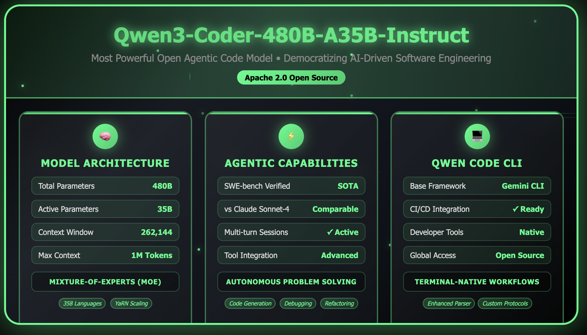

# Qwen Releases Qwen3-Coder-480B-A35B-Instruct: Its Most Powerful Open Agentic Code Model Yet

> Introduction Qwen has unveiled Qwen3-Coder-480B-A35B-Instruct, their most powerful open agentic code model released to date. With a distinctive Mixture-of-Experts (MoE) architecture and comprehensive agentic coding capabilities, Qwen3-Coder not only sets a new standard for open-source coding models but also redefines what’s possible for large-scale, autonomous developer assistance. Model Architecture and Specifications Key Features Mixture-of-Experts Design The […]

## Introduction

Qwen has unveiled **Qwen3-Coder-480B-A35B-Instruct**, _their _most powerful open agentic code model released to date. With a distinctive Mixture-of-Experts (MoE) architecture and comprehensive agentic coding capabilities, Qwen3-Coder not only sets a new standard for open-source coding models but also redefines what’s possible for large-scale, autonomous developer assistance.

## Model Architecture and Specifications

### Key Features

- **Model Size:** 480 billion parameters (Mixture-of-Experts), with 35 billion active parameters during inference.

- **Architecture:** 160 experts, 8 activated per inference, enabling both efficiency and scalability.

- **Layers:** 62

- **Attention Heads (GQA):** 96 (Q), 8 (KV)

- **Context Length:** Natively supports **256,000 tokens**; scales to **1,000,000 tokens** using context extrapolation techniques.

- **Supported Languages:** **Supports a large variety of programming and markup languages** including Python, JavaScript, Java, C++, Go, Rust, and many more.

- **Model Type:** Causal Language Model, available in both base and instruct variants.

### Mixture-of-Experts Design

The MoE approach activates only a subset of the model’s parameters for any given inference, delivering state-of-the-art performance with dramatically reduced computational overhead and enabling unprecedented scale.

### Long Context and Scalability

Qwen3-Coder-480B-A35B-Instruct stands out for its **native 256K context window**, allowing direct handling of extremely large files and repositories. With context window extrapolation (using methods such as Yarn), it can scale up to **1 million tokens**, making it suitable for even the largest codebases and documentation sets.

## Performance Across Benchmarks

### Agentic Coding

Qwen3-Coder is designed and optimized for agentic coding workflows—where the model not only generates code but autonomously interacts with tools and developer environments.

### Benchmarks

- **SWE-bench-Verified:** Achieves state-of-the-art results among open models on this challenging real-world coding task suite, outperforming or matching proprietary closed models in performance.

- **Additional Agentic Tasks:** Excels at Agentic Coding, Agentic Browser-Use, and Agentic Tool-Use, comparable to top-tier models such as Claude Sonnet-4.

- **Breadth:** Demonstrates high proficiency across competitive programming, automated testing, code refactoring, and debugging.

## Foundation Model for Developer Ecosystems

Qwen3-Coder-480B-A35B-Instruct is built as a **foundation model**—intended to serve as a universal backbone for code understanding, generation, and agentic workflows across the digital world:

- Maintains strengths in mathematics and reasoning, inherited from the Qwen3 base model.

- Adapts easily to various developer workflows, CI/CD pipelines, and code review systems.

## Qwen Code: Open-Source Agentic Command-Line Tool

### Overview

In tandem with the model, Qwen is also **open-sourcing “Qwen Code”**, a command-line agentic coding tool engineered to fully leverage the new model’s capabilities.

### Key Features

- **Origin:** Forked from Gemini Code (gemini-cli), ensuring compliance and open-source accessibility.

- **Custom Prompts and Protocols:** Enhanced with custom prompts and advanced function call protocols tailored for Qwen3-Coder, unlocking agentic use-cases such as tool integration, multi-turn code refinement, and context injection.

- **Developer Integration:** Designed to work seamlessly with best-in-class community tools, editors, and CI systems. Supports dynamic code interactions, repository-scale tasks, and direct function calling.

- **Enhanced Tool Support:** Utilizes an upgraded parser and function call logic to empower agentic workflows and program synthesis.

## Usage and Extensibility

Qwen3-Coder-480B-A35B-Instruct is available under an open license and integrates with the broader open-source AI and development landscape. It can be run using standard transformers pipelines or through the dedicated Qwen Code CLI, and is compatible with modern developer stacks.

## Conclusion

Qwen3-Coder-480B-A35B-Instruct marks a significant milestone in open-source code intelligence. With its blend of scalability, state-of-the-art agentic coding abilities, and developer-centric tooling, it provides a robust foundation model for the future of autonomous software development. Qwen’s commitment to openness—exemplified by both the release of the model and the Qwen Code agentic CLI—signals a new era for AI-powered, agentic coding in the global developer community.

#### FAQ 1: What are the main advantages of Qwen3-Coder-480B-A35B-Instruct compared to other open code models?

Qwen3-Coder-480B-A35B-Instruct stands out due to its massive scale—a 480B-parameter Mixture-of-Experts architecture with 35B active parameters—and its ability to natively handle 256,000-token contexts (scaling up to 1 million tokens via context extrapolation). This enables it to work with entire large codebases or repositories in one go. Its agentic design allows it not just to generate code, but also actively interact with developer tools and environments to autonomously solve complex programming tasks. Across multiple coding and agentic benchmarks, Qwen3-Coder delivers top-tier performance among open models, particularly excelling at SWE-bench-Verified and other real-world software engineering tasks.

#### FAQ 2: How do I use Qwen3-Coder with my own projects, and what is Qwen Code?

Qwen3-Coder-480B-A35B-Instruct can be accessed via standard Transformers pipelines or with the **Qwen Code** command-line interface, which is open-source and available on GitHub. Qwen Code, forked from Gemini Code, is a specialized agentic coding tool that leverages the model’s advanced custom prompts and function call protocols. It integrates easily with popular development stacks, supports seamless interaction with code bases and tools, and allows you to utilize Qwen3-Coder’s agentic capabilities for tasks such as code generation, refactoring, debugging, and automated tool use directly from your terminal.

#### FAQ 3: What kind of programming languages and tasks does Qwen3-Coder support?

Qwen3-Coder natively supports **358 programming and markup languages**, including Python, JavaScript, Java, C++, Go, Rust, HTML, SQL, and many more. It is proficient at a wide spectrum of coding tasks, from competitive programming and code completion to bug fixing, code review, repository-scale understanding, test generation, refactoring, and multi-turn agentic workflows. Its long-context and foundation model architecture also make it suitable for integrating with CI/CD pipelines, cloud platforms, and large-scale software engineering environments.

---

Check out the** [Model on Hugging Face](https://huggingface.co/Qwen/Qwen3-Coder-480B-A35B-Instruct) and [Qwen Code GitHub Page](https://github.com/QwenLM/qwen-code).** All credit for this research goes to the researchers of this project.

[Join the fastest growing AI Dev Newsletter read by Devs and Researchers from NVIDIA, OpenAI, DeepMind, Meta, Microsoft, JP Morgan Chase, Amgen, Aflac, Wells Fargo and 100s more…….](https://newsletter.marktechpost.com/)
