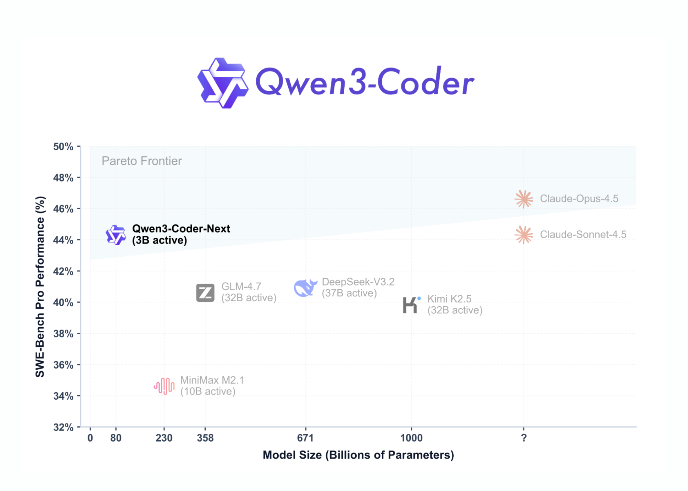

# Qwen Team Releases Qwen3-Coder-Next: An Open-Weight Language Model Designed Specifically for Coding Agents and Local Development

> Qwen team has just released Qwen3-Coder-Next, an open-weight language model designed for coding agents and local development. It sits on top of the Qwen3-Next-80B-A3B backbone. The model uses a sparse Mixture-of-Experts (MoE) architecture with hybrid attention. It has 80B total parameters, but only 3B parameters are activated per token. The goal is to match the […]

Qwen team has just released Qwen3-Coder-Next, an open-weight language model designed for coding agents and local development. It sits on top of the Qwen3-Next-80B-A3B backbone. The model uses a sparse Mixture-of-Experts (MoE) architecture with hybrid attention. It has 80B total parameters, but only 3B parameters are activated per token. The goal is to match the performance of much larger active models while keeping inference cost low for long coding sessions and agent workflows.

The model is positioned for agentic coding, browser-based tools, and IDE copilots rather than simple code completion. Qwen3-Coder-Next is trained with a large corpus of executable tasks and reinforcement learning so that it can plan, call tools, run code, and recover from runtime failures across long horizons.

### Architecture: Hybrid Attention Plus Sparse MoE

The research team describes it as a hybrid architecture that combines Gated DeltaNet, Gated Attention, and MoE.

**Key configuration points are:**

- Type: causal language model, pretraining plus post-training.

- Parameters: 80B in total, 79B non-embedding.

- Active parameters: 3B per token.

- Layers: 48.

- Hidden dimension: 2048.

- Layout: 12 repetitions of `3 × (Gated DeltaNet → MoE)` followed by `1 × (Gated Attention → MoE)`.

The Gated Attention block uses 16 query heads and 2 key-value heads with head dimension 256 and rotary position embeddings of dimension 64. The Gated DeltaNet block uses 32 linear-attention heads for values and 16 for queries and keys with head dimension 128.

The MoE layer has 512 experts, with 10 experts and 1 shared expert active per token. Each expert uses an intermediate dimension of 512. This design gives strong capacity for specialization, while the active compute stays near a 3B dense model footprint.

### Agentic Training: Executable Tasks And RL

Qwen team describes Qwen3-Coder-Next as ‘agentically trained at scale’ on top of Qwen3-Next-80B-A3B-Base. The training pipeline uses large-scale executable task synthesis, interaction with environments, and reinforcement learning.

It highlight about 800K verifiable tasks with executable environments used during training. These tasks provide concrete signals for long-horizon reasoning, tool sequencing, test execution, and recovery from failing runs. This is aligned with SWE-Bench-style workflows rather than pure static code modeling.

### Benchmarks: SWE-Bench, Terminal-Bench, And Aider

On SWE-Bench Verified using the SWE-Agent scaffold, Qwen3-Coder-Next scores 70.6. DeepSeek-V3.2 at 671B parameters scores 70.2, and GLM-4.7 at 358B parameters scores 74.2. On SWE-Bench Multilingual, Qwen3-Coder-Next reaches 62.8, very close to DeepSeek-V3.2 at 62.3 and GLM-4.7 at 63.7. On the more challenging SWE-Bench Pro, Qwen3-Coder-Next scores 44.3, above DeepSeek-V3.2 at 40.9 and GLM-4.7 at 40.6.

*https://qwen.ai/blog?id=qwen3-coder-next*

On Terminal-Bench 2.0 with the Terminus-2 JSON scaffold, Qwen3-Coder-Next scores 36.2, again competitive with larger models. On the Aider benchmark, it reaches 66.2, which is close to the best models in its class.

These results support the claim from the Qwen team that Qwen3-Coder-Next achieves performance comparable to models with 10–20× more active parameters, especially in coding and agentic settings.

### Tool Use And Agent Integrations

Qwen3-Coder-Next is tuned for tool calling and integration with coding agents. The model is designed to plug into IDE and CLI environments such as Qwen-Code, Claude-Code, Cline, and other agent frontends. The 256K context lets these systems keep large codebases, logs, and conversations in a single session.

Qwen3-Coder-Next supports only non-thinking mode. Both the official model card and [Unsloth documentation](https://unsloth.ai/docs/models/qwen3-coder-next) stress that it does not generate `<think></think>` blocks. This simplifies integration for agents that already assume direct tool calls and responses without hidden reasoning segments.

### Deployment: SGLang, vLLM, And Local GGUF

For server deployment, Qwen team recommends SGLang and vLLM. In SGLang, users run `sglang>=0.5.8` with `--tool-call-parser qwen3_coder` and a default context length of 256K tokens. In vLLM, users run `vllm>=0.15.0` with `--enable-auto-tool-choice` and the same tool parser. Both setups expose an OpenAI-compatible `/v1` endpoint.

For local deployment, [Unsloth provides GGUF quantizations](https://unsloth.ai/docs/models/qwen3-coder-next) of Qwen3-Coder-Next and a full llama.cpp and llama-server workflow. A 4-bit quantized variant needs about 46 GB of RAM or unified memory, while 8-bit needs about 85 GB. The Unsloth guide recommends context sizes up to 262,144 tokens, with 32,768 tokens as a practical default for smaller machines.

The [Unsloth guide](https://unsloth.ai/docs/models/qwen3-coder-next) also shows how to hook Qwen3-Coder-Next into local agents that emulate OpenAI Codex and Claude Code. These examples rely on llama-server with an OpenAI-compatible interface and reuse agent prompt templates while swapping the model name to Qwen3-Coder-Next.

### Key Takeaways

- **MoE architecture with low active compute**: Qwen3-Coder-Next has 80B total parameters in a sparse MoE design, but only 3B parameters are active per token, which reduces inference cost while keeping high capacity for specialized experts.

- **Hybrid attention stack for long-horizon coding**: The model uses a hybrid layout of Gated DeltaNet, Gated Attention, and MoE blocks over 48 layers with a 2048 hidden size, optimized for long-horizon reasoning in code editing and agent workflows.

- **Agentic training with executable tasks and RL**: Qwen3-Coder-Next is trained on large-scale executable tasks and reinforcement learning on top of Qwen3-Next-80B-A3B-Base, so it can plan, call tools, run tests, and recover from failures instead of only completing short code snippets.

- **Competitive performance on SWE-Bench and Terminal-Bench**: Benchmarks show that Qwen3-Coder-Next reaches strong scores on SWE-Bench Verified, SWE-Bench Pro, SWE-Bench Multilingual, Terminal-Bench 2.0, and Aider, often matching or surpassing much larger MoE models with 10–20× more active parameters.

- **Practical deployment for agents and local use**: The model supports 256K context, non-thinking mode, OpenAI-compatible APIs via SGLang and vLLM, and GGUF quantizations for llama.cpp, making it suitable for IDE agents, CLI tools, and local private coding copilots under Apache-2.0.

---

Check out the **[Paper](https://github.com/QwenLM/Qwen3-Coder/blob/main/qwen3_coder_next_tech_report.pdf), [Repo](https://github.com/QwenLM/Qwen3-Coder?tab=readme-ov-file), [Model Weights](https://huggingface.co/collections/Qwen/qwen3-coder-next) and [Technical details](https://qwen.ai/blog?id=qwen3-coder-next)**. Also, feel free to follow us on **[Twitter](https://x.com/intent/follow?screen_name=marktechpost)** and don’t forget to join our **[100k+ ML SubReddit](https://www.reddit.com/r/machinelearningnews/)** and Subscribe to **[our Newsletter](https://www.aidevsignals.com/)**. Wait! are you on telegram? **[now you can join us on telegram as well.](https://t.me/machinelearningresearchnews)**
