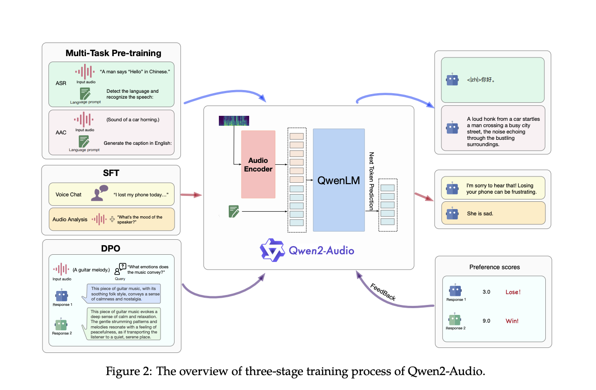

# Qwen2-Audio Released: A Revolutionary Audio-Language Model Overcoming Complex Audio Challenges with Unmatched Precision and Versatile Interaction Capabilities

> Audio, as a medium, holds immense potential for conveying complex information, making it essential for developing systems that can accurately interpret & respond to audio inputs. The field aims to create models that can comprehend a wide range of sounds, from spoken language to environmental noise, and use this understanding to facilitate more natural interactions […]

Audio, as a medium, holds immense potential for conveying complex information, making it essential for developing systems that can accurately interpret & respond to audio inputs. The field aims to create models that can comprehend a wide range of sounds, from spoken language to environmental noise, and use this understanding to facilitate more natural interactions between humans & machines. These advancements are key to pushing the boundaries of Artificial General Intelligence (AGI), where machines not only process audio but also derive meaning and context from it.

One of the major challenges in this domain is the development of systems capable of handling the diverse nature of audio signals in real-world scenarios. Traditional models often fall short when recognizing and responding to complex audio inputs, such as overlapping sounds, multi-speaker environments, and mixed audio formats. The problem is exacerbated when these systems are expected to perform without extensive task-specific fine-tuning. This limitation has driven researchers to explore new methodologies that can better equip models to deal with the unpredictability and complexity of real-world audio data, thus enhancing their ability to follow instructions and respond accurately in various contexts.

Historically, audio-language models have relied on hierarchical tagging systems and complicated pre-training processes. These models, such as Whisper and SpeechT5, have been instrumental in advancing the field but require significant fine-tuning to perform well on specific tasks. Whisper-large-v3, for instance, is known for its zero-shot evaluation capabilities on certain datasets, but it struggles with tasks that require understanding beyond simple speech recognition. Despite improvements, these models have shown limitations in scenarios that demand nuanced interpretation of multi-modal audio data, such as simultaneous speech, music, and environmental sounds.

Researchers at Qwen Team, Alibaba Group introduced [**Qwen2-Audio**](https://github.com/QwenLM/Qwen2-Audio), an advanced large-scale audio-language model designed to process and respond to complex audio signals without requiring task-specific fine-tuning. Qwen2-Audio distinguishes itself by simplifying the pre-training process using natural language prompts instead of hierarchical tags, significantly expanding the model’s data volume and enhancing its instruction-following capabilities. The model operates in two primary modes: Voice Chat and Audio Analysis, allowing it to engage in free-form voice interactions or analyze various types of audio data based on user instructions. The dual-mode functionality ensures that Qwen2-Audio seamlessly transitions between tasks without separate system prompts.

The architecture of Qwen2-Audio integrates a sophisticated audio encoder, initialized based on the Whisper-large-v3 model, with the Qwen-7B large language model as its core component. The training process involves converting raw audio waveforms into 128-channel mel-spectrograms, which are then processed using a window size of 25ms and a hop size of 10ms. The resulting data is passed through a pooling layer, reducing the length of the audio representation and ensuring that each frame corresponds to approximately 40ms of the original audio signal. With 8.2 billion parameters, Qwen2-Audio can handle various audio inputs, from simple speech to complex, multi-modal audio environments.

Performance evaluations reveal that Qwen2-Audio excels across various benchmarks, outperforming previous models in tasks such as Automatic Speech Recognition (ASR), Speech-to-Text Translation (S2TT), and Speech Emotion Recognition (SER). The model achieved a Word Error Rate (WER) of 1.6% on the Librispeech test-clean dataset and 3.6% on the test-other dataset, significantly improving over previous models like Whisper-large-v3. In speech-to-text translation, Qwen2-Audio outperformed baselines across seven translation directions, achieving a BLEU score of 45.2 in the en-de direction and 24.4 in the zh-en direction. Furthermore, in the Vocal Sound Classification (VSC) task, Qwen2-Audio attained an accuracy of 93.92%, showcasing its robust performance across diverse audio tasks.

In conclusion, Qwen2-Audio, by simplifying the pre-training process, expanding data volume, and integrating advanced architecture, the model addresses the limitations of its predecessors and sets a new standard for audio interaction systems. Its ability to perform well across various tasks without requiring task-specific fine-tuning highlights its potential to revolutionize how machines process and interact with audio signals.

---

Check out the **[Paper](https://arxiv.org/pdf/2407.10759)**, **[Model Card](https://huggingface.co/collections/Qwen/qwen2-audio-66b628d694096020e0c52ff6)**, and **[Demo](https://huggingface.co/spaces/Qwen/Qwen2-Audio-Instruct-Demo)**. All credit for this research goes to the researchers of this project. Also, don’t forget to follow us on **[Twitter](https://twitter.com/Marktechpost)** and join our **[Telegram Channel](https://pxl.to/at72b5j)** and [**LinkedIn Gr**](https://www.linkedin.com/groups/13668564/)[**oup**](https://www.linkedin.com/groups/13668564/). **If you like our work, you will love our**[** newsletter..**](https://marktechpost-newsletter.beehiiv.com/subscribe)

Don’t Forget to join our **[48k+ ML SubReddit](https://www.reddit.com/r/machinelearningnews/)**

**Find Upcoming [AI Webinars here](https://www.marktechpost.com/ai-webinars-list-llms-rag-generative-ai-ml-vector-database/)**

---

> [Arcee AI Released DistillKit: An Open Source, Easy-to-Use Tool Transforming Model Distillation for Creating Efficient, High-Performance Small Language Models](https://www.marktechpost.com/2024/08/01/arcee-ai-released-distillkit-an-open-source-easy-to-use-tool-transforming-model-distillation-for-creating-efficient-high-performance-small-language-models/)
