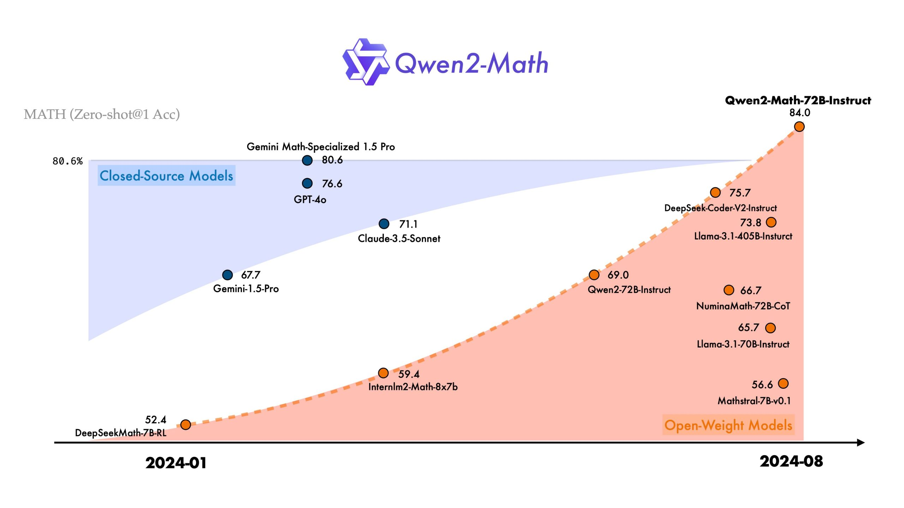

# Qwen2-Math Released: A Comprehensive AI Suite Featuring Models Ranging from 1.5B to 72B Parameters, Transforming Mathematical Computation

> The Qwen Team has recently released the Qwen 2-Math series. This release, encompassing several model variants tailored for distinct applications, demonstrates the team’s commitment to enhancing AI’s proficiency in handling complex mathematical tasks. The Qwen 2-Math series is a comprehensive set of models, each designed to cater to different computational needs. The lineup includes: These […]

The Qwen Team has recently released the [**Qwen 2-Math series**](https://qwenlm.github.io/blog/qwen2-math/). This release, encompassing several model variants tailored for distinct applications, demonstrates the team’s commitment to enhancing AI’s proficiency in handling complex mathematical tasks. The Qwen 2-Math series is a comprehensive set of models, each designed to cater to different computational needs. The lineup includes:

- Qwen 2-Math-72B

- Qwen 2-Math-72B-Instruct

- Qwen 2-Math-7B

- Qwen 2-Math-7B-Instruct

- Qwen 2-Math-1.5B

- Qwen 2-Math-1.5B-Instruct

These models vary in complexity and instruction-following capabilities. It provides users with various options depending on their specific requirements.

*[**Image Source**](https://qwenlm.github.io/blog/qwen2-math/)*

At the top of the range is the Qwen 2-Math-72B, a model that boasts an impressive 72 billion parameters. This variant is designed for highly complex mathematical computations and is suitable for tasks requiring deep learning and extensive data processing. The “Instruct” version of this model, Qwen 2-Math-72B-Instruct, offers additional enhancements that allow it to follow user instructions more precisely.

*[**Image Source**](https://qwenlm.github.io/blog/qwen2-math/)*

The Qwen 2-Math-7B and its instruct variant, Qwen 2-Math-7B-Instruct, provide a more balanced approach, offering a mid-range solution with 7 billion parameters. These models balance computational power and efficiency, making them suitable for various tasks without requiring the extensive resources needed for the 72B variant.

Lastly, the Qwen 2-Math-1.5B and Qwen 2-Math-1.5B-Instruct are the most lightweight models in the series, with 1.5 billion parameters. These models are designed for tasks that need less computational power but still benefit from the advanced capabilities of the Qwen architecture. The instruct version enhances the model’s ability to follow detailed instructions, making it useful for educational purposes and other applications where user interaction is frequent.

*[**Image Source**](https://qwenlm.github.io/blog/qwen2-math/)*

Each model in the series is built on a refined version of the architecture used in previous Qwen models, incorporating new techniques in deep learning, natural language processing, and symbolic reasoning. These advancements allow the models to handle a broader range of mathematical problems, from basic arithmetic to complex calculus and even higher-level abstract mathematical reasoning. Including instruct variants in the Qwen 2-Math series highlights the team’s focus on user-friendliness and versatility. These variants are specifically optimized to interpret and execute user commands more effectively, making them highly valuable in educational settings, research, and any other field where AI needs to work closely with human operators.

In conclusion, the release of the Qwen 2-Math series is poised to impact the AI community substantially. By offering models catering to high-end and more accessible use cases, the Qwen Team has ensured that these powerful tools are available to many users. Researchers, educators, and industry professionals are expected to benefit greatly from these models as they open up new possibilities for AI-assisted learning, research, and development in mathematics and related fields. With its range of models tailored for different levels of complexity and user interaction, this release is set to empower users across various domains.

---

Check out the **[Models here](https://huggingface.co/collections/Qwen/qwen2-math-66b4c9e072eda65b5ec7534d)**. All credit for this research goes to the researchers of this project. Also, don’t forget to follow us on **[Twitter](https://twitter.com/Marktechpost)** and join our **[Telegram Channel](https://pxl.to/at72b5j)** and [**LinkedIn Gr**](https://www.linkedin.com/groups/13668564/)[**oup**](https://www.linkedin.com/groups/13668564/). **If you like our work, you will love our**[** newsletter..**](https://marktechpost-newsletter.beehiiv.com/subscribe)

Don’t Forget to join our **[48k+ ML SubReddit](https://www.reddit.com/r/machinelearningnews/)**

**Find Upcoming [AI Webinars here](https://www.marktechpost.com/ai-webinars-list-llms-rag-generative-ai-ml-vector-database/)**

---

> [Arcee AI Released DistillKit: An Open Source, Easy-to-Use Tool Transforming Model Distillation for Creating Efficient, High-Performance Small Language Models](https://www.marktechpost.com/2024/08/01/arcee-ai-released-distillkit-an-open-source-easy-to-use-tool-transforming-model-distillation-for-creating-efficient-high-performance-small-language-models/)
