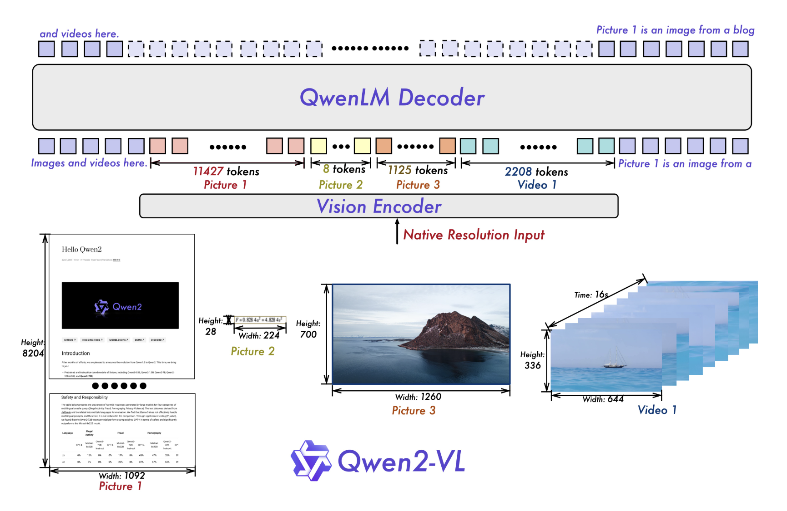

# Qwen2-VL Released: The Latest Version of the Vision Language Models based on Qwen2 in the Qwen Model Familities

> Researchers at Alibaba have announced the release of Qwen2-VL, the latest iteration of vision language models based on Qwen2 within the Qwen model family. This new version represents a significant leap forward in multimodal AI capabilities, building upon the foundation established by its predecessor, Qwen-VL. The advancements in Qwen2-VL open up exciting possibilities for a […]

Researchers at Alibaba have announced the release of Qwen2-VL, the latest iteration of vision language models based on Qwen2 within the Qwen model family. This new version represents a significant leap forward in multimodal AI capabilities, building upon the foundation established by its predecessor, Qwen-VL. The advancements in Qwen2-VL open up exciting possibilities for a wide range of applications in visual understanding and interaction, following a year of intensive development efforts.

The researchers evaluated Qwen2-VL’s visual capabilities across six key dimensions: complex college-level problem-solving, mathematical abilities, document and table comprehension, multilingual text-image understanding, general scenario question-answering, video comprehension, and agent-based interactions. The 72B model demonstrated top-tier performance across most metrics, often surpassing even closed-source models like GPT-4V and Claude 3.5-Sonnet. Notably, Qwen2-VL exhibited a significant advantage in document understanding, highlighting its versatility and advanced capabilities in processing visual information.

*_Image source: _[_https://qwenlm.github.io/blog/qwen2-vl/_](https://qwenlm.github.io/blog/qwen2-vl/)*

The 7B scale model of Qwen2-VL retains support for image, multi-image, and video inputs, delivering competitive performance in a more cost-effective size. This version excels in document understanding tasks, as demonstrated by its performance on benchmarks like DocVQA. Also, the model shows impressive capabilities in multilingual text understanding from images, achieving state-of-the-art performance on the MTVQA benchmark. These achievements highlight the model’s efficiency and versatility across various visual and linguistic tasks.

*_Image source: _[_https://qwenlm.github.io/blog/qwen2-vl/_](https://qwenlm.github.io/blog/qwen2-vl/)*

A new, compact 2B model of Qwen2-VL has also been introduced, optimized for potential mobile deployment. Despite its small size, this version demonstrates strong image, video, and multilingual comprehension performance. The 2B model particularly excels in video-related tasks, document understanding, and general scenario question-answering when compared to other models of similar scale. This development showcases the researchers’ ability to create efficient, high-performing models suitable for resource-constrained environments.

*_Image source: _[_https://qwenlm.github.io/blog/qwen2-vl/_](https://qwenlm.github.io/blog/qwen2-vl/)*

Qwen2-VL introduces significant enhancements in object recognition, including complex multi-object relationships and improved handwritten text and multilingual recognition. The model’s mathematical and coding proficiencies have been greatly improved, enabling it to solve complex problems through chart analysis and interpret distorted images. Information extraction from real-world images and charts has been reinforced, along with improved instruction-following capabilities. Also, Qwen2-VL now excels in video content analysis, offering summarization, question-answering, and real-time conversation capabilities. These advancements position Qwen2-VL as a versatile visual agent, capable of bridging abstract concepts with practical solutions across various domains.

*_Image source: _[_https://qwenlm.github.io/blog/qwen2-vl/_](https://qwenlm.github.io/blog/qwen2-vl/)*

*_Image source: _[_https://qwenlm.github.io/blog/qwen2-vl/_](https://qwenlm.github.io/blog/qwen2-vl/)*

The researchers have maintained the Qwen-VL architecture for Qwen2-VL, which combines a Vision Transformer (ViT) model with Qwen2 language models. All variants utilize a ViT with approximately 600M parameters, capable of handling both image and video inputs. Key enhancements include the implementation of Naive Dynamic Resolution support, allowing the model to process arbitrary image resolutions by mapping them into a dynamic number of visual tokens. This approach more closely mimics human visual perception. Also, the Multimodal Rotary Position Embedding (M-ROPE) innovation enables the model to concurrently capture and integrate 1D textual, 2D visual, and 3D video positional information.

*_Image source: _[_https://qwenlm.github.io/blog/qwen2-vl/_](https://qwenlm.github.io/blog/qwen2-vl/)*

Alibaba has introduced Qwen2-VL, the latest vision-language model in the Qwen family, enhancing multimodal AI capabilities. Available in 72B, 7B, and 2B versions, Qwen2-VL excels in complex problem-solving, document comprehension, multilingual text-image understanding, and video analysis, often outperforming models like GPT-4V. Key innovations include improved object recognition, enhanced mathematical and coding skills, and the ability to handle complex visual tasks. The model integrates a Vision Transformer with Naive Dynamic Resolution and Multimodal Rotary Position Embedding, making it a versatile and efficient tool for diverse applications.

---

Check out the **[Model Card](https://huggingface.co/collections/Qwen/qwen2-vl-66cee7455501d7126940800d)** and **[Details](https://qwenlm.github.io/blog/qwen2-vl/).** All credit for this research goes to the researchers of this project. Also, don’t forget to follow us on **[Twitter](https://twitter.com/Marktechpost)** and join our **[Telegram Channel](https://www.zyphra.com/post/zamba2-mini)** and [**LinkedIn Gr**](https://www.linkedin.com/groups/13668564/)[**oup**](https://www.linkedin.com/groups/13668564/). **If you like our work, you will love our**[** newsletter..**](https://marktechpost-newsletter.beehiiv.com/subscribe)

Don’t Forget to join our **[50k+ ML SubReddit](https://www.reddit.com/r/machinelearningnews/)**

Here is a highly recommended webinar from our sponsor: **[‘Building Performant AI Applications with NVIDIA NIMs and Haystack’](https://landing.deepset.ai/webinar-nvidia-nims-and-haystack?utm_campaign=2409-campaign-nvidia-nims-and-haystack-&utm_source=marktechpost&utm_medium=banner-ad-desktop)**
