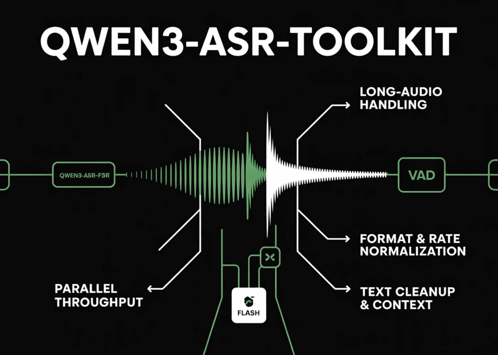

# Qwen3-ASR-Toolkit: An Advanced Open Source Python Command-Line Toolkit for Using the Qwen-ASR API Beyond the 3 Minutes/10 MB Limit

> Qwen has released Qwen3-ASR-Toolkit, an MIT-licensed Python CLI that programmatically bypasses the Qwen3-ASR-Flash API’s 3-minute/10 MB per-request limit by performing VAD-aware chunking, parallel API calls, and automatic resampling/format normalization via FFmpeg. The result is stable, hour-scale transcription pipelines with configurable concurrency, context injection, and clean text post-processing. Python ≥3.8 prerequisite, Install with: What the toolkit […]

Qwen has released **[Qwen3-ASR-Toolkit](https://github.com/QwenLM/Qwen3-ASR-Toolkit)**, an MIT-licensed Python CLI that programmatically bypasses the Qwen3-ASR-Flash API’s **3-minute/10 MB per-request** limit by performing VAD-aware chunking, parallel API calls, and automatic resampling/format normalization via FFmpeg. The result is stable, hour-scale transcription pipelines with configurable concurrency, context injection, and clean text post-processing. **Python ≥3.8** prerequisite, Install with:

Copy CodeCopiedUse a different Browser
```
pip install qwen3-asr-toolkit
```

### What the toolkit adds on top of the API

- **Long-audio handling.** The toolkit slices input using **voice activity detection (VAD)** at natural pauses, keeping each chunk under the API’s hard duration/size caps, then merges outputs in order.

- **Parallel throughput.** A thread pool dispatches multiple chunks concurrently to **DashScope** endpoints, improving wall-clock latency for hour-long inputs. You control concurrency via `-j/--num-threads`.

- **Format & rate normalization.** Any common **audio/video** container (MP4/MOV/MKV/MP3/WAV/M4A, etc.) is converted to the API’s required **mono 16 kHz** before submission. Requires FFmpeg installed on PATH.

- **Text cleanup & context.** The tool includes post-processing to reduce repetitions/hallucinations and supports **context injection** to bias recognition toward domain terms; the underlying API also exposes **language detection** and **inverse text normalization (ITN)** toggles.

The official **Qwen3-ASR-Flash** API is single-turn and enforces **≤3 min** duration and **≤10 MB** payloads per call. That is reasonable for interactive requests but awkward for long media. The toolkit operationalizes best practices—VAD-aware segmentation + concurrent calls—so teams can batch large archives or live capture dumps without writing orchestration from scratch.

### Quick start

- **Install prerequisites**

Copy CodeCopiedUse a different Browser
```
# System: FFmpeg must be available
# macOS
brew install ffmpeg
# Ubuntu/Debian
sudo apt update && sudo apt install -y ffmpeg

```

- **Install the CLI**

Copy CodeCopiedUse a different Browser
```
pip install qwen3-asr-toolkit

```

- **Configure credentials**

Copy CodeCopiedUse a different Browser
```
# International endpoint key
export DASHSCOPE_API_KEY="sk-..."

```

- **Run**

Copy CodeCopiedUse a different Browser
```
# Basic: local video, default 4 threads
qwen3-asr -i "/path/to/lecture.mp4"

# Faster: raise parallelism and pass key explicitly (optional if env var set)
qwen3-asr -i "/path/to/podcast.wav" -j 8 -key "sk-..."

# Improve domain accuracy with context
qwen3-asr -i "/path/to/earnings_call.m4a" \
  -c "tickers, CFO name, product names, Q3 revenue guidance"

```

Arguments you’ll actually use:
`-i/--input-file` (file path or http/https URL), `-j/--num-threads`, `-c/--context`, `-key/--dashscope-api-key`, `-t/--tmp-dir`, `-s/--silence`. Output is printed and saved as `<input_basename>.txt`.

### Minimal pipeline architecture

- **Load** local file or URL → 2) **VAD** to find silence boundaries → 3) **Chunk** under API caps → 4) **Resample** to 16 kHz mono → 5) **Parallel submit** to DashScope → 6) **Aggregate** segments in order → 7) **Post-process** text (dedupe, repetitions) → 8) **Emit** `.txt` transcript.

### Summary

Qwen3-ASR-Toolkit turns Qwen3-ASR-Flash into a practical long-audio pipeline by combining VAD-based segmentation, FFmpeg normalization (mono/16 kHz), and parallel API dispatch under the 3-minute/10 MB caps. Teams get deterministic chunking, configurable throughput, and optional context/LID/ITN controls without custom orchestration. For production, pin the package version, verify region endpoints/keys, and tune thread count to your network and QPS—then `pip install qwen3-asr-toolkit` and ship.

---

Check out the **[GitHub Page for Codes](https://github.com/QwenLM/Qwen3-ASR-Toolkit)_._** Feel free to check out our **[GitHub Page for Tutorials, Codes and Notebooks](https://github.com/Marktechpost/AI-Tutorial-Codes-Included)**. Also, feel free to follow us on **[Twitter](https://x.com/intent/follow?screen_name=marktechpost)** and don’t forget to join our **[100k+ ML SubReddit](https://www.reddit.com/r/machinelearningnews/)** and Subscribe to **[our Newsletter](https://www.aidevsignals.com/)**.
