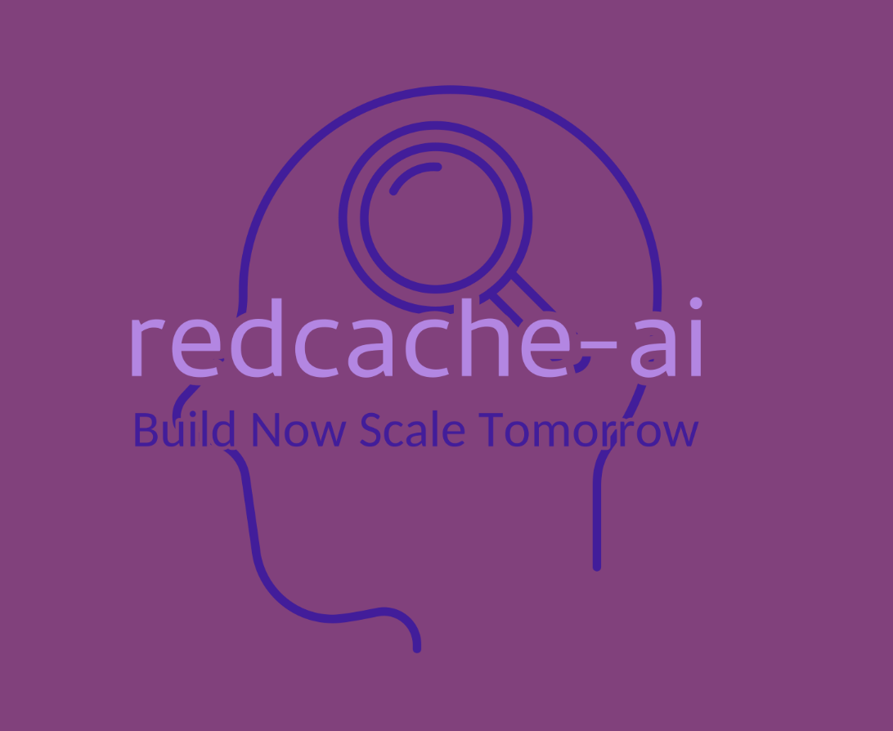

# Redcache: An Open-Source Python Package to Improve the Memory of Large Language Models LLMs and Agents

> A common challenge in developing AI-driven applications is managing and utilizing memory effectively. Developers often face high costs, closed-source limitations, and inadequate support for integrating external dependencies. These issues can hinder the development of robust applications like AI-powered dating apps or healthcare diagnostics platforms. Existing solutions for memory management in AI applications are either prohibitively […]

A common challenge in developing AI-driven applications is managing and utilizing memory effectively. Developers often face high costs, closed-source limitations, and inadequate support for integrating external dependencies. These issues can hinder the development of robust applications like AI-powered dating apps or healthcare diagnostics platforms.

Existing solutions for memory management in AI applications are either prohibitively expensive, closed-source, or lack comprehensive support for external dependencies. These limitations make it difficult for developers to create flexible and scalable AI applications that can effectively retain and utilize memory.

Meet **[RedCache-AI](https://github.com/chisasaw/redcache-ai)**, a Python package that addresses this problem by providing an open-source, dynamic memory framework specifically designed for Large Language Models (LLMs). This framework allows developers to store and retrieve text memories efficiently, facilitating the development of various applications. With RedCache-AI, developers can easily manage user interactions, retain context, and enhance the performance of their applications using stored memories.

RedCache-AI offers robust features such as memory storage to disk or SQLite, retrieval, updating, and deletion of memories. It also supports integration with OpenAI to enhance memories using LLMs. The package provides Retrieval Augmented Generation (RAG), semantic search, and storage capabilities in one platform. For instance, developers can store large chunks of text, vectorize them, and use an LLM provider to summarize or generate similar versions of the input text. These features are particularly advantageous for applications that handle extensive textual data, like summarizing lengthy PDF documents or conducting semantic searches.

**The capabilities of RedCache-AI are demonstrated by:**

- Its efficient memory storage and retrieval processes.

- Seamless integration with LLMs like OpenAI’s GPT-4.

- The capability to handle complex tasks like text summarization and semantic search.

By providing these capabilities, RedCache-AI enables developers to build more intelligent and context-aware applications, enhancing the overall user experience.

In conclusion, RedCache-AI is a valuable tool for developers seeking to enhance the memory management capabilities of their AI applications. By addressing the limitations of existing solutions, RedCache-AI provides a flexible, open-source framework that supports the development of a wide range of applications. Its robust features and seamless integration with LLMs make it a powerful solution for managing and utilizing memory effectively in AI-driven applications.

---

> [Arcee AI Released DistillKit: An Open Source, Easy-to-Use Tool Transforming Model Distillation for Creating Efficient, High-Performance Small Language Models](https://www.marktechpost.com/2024/08/01/arcee-ai-released-distillkit-an-open-source-easy-to-use-tool-transforming-model-distillation-for-creating-efficient-high-performance-small-language-models/)
