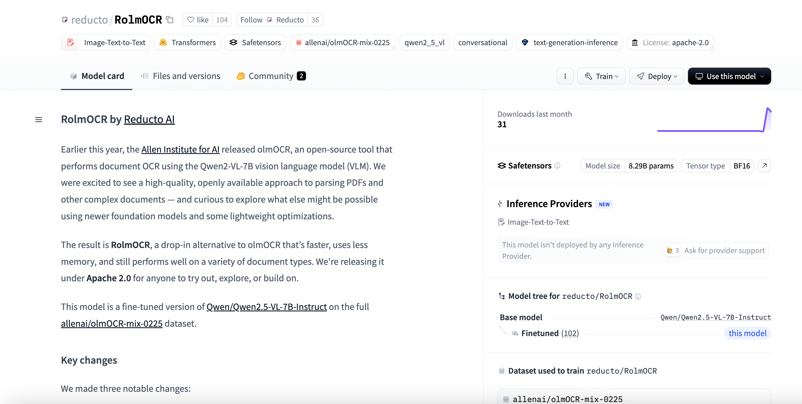

# Reducto AI Released RolmOCR: A SoTA OCR Model Built on Qwen 2.5 VL, Fully Open-Source and Apache 2.0 Licensed for Advanced Document Understanding

> Optical Character Recognition (OCR) has long been a cornerstone of document digitization, enabling the transformation of printed text into machine-readable formats. However, traditional OCR systems face significant limitations as the world grows increasingly multilingual and dependent on handwritten and visually structured content. These systems often struggle with the complexities of diverse scripts, free-form handwritten content, […]

Optical Character Recognition (OCR) has long been a cornerstone of document digitization, enabling the transformation of printed text into machine-readable formats. However, traditional OCR systems face significant limitations as the world grows increasingly multilingual and dependent on handwritten and visually structured content. These systems often struggle with the complexities of diverse scripts, free-form handwritten content, and documents that include intricate layouts with visual context. Also, many OCR solutions remain constrained by proprietary licenses, making them inaccessible for modification or use in large-scale custom applications. The demand for open, high-performing, and context-aware OCR models has never been higher, particularly as enterprises and developers look to integrate intelligent document understanding into their workflows.

Reducto AI has introduced [**RolmOCR**](https://huggingface.co/reducto/RolmOCR), a state-of-the-art OCR model that significantly advances visual-language technology. Released under the Apache 2.0 license, RolmOCR is based on Qwen2.5-VL, a powerful vision-language model developed by Alibaba. This strategic foundation enables RolmOCR to go beyond traditional character recognition by incorporating a deeper understanding of visual layout and linguistic content. The timing of its release is notable, coinciding with the increasing need for OCR systems that can accurately interpret a variety of languages and formats, from handwritten notes to structured government forms. 

RolmOCR leverages the underlying vision-language fusion of Qwen-VL to understand documents comprehensively. Unlike conventional OCR models, it interprets visual and textual elements together, allowing it to recognize printed and handwritten characters across multiple languages but also the structural layout of documents. This includes capabilities such as table detection, checkbox parsing, and the semantic association between image regions and text. By supporting prompt-based interactions, users can query the model with natural language to extract specific content from documents, enhancing its usability in dynamic or rule-based environments. Its performance across diverse datasets, including real-world scanned documents and low-resource languages, sets a new benchmark in open-source OCR.

The robust capabilities of RolmOCR can automate the processing of multilingual forms, permits, and contracts with high fidelity in the legal and governmental sectors. The educational and research communities benefit from its ability to digitize handwritten notes, historical archives, and academic publications, making them searchable and analyzable. In financial and insurance operations, RolmOCR facilitates the extraction of structured information from invoices, statements, and policy documents. Healthcare institutions can use the model to digitize handwritten prescriptions and patient intake forms, improving data accessibility and compliance. Also, RolmOCR supports building intelligent search engines by transforming scanned documents into structured datasets suitable for indexing and retrieval. Its prompt-based querying mechanism further enhances its adaptability, allowing developers to embed OCR-driven reasoning into AI agents or workflow automation.

In conclusion, Reducto AI delivers a tool that performs exceptionally well across diverse document types and languages and empowers innovation through unrestricted use. The release of RolmOCR under an Apache 2.0 license ensures that it can be fine-tuned, integrated, and scaled in academic and commercial settings. Tools like RolmOCR will be instrumental in providing scalable, intelligent, and inclusive OCR solutions. Based on Qwen2.5-VL, its architecture offers a glimpse into the future of AI-driven document understanding, which is multilingual, layout-aware, and programmable.

---

Check out **_the [Model on Hugging Face](https://huggingface.co/reducto/RolmOCR)._** All credit for this research goes to the researchers of this project. Also, feel free to follow us on **[Twitter](https://x.com/intent/follow?screen_name=marktechpost)** and don’t forget to join our **[85k+ ML SubReddit](https://www.reddit.com/r/machinelearningnews/)**.

[**🔥 [Register Now] miniCON Virtual Conference on OPEN SOURCE AI: FREE REGISTRATION + Certificate of Attendance + 3 Hour Short Event (April 12, 9 am- 12 pm PST) + Hands on Workshop [Sponsored]**](https://pxl.to/hki7r39)
