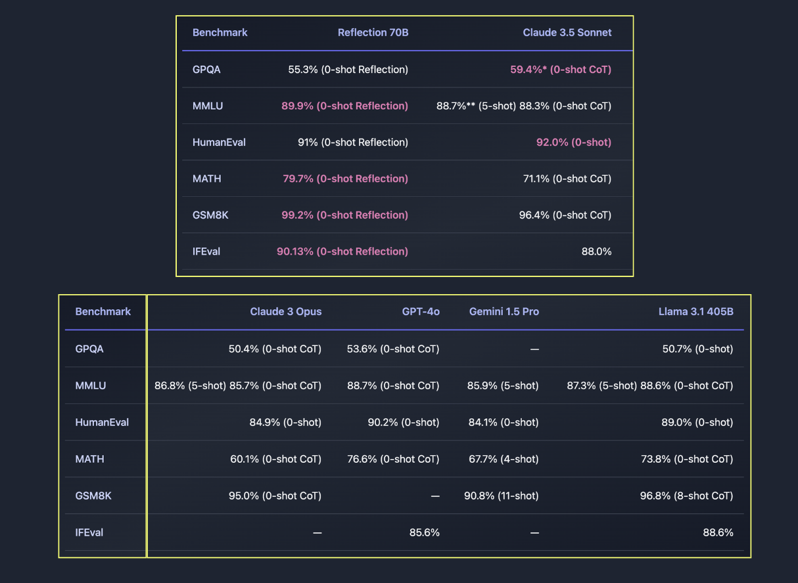

# Reflection 70B: A Ground Breaking Open-Source LLM, Trained with a New Technique called Reflection-Tuning that Teaches a LLM to Detect Mistakes in Its Reasoning and Correct Course

> Hallucination is a phenomenon where large language models (LLMs) produce responses that are not grounded in reality or do not align with the provided context, generating incorrect, misleading, or nonsensical information. These errors can have serious consequences, particularly in applications that require high precision, like medical diagnosis, legal advice, or other high-stakes scenarios. As the […]

Hallucination is a phenomenon where large language models (LLMs) produce responses that are not grounded in reality or do not align with the provided context, generating incorrect, misleading, or nonsensical information. These errors can have serious consequences, particularly in applications that require high precision, like medical diagnosis, legal advice, or other high-stakes scenarios. As the use of LLMs becomes more widespread, minimizing such hallucinations is essential for ensuring trustworthiness and reliability in AI systems.

Current approaches to managing hallucinations in LLMs typically focus on improving training techniques or maximizing the likelihood of correct responses. However, these methods do not address the root issue—how models process and reflect on their reasoning before generating outputs. Researchers introduce a novel approach called “Reflection-Tuning,” integrated into the Reflection 70B model, built on Meta’s open-source Llama 3.1-70B Instruct. The proposed method enables the model to reflect on its reasoning during the output generation process to improve accuracy and consistency.

Unlike other models that output a single answer directly, Reflection 70B adds distinct phases of reasoning and reflection using special tokens. When generating responses, the model outputs its thought process inside special <thinking> tags and revises potential errors with <reflection> tags, before finally presenting a refined answer inside <output> tags. This allows the model to catch mistakes before providing the user with a final answer, reducing hallucinations and increasing trust.

Reflection-Tuning forms the core of this approach, using a form of self-supervised learning to train the model to pause, analyze its thought process, and correct errors before responding. The training methodology involves several stages: prompt generation across various topics, response generation, reflection on the generated responses to ensure accuracy and consistency, and refinement of those responses based on the reflection. This provides the model with the ability to respond and evaluate the quality of its own answers.

Reflection 70B has shown significant improvements in mitigating hallucinations. Benchmarks such as MMLU, MATH, and IFEval reflect its superiority over other models like GPT-4 and Sonnet 3.5. Reflection 70B achieved 89.9% on MMLU, 79.7% on MATH, and 90.1% on IFEval, confirming its effectiveness in generating accurate and contextually relevant responses. Additionally, it was checked for contamination using LMSys’s LLM Decontaminator, ensuring its reliability and robustness.

In conclusion, Reflection 70B introduces a new and practical approach to mitigating hallucinations in LLMs through the Reflection-Tuning technique. Training the model to reflect on its reasoning before generating final outputs successfully reduces errors and increases the overall reliability of its responses. The reflection mechanism offers a promising way forward, though there is still room for further research and improvement in handling more complex hallucinations.

---

Check out the **[Model](https://huggingface.co/mattshumer/Reflection-Llama-3.1-70B).** All credit for this research goes to the researchers of this project. Also, don’t forget to follow us on **[Twitter](https://twitter.com/Marktechpost)** and [**LinkedIn**](https://www.linkedin.com/company/marktechpost/?viewAsMember=true). Join our **[Telegram Channel](https://www.zyphra.com/post/zamba2-mini)**.

**If you like our work, you will love our**[** newsletter..**](https://marktechpost-newsletter.beehiiv.com/subscribe)

Don’t Forget to join our **[50k+ ML SubReddit](https://www.reddit.com/r/machinelearningnews/)**
