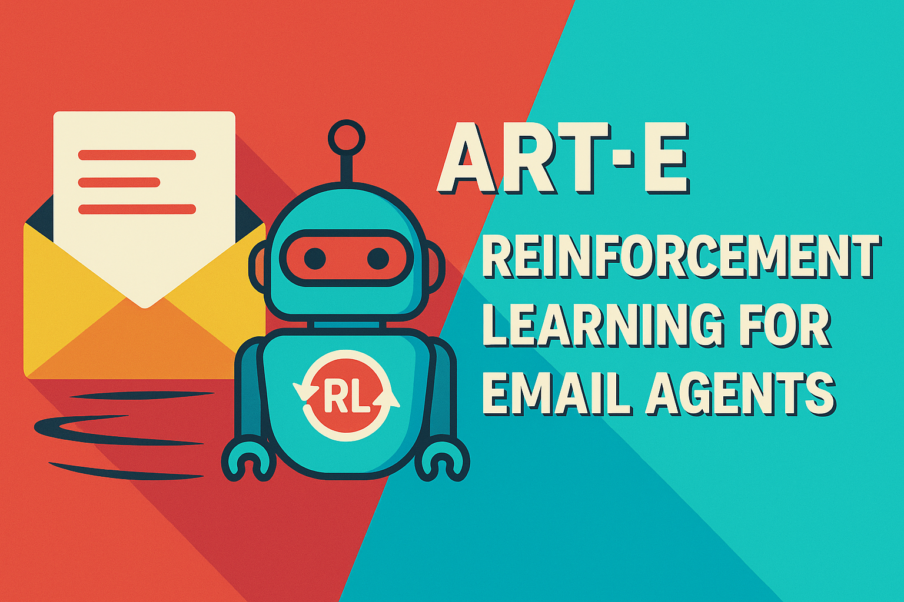

# Reinforcement Learning for Email Agents: OpenPipe’s ART·E Outperforms o3 in Accuracy, Latency, and Cost

> OpenPipe has introduced ART·E (Autonomous Retrieval Tool for Email), an open-source research agent designed to answer user questions based on inbox contents with a focus on accuracy, responsiveness, and computational efficiency. ART·E demonstrates the practical utility of reinforcement learning (RL) in fine-tuning large language model (LLM) agents for specialized, high-signal use cases. Addressing Limitations in […]

OpenPipe has introduced ART·E (Autonomous Retrieval Tool for Email), an open-source research agent designed to answer user questions based on inbox contents with a focus on accuracy, responsiveness, and computational efficiency. ART·E demonstrates the practical utility of reinforcement learning (RL) in fine-tuning [large language model](https://www.marktechpost.com/2025/01/11/what-are-large-language-model-llms/) (LLM) agents for specialized, high-signal use cases.

### Addressing Limitations in Email-Centric Agent Workflows

Despite significant advances in retrieval-augmented generation ([RAG](https://www.marktechpost.com/2024/11/25/retrieval-augmented-generation-rag-deep-dive-into-25-different-types-of-rag/)), current LLM-based agents often exhibit inefficiencies when applied to structured personal data such as emails. Existing approaches tend to rely on generic prompting and multi-tool execution, leading to:

- Increased latency due to excessive processing steps

- High inference costs, particularly when using proprietary models

- Variable accuracy caused by ambiguity in email content and intent

The objective behind ART·E is to investigate whether reinforcement learning techniques, in combination with curated data and domain-focused design, can improve agent effectiveness across these dimensions.

### ART·E: Architecture and Reinforcement Learning Workflow

OpenPipe developed ART·E as a lightweight email question-answering agent that integrates retrieval and generation with a streamlined decision policy. It is trained using a reinforcement learning setup, following a Proximal Policy Optimization (PPO) regime after initial supervised fine-tuning. The core components include:

- **Retriever Module**: Identifies relevant emails using embeddings derived from compact, efficient encoders.

- **LLM Policy Head**: Generates responses informed by the retrieved content, optimized through iterative RL based on feedback signals.

- **Evaluation Pipeline**: Implements automated correctness evaluation and utility scoring to guide learning during the RL phase.

This architecture supports modularity, allowing independent improvements or substitutions of retrievers, evaluators, or policy heads.

### Evaluation: ART·E Compared to o3 Agent

Benchmarking against OpenAI’s o3 agent on real-world email queries, ART·E demonstrates:

Metrico3 AgentART·E AgentResponse AccuracyBaseline+12.4%Average Latency1.0x0.2x (5× faster)Inference Cost1.0x0.016x (64× cheaper)

These gains result from a tailored execution path, reduced reliance on external API calls, and a narrower, more relevant context window. The cost-performance tradeoff is particularly favorable for users deploying agents at scale or within privacy-sensitive environments.

### Open-Source Release and Integration Potential

The ART·E codebase is publicly available on [GitHub](https://github.com/OpenPipe/ART), offering an extensible platform for further research and practical deployments. Key features of the repository include:

- A configurable evaluator with built-in feedback collection tools

- Abstractions for retriever and language model components

- Interfaces for connecting to common email providers

- Training scripts supporting both supervised learning and RL via the `trlx` library

This release provides a reproducible framework for applying RLHF in agent design across adjacent domains.

### Broader Implications: RLHF in Narrow Agent Tasks

While RLHF is traditionally associated with alignment in general-purpose LLMs, ART·E exemplifies its applicability in narrow, goal-oriented tasks. In constrained domains such as email summarization or question answering, reinforcement learning enables agents to:

- Execute more targeted and efficient retrievals

- Develop preference-aware response policies

- Maintain robustness in noisy or partially structured data environments

The ART·E training methodology thus offers a compelling path forward for organizations aiming to optimize LLM-based agents for vertical-specific workflows.

### Conclusion

ART·E represents a technically grounded application of RL in agent development, targeting a clearly defined, practical problem space. Its performance improvements across accuracy, latency, and cost metrics highlight the value of integrating reinforcement learning with domain-aware system design. As interest in domain-specialized AI agents continues to grow, ART·E serves as a reproducible and extensible example for future research and development.

---

Check out the **[GitHub Page](https://github.com/OpenPipe/ART)** and [**Technical details**.](https://openpipe.ai/blog/art-e-mail-agent) Also, don’t forget to follow us on **[Twitter](https://x.com/intent/follow?screen_name=marktechpost)** and join our **[Telegram Channel](https://arxiv.org/abs/2406.09406)** and [**LinkedIn Gr**](https://www.linkedin.com/groups/13668564/)[**oup**](https://www.linkedin.com/groups/13668564/). Don’t Forget to join our **[90k+ ML SubReddit](https://www.reddit.com/r/machinelearningnews/)**.

[**🔥 [Register Now] miniCON Virtual Conference on AGENTIC AI: FREE REGISTRATION + Certificate of Attendance + 4 Hour Short Event (May 21, 9 am- 1 pm PST) + Hands on Workshop**](https://minicon.marktechpost.com/)
