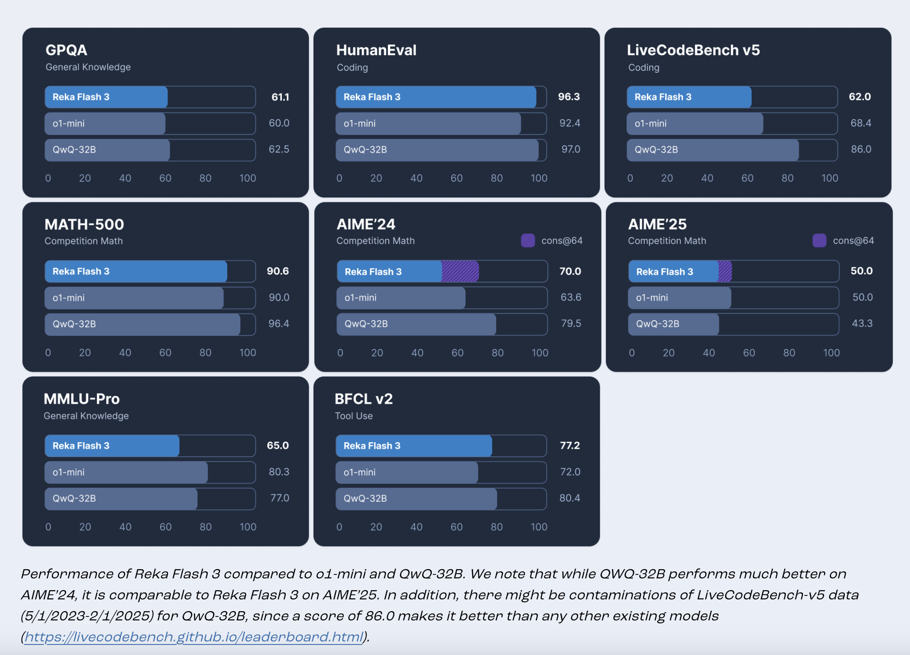

# Reka AI Open Sourced Reka Flash 3: A 21B General-Purpose Reasoning Model that was Trained from Scratch

> In today’s dynamic AI landscape, developers and organizations face several practical challenges. High computational demands, latency issues, and limited access to truly adaptable open-source models often constrain progress. Many existing solutions require expensive cloud infrastructures or are too large for on-device applications, leaving a gap for models that are both efficient and flexible. Addressing these […]

In today’s dynamic AI landscape, developers and organizations face several practical challenges. High computational demands, latency issues, and limited access to truly adaptable open-source models often constrain progress. Many existing solutions require expensive cloud infrastructures or are too large for on-device applications, leaving a gap for models that are both efficient and flexible. Addressing these challenges is key to enabling more accessible, custom AI solutions that can be tailored for diverse applications without overburdening resources .

Reka AI has introduced Reka Flash 3—a reasoning model built from the ground up with 21 billion parameters. Designed for general conversation, coding support, instruction following, and even function calling, this model is crafted to serve as a practical foundation for a wide variety of applications. The training process incorporates a mix of publicly accessible and synthetic datasets, followed by careful instruction tuning and reinforcement learning using REINFORCE Leave One-Out (RLOO) methods. This deliberate approach aims to strike a balance between capability and efficiency, positioning Reka Flash 3 as a sensible choice among its peers.

From a technical standpoint, Reka Flash 3 offers several features that make it both versatile and resource-efficient. One notable aspect is its ability to handle a context length of up to 32k tokens, which facilitates the processing of lengthy documents and complex tasks without undue strain. The model also incorporates a “budget forcing” mechanism through designated <reasoning> tags. This feature enables users to limit the model’s thinking process to a set number of steps, thereby ensuring consistent performance without excessive computational overhead. Moreover, Reka Flash 3 is well-suited for on-device deployments, offering a full precision size of 39GB (fp16) that can be further compressed to 11GB via 4-bit quantization. Such flexibility allows for smoother, local deployments when compared to larger, more resource-intensive models.

Evaluation metrics and performance data reinforce the model’s practicality. For example, while Reka Flash 3 shows a modest MMLU-Pro score of 65.0, it remains competitive when paired with supplementary knowledge sources like web search. Additionally, its multilingual capabilities are reflected in an 83.2 COMET score on WMT’23, indicating a reasonable level of support for non-English inputs despite its primary focus on English. These results, combined with its efficient parameter count relative to peers such as QwQ-32B, highlight its potential for a range of real-world applications without resorting to overblown claims .

In summary, Reka Flash 3 represents a thoughtful step toward more accessible AI solutions. By carefully balancing performance with efficiency, it provides a robust yet adaptable model suitable for general chat, coding, and instruction tasks. Its compact design, enhanced by a 32k token context window and innovative budget forcing mechanism, makes it a practical option for on-device deployments and low-latency applications. For researchers and developers looking for a model that is both capable and manageable, Reka Flash 3 offers a promising foundation that aligns with practical needs without excessive fanfare.

---

Check out **_the [Model on Hugging Face](https://huggingface.co/RekaAI/reka-flash-3), and [Technical details](https://www.reka.ai/news/introducing-reka-flash)._** All credit for this research goes to the researchers of this project. Also, feel free to follow us on **[Twitter](https://x.com/intent/follow?screen_name=marktechpost)** and don’t forget to join our **[80k+ ML SubReddit](https://www.reddit.com/r/machinelearningnews/)**.

**🚨 [Meet Parlant: An LLM-first conversational AI framework designed to provide developers with the control and precision they need over their AI customer service agents, utilizing behavioral guidelines and runtime supervision. 🔧 🎛️ It’s operated using an easy-to-use CLI 📟 and native client SDKs in Python and TypeScript 📦.](https://pxl.to/6p7dm6p)**
