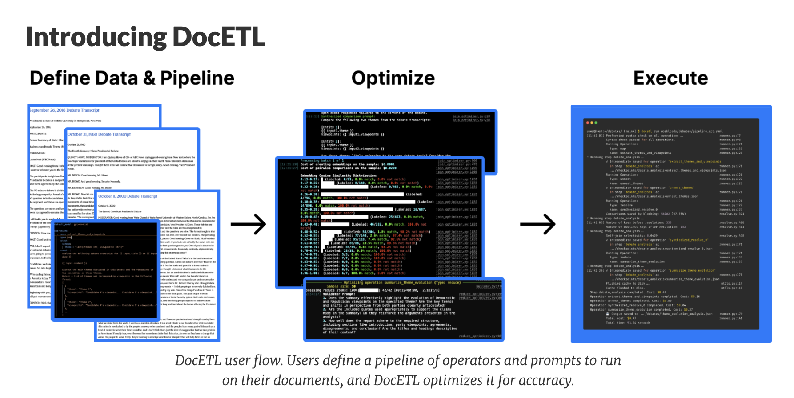

# Researchers at UC Berkeley Developed DocETL: An Open-Source Low-Code AI System for LLM-Powered Data Processing

> As the volume of unstructured data grows in various fields, including healthcare, legal, and finance, the demand for efficient, accurate document processing solutions increases. Handling unstructured data is challenging due to its inherent lack of structure and consistency. Unlike structured data, which follows a predefined format (e.g., databases), unstructured data can vary widely in format, […]

As the volume of unstructured data grows in various fields, including healthcare, legal, and finance, the demand for efficient, accurate document processing solutions increases. Handling unstructured data is challenging due to its inherent lack of structure and consistency. Unlike structured data, which follows a predefined format (e.g., databases), unstructured data can vary widely in format, content, and organization. Traditional approaches to handling this data are often inefficient, time-consuming, and prone to errors, especially when documents contain ambiguity or noise.

Current document processing methods often rely on manual techniques or basic automation that need more sophistication to handle unstructured data effectively. Natural language processing (NLP) tools may offer some capabilities but fall short when processing complex documents that require higher-level understanding. Researchers from UC Berkeley introduced DocETL, a more advanced, low-code solution powered by large language models (LLMs) to address the challenge of processing complex, unstructured documents. The tool enables users to perform tasks such as summarization, classification, and question-answering on unstructured data through a declarative YAML interface, making it accessible to non-experts. Additionally, it incorporates a suite of specialized operators for entity resolution, maintaining context, and optimizing performance, significantly reducing the need for manual intervention.

DocETL operates by ingesting documents and following a multi-step pipeline that includes document preprocessing, feature extraction, and LLM-based operations for in-depth analysis. The LLMs used within the system can handle tasks like summarizing long documents, classifying them into categories, answering user queries, and identifying key entities such as people or organizations. The tool also boasts an automatic optimization feature that experiments with different pipeline configurations, hyperparameters, and operator sequences to identify the most accurate and efficient setup for a given task. Users can further extend its functionality by creating custom operators tailored to specific document processing needs, making DocETL a versatile solution across industries. The tool’s efficiency heavily relies on the capabilities of the integrated LLMs, the design of the processing pipeline, and the quality of the input data, all of which contribute to its ability to automate complex workflows.

In conclusion, DocETL effectively addresses the need for a robust and flexible solution to handle complex document processing tasks in domains where unstructured data abounds. By combining LLM-powered operations, a user-friendly YAML interface, and automatic optimization, it simplifies the process of extracting insights from documents. Although the tool’s performance is not quantitively evaluated over existing tools, its versatility and low-code approach suggest that DocETL has significantly improved its ability to automate unstructured data.

---

Check out the **[GitHub](https://github.com/ucbepic/docetl)**, **[Demo](https://www.docetl.com/)**, and **[Details](https://data-people-group.github.io/blogs/2024/09/24/docetl/)**. All credit for this research goes to the researchers of this project. Also, don’t forget to follow us on **[Twitter](https://twitter.com/Marktechpost)** and join our **[Telegram Channel](https://pxl.to/at72b5j)** and [**LinkedIn Gr**](https://www.linkedin.com/groups/13668564/)[**oup**](https://www.linkedin.com/groups/13668564/). **If you like our work, you will love our**[** newsletter..**](https://marktechpost-newsletter.beehiiv.com/subscribe)

Don’t Forget to join our **[52k+ ML SubReddit](https://www.reddit.com/r/machinelearningnews/)**
