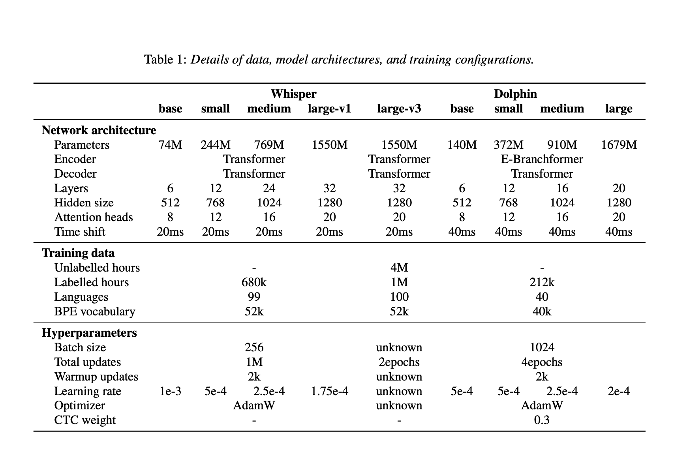

# Researchers from Dataocean AI and Tsinghua University Introduces Dolphin: A Multilingual Automatic Speech Recognition ASR Model Optimized for Eastern Languages and Dialects

> Automatic speech recognition (ASR) technologies have advanced significantly, yet notable disparities remain in their ability to accurately recognize diverse languages. Prominent ASR systems, such as OpenAI’s Whisper, exhibit pronounced performance gaps when processing Eastern languages compared to Western counterparts. This discrepancy presents tangible challenges in multilingual regions, particularly those characterized by numerous dialects and linguistic […]

Automatic speech recognition (ASR) technologies have advanced significantly, yet notable disparities remain in their ability to accurately recognize diverse languages. Prominent ASR systems, such as OpenAI’s Whisper, exhibit pronounced performance gaps when processing Eastern languages compared to Western counterparts. This discrepancy presents tangible challenges in multilingual regions, particularly those characterized by numerous dialects and linguistic variations, underscoring the necessity for sophisticated multilingual ASR systems tailored specifically to Eastern languages.

Researchers from Dataocean AI and Tsinghua University have introduced Dolphin, a comprehensive multilingual automatic speech recognition model built upon an extended Whisper architecture, optimized to accommodate a broader spectrum of Eastern languages and dialects. Dolphin effectively addresses key limitations identified in current multilingual ASR models by integrating both proprietary datasets and publicly accessible datasets. The model proficiently supports 40 Eastern languages from East Asia, South Asia, Southeast Asia, and the Middle East, as well as 22 distinct dialects of Chinese.

Dolphin employs a hybrid ASR approach combining Connectionist Temporal Classification (CTC) with attention-based mechanisms. Its architecture incorporates an E-Branchformer encoder and a Transformer decoder, substantially enhancing the model’s capability to interpret complex linguistic patterns across diverse languages. Dolphin also utilizes a dual-level language tokenization system, distinguishing general language codes from region-specific dialect tokens. This mechanism improves recognition accuracy and resolution, particularly for dialect-intensive languages such as Chinese. Additionally, Dolphin incorporates a 4× subsampling layer to efficiently reduce input sequence lengths, enhancing computational speed and training effectiveness without compromising recognition accuracy.

Experimental evaluations demonstrate Dolphin’s marked improvements in multilingual speech recognition accuracy relative to Whisper models. For instance, the Dolphin small model reduced the Word Error Rate (WER) by approximately 24.5% compared to the base model, with further incremental improvements observed in medium and large variants. Specifically, the Dolphin base model attained an average WER of 31.8%, notably outperforming Whisper’s large-v3 model, which recorded an average WER of 52.3% across the same evaluation benchmarks. Assessments conducted on dialect-focused datasets, including KeSpeech, confirmed Dolphin’s capability to consistently handle intricate linguistic variations, with performance enhancements correlating positively with increased model size.

The research team released the Dolphin base and small models publicly under the Apache 2.0 license, along with associated inference code. Dolphin’s training utilized an extensive dataset encompassing 21.2 million hours of audio recordings, incorporating 7.4 million hours derived from open datasets such as Common Voice, ReazonSpeech, and GigaSpeech2, thereby ensuring robustness and replicability.

In summary, Dolphin constitutes a significant advancement in multilingual ASR technology, systematically addressing prevailing limitations in Eastern language and dialect recognition through methodological data integration, refined architectural frameworks, and commitment to open-source dissemination. This work sets an influential benchmark for future developments in multilingual ASR research, advancing linguistic inclusivity and system generalization.

---

Check out **_the [Paper](https://arxiv.org/abs/2503.20212), [Dolphin-small-model](https://huggingface.co/DataoceanAI/dolphin-small) and [Dolphin-base-model](https://huggingface.co/DataoceanAI/dolphin-base)._** All credit for this research goes to the researchers of this project. Also, feel free to follow us on **[Twitter](https://x.com/intent/follow?screen_name=marktechpost)** and don’t forget to join our **[85k+ ML SubReddit](https://www.reddit.com/r/machinelearningnews/)**.

[**🔥 [Register Now] miniCON Virtual Conference on OPEN SOURCE AI: FREE REGISTRATION + Certificate of Attendance + 3 Hour Short Event (April 12, 9 am- 12 pm PST) + Hands on Workshop [Sponsored]**](https://pxl.to/hki7r39)
